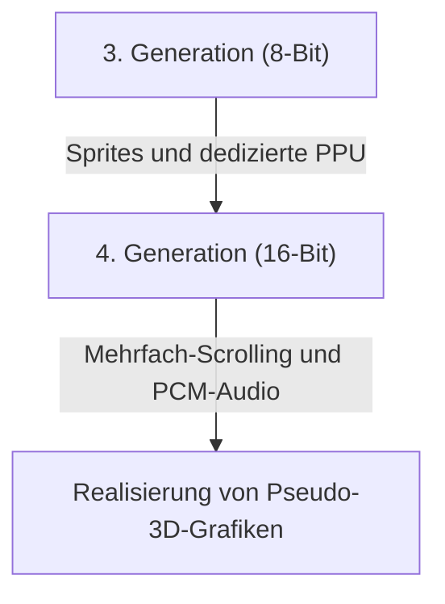

# Von Pieptönen zu fotorealistischen virtuellen Welten: 50 Jahre Evolution und technologische Innovation von Heimvideospielkonsolen

Die Geschichte der Heimvideospielkonsolen ist eng mit der Entwicklung der Computertechnologie verbunden. Von der Zeit, als sie nur eine Ansammlung elektronischer Komponenten waren, bis hin zu den heutigen Konsolen mit extrem hoher Rechenleistung und Echtzeit-Raytracing, haben sie sich in den letzten etwa 50 Jahren ständig weiterentwickelt. In diesem Artikel blicken wir auf diese Geschichte Generation für Generation zurück und untersuchen die technologischen Innovationen.

## 1. Die Anfangsjahre: Das Fehlen einer CPU und Hardware-Logik (1. Generation)

Die Geschichte der Heimvideospielkonsolen reicht bis in die 1970er Jahre zurück. Die "Magnavox Odyssey" (1972), die als die erste Heimvideospielkonsole der Welt gilt, hatte keine CPU (Central Processing Unit), wie wir sie heute kennen.

Stattdessen bestand sie ausschließlich aus reinen Hardware-Logikschaltungen mit Transistoren und Dioden und konnte nur schwarz-weiße Punkte auf dem Bildschirm anzeigen und bewegen. Die Anekdote, dass Plastik-Overlays direkt auf den Fernsehbildschirm geklebt wurden, um den Hintergrund oder das Spielfeld darzustellen, zeugt von den damaligen technischen Grenzen.

## 2. Das Aufkommen von Mikroprozessoren und die 8-Bit-Ära (2. bis 3. Generation)

In den späten 1970er und 1980er Jahren führte der Preisverfall bei Mikroprozessoren (CPUs) dazu, dass Konsolen zum heutigen Stil übergingen, bei dem Software (ROM-Kassetten) geladen und Programme ausgeführt werden.

Konsolen der zweiten Generation wie der Atari 2600 hatten nur wenige Kilobyte Speicherplatz und sehr einfache Grafiken. Doch mit dem 1983 von Nintendo veröffentlichten "Family Computer (Famicom/NES)" änderte sich die Situation schlagartig. Durch die Integration einer speziellen PPU (Picture Processing Unit) und die Implementierung der Sprite-Funktionalität (eine Technologie, um Charaktere unabhängig vom Hintergrund zu bewegen) konnten die Menschen zu Hause flüssige und farbenfrohe Actionspiele genießen.

## 3. Die 16-Bit-Innovation und der Vorlauf zur 3D-Grafik (4. Generation)

Die 1990er Jahre läuteten die Ära der 16-Bit-Konsolen ein, vertreten durch das Super Nintendo Entertainment System (Super Famicom) und den Sega Genesis (Mega Drive).

Die dramatisch gesteigerte Rechenleistung ermöglichte mehr Farben auf dem Bildschirm, Mehrfach-Scrolling (eine Technik, die den Hintergrund in mehrere Ebenen unterteilt, die sich mit unterschiedlichen Geschwindigkeiten bewegen, um einen 3D-Effekt zu erzeugen) und Pseudo-3D-Darstellungen (wie "Mode 7" beim Super Nintendo). Auch beim Sound gab es durch die Einführung von PCM-Audioquellen massive Verbesserungen bei der Ausdruckskraft, was orchestrale Hintergrundmusik und die Wiedergabe von echten Stimmen ermöglichte.

## 4. Der Einfluss von 3D-Polygonen und CD-ROMs (5. Generation)

1994 war einer der größten Wendepunkte für Spielkonsolen: Das Jahr markierte die Einführung der "PlayStation" und des "Sega Saturn".

Das wichtigste Merkmal dieser Generation war der vollständige Übergang von 2D (Pixel-Art) zu 3D-Polygonen. Die Fähigkeit, 3D-Modelle mit Texture Mapping in Echtzeit zu rendern, revolutionierte das bisherige Spielerlebnis grundlegend. Darüber hinaus führte der Wechsel des Speichermediums von ROM-Kassetten zu CD-ROMs zu einer hundertfachen Erhöhung der Datenkapazität. Dies ermöglichte Eventszenen mit vollständiger Sprachausgabe und lange, wunderschöne vorberechnete Filmsequenzen (CGI), wodurch Spiele zu einem filmischeren Erlebnis wurden.

## 5. Internetanbindung und der Beginn der HD-Ära (6. bis 7. Generation)

Im frühen 21. Jahrhundert, mit der 6. Generation (PlayStation 2, Nintendo GameCube, erste Xbox), wurden die Verwendung von DVDs und Online-Multiplayer über das Internet allmählich populär.

In der darauffolgenden 7. Generation (PlayStation 3, Xbox 360, Wii) wurde schließlich die HD-Auflösung (High Definition) unterstützt. Programmierbare Shader wurden in großem Umfang eingeführt, was die physikalischen Berechnungen von Licht und Schatten drastisch verbesserte, wie z.B. bei der Textur von Metallen oder der Reflexion auf Wasseroberflächen. Außerdem wurden die Grundlagen für die heutigen Konsolen als Plattformen in dieser Ära geschaffen, darunter der Kauf von herunterladbaren Spielen in Online-Shops und Firmware-Update-Funktionen.

## 6. Fotorealistische virtuelle Welten und die Gegenwart (8. bis 9. Generation)

Mit der PlayStation 4 und Xbox One (8. Generation) sowie den neuesten PlayStation 5 und Xbox Series X/S (9. Generation) verschmelzen Spielkonsolen zunehmend mit hochleistungsfähigen PC-Architekturen.

Die wichtigsten Technologien der neuesten Generation sind:

- **Echtzeit-Raytracing**: Eine Technologie, die die Brechung und Reflexion von Licht sowie komplexe Schatten wie in der realen Welt berechnet, um extrem fotorealistische Bilder zu erzeugen.
- **Ultraschnelle SSDs**: Durch das Laden von Daten mit einer Geschwindigkeit, die mit herkömmlichen HDDs nicht vergleichbar ist, wurden Ladebildschirme praktisch eliminiert und eine nahtlose Bewegung durch riesige offene Welten ermöglicht.
- **Haptisches Feedback**: Steuert präzise die Vibrationen des Controllers und überträgt das Gefühl fallender Regentropfen oder den Widerstand beim Spannen eines Bogens direkt auf die Hände des Spielers.

## Fazit

In einem halben Jahrhundert haben sich Heimvideospielkonsolen von "Maschinen, die leuchtende Punkte bewegen" zu "Computern, die real wirkende Welten simulieren" entwickelt. Diese Entwicklung ist das Ergebnis von Halbleitertechnologien, Grafik-APIs und der Kreativität leidenschaftlicher Spieleentwickler.

In Zukunft werden sich Konsolen durch Cloud-Gaming, KI-Technologien und die weitere Integration mit VR/AR weiter diversifizieren. Der grundlegende Zweck, das beste Unterhaltungserlebnis zu bieten, wird jedoch für immer derselbe bleiben.
