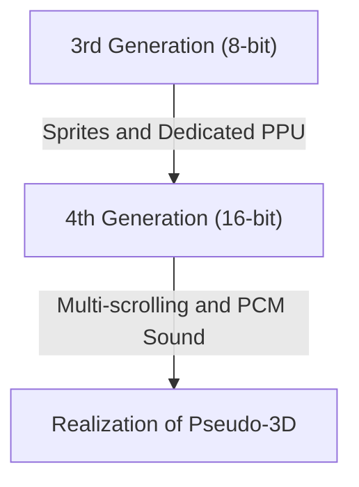
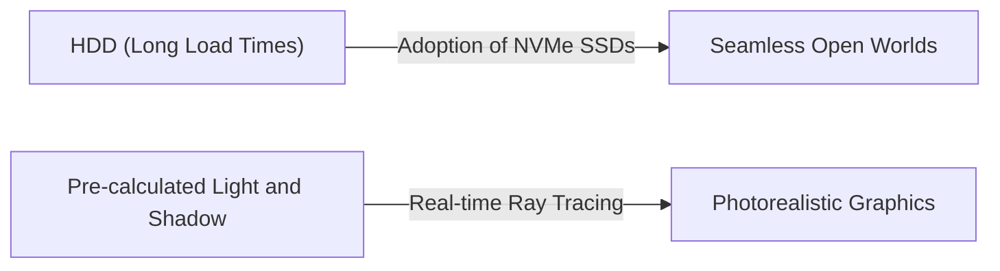

# From Beeps to Photorealistic Virtual Worlds: 50 Years of Evolution and Technical Innovation in Video Game Consoles

The history of home video game consoles is closely tied to the evolution of computing technology. Over the past 50 years, game consoles have evolved from a mere collection of electronic components to devices equipped with ultra-high-performance processing power and real-time ray tracing. In this article, we look back at that history generation by generation to explore the technological innovations that took place.

## 1. The Dawn: Absence of CPUs and Hardware Logic (First Generation)

The history of home consoles dates back to the 1970s. The "Magnavox Odyssey" (1972), considered the world's first home video game console, did not feature a CPU (Central Processing Unit) as we know it today.

Instead, it consisted purely of hardware logic circuits using transistors and diodes, and was only capable of displaying and moving black and white dots on the screen. The story of players having to place plastic overlay sheets directly onto their television screens to represent game backgrounds and fields speaks volumes about the technical limitations of the time.

## 2. The Advent of Microprocessors and the 8-Bit Era (Second to Third Generation)

From the late 1970s to the 1980s, driven by falling microprocessor (CPU) prices, consoles transitioned to the modern style of loading software (ROM cartridges) and executing programs.

Second-generation consoles like the Atari 2600 still possessed only a few kilobytes of memory and had very simple graphics. However, the situation changed completely with the release of the "Family Computer (Famicom/NES)" by Nintendo in 1983. By incorporating a dedicated PPU (Picture Processing Unit) and realizing sprite functionality (the technology to move characters independently of the background), smooth and colorful action games could now be enjoyed at home.

## 3. 16-Bit Innovation and the Lead-up to 3D Graphics (Fourth Generation)

Entering the 1990s, the era of 16-bit machines arrived, represented by the Super Famicom (Super Nintendo Entertainment System) and the Mega Drive (Sega Genesis).

With a dramatic improvement in processing power, the number of displayed colors increased, and techniques like multi-scrolling (dividing the background into multiple layers moving at different speeds to create a sense of depth) and pseudo-3D representation (such as Mode 7 on the Super Famicom) became possible. Furthermore, PCM sound sources were adopted for audio, allowing for orchestral background music and voice playback, which dramatically enhanced expressive capabilities.

## 4. The Impact of 3D Polygons and CD-ROMs (Fifth Generation)

1994 can be considered one of the biggest turning points in game consoles, marked by the arrival of the "PlayStation" and "Sega Saturn".

The defining feature of this generation was the complete transition from 2D (pixel art) to 3D polygons. The ability to render texture-mapped 3D models in real-time fundamentally overturned previous gaming experiences. Additionally, the shift in storage media from ROM cartridges to CD-ROMs increased data capacity by hundreds of times. This enabled the inclusion of fully-voiced event scenes and long, beautiful pre-rendered movies (CGI), evolving games into a more "cinematic" experience.

## 5. Internet Connectivity and the HD Era (Sixth to Seventh Generation)

In the sixth generation of the early 2000s (PlayStation 2, Nintendo GameCube, original Xbox), the adoption of DVDs and online multiplayer via the internet began to gradually spread.

In the subsequent seventh generation (PlayStation 3, Xbox 360, Wii), HD (High Definition) resolution was finally supported. Programmable shaders were introduced in earnest, dramatically advancing the physics of light and shadow, such as the texture of metal and water reflections. Furthermore, the foundations of modern game consoles as platforms were established during this era, including downloadable game purchases from online stores and firmware update functionalities.

## 6. Photorealistic Virtual Worlds and the Present (Eighth to Ninth Generation)

Reaching the PlayStation 4 and Xbox One (eighth generation), and the latest PlayStation 5 and Xbox Series X/S (ninth generation), game consoles are increasingly integrating with ultra-high-performance PC architectures.

The key technologies of the latest generation are as follows:

- **Real-time Ray Tracing**: A technology that calculates the refraction and reflection of light and complex shadows just like in the real world, generating extremely photorealistic visuals.
- **Ultra-fast SSDs**: By loading data at speeds incomparable to conventional HDDs, loading screens have been virtually eliminated, making it possible to traverse vast open worlds seamlessly.
- **Haptic Feedback**: Meticulously controls controller vibrations to transmit sensations directly to the player's hands, such as the feeling of falling raindrops or the resistance of drawing a bow.

## Conclusion

Over half a century, home video game consoles have undergone tremendous evolution, from "machines that move glowing dots" to "computers that simulate worlds indistinguishable from reality." This evolution is the crystallization of semiconductor technology, graphics APIs, and the ingenuity of passionate game creators.

Looking ahead, the nature of game consoles will continue to diversify with cloud gaming, AI technology, and further integration with VR/AR. However, the fundamental purpose of pursuing the ultimate entertainment experience will remain unchanged.
