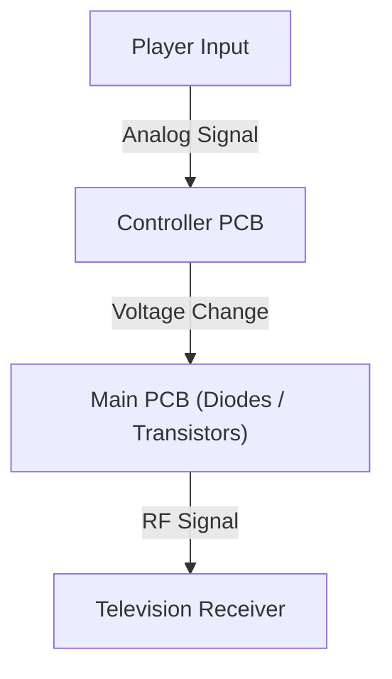
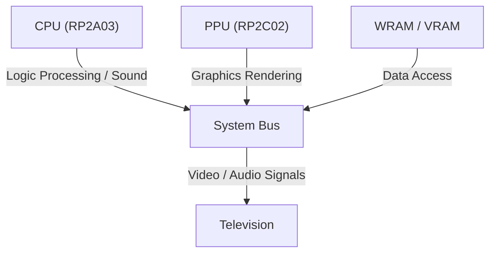

# From 8-Bit Bleeps to Photorealistic Virtual Worlds: 50 Years of Home Video Game Console Evolution and Technological Innovation

The history of video game consoles is, in itself, the history of computing technology. From the simple logic circuits of the early days to cutting-edge systems harnessing advanced GPUs and ultra-fast SSDs, the technological innovation in this space has been extraordinary. In this article, we delve deeply into the technical evolution of home video game consoles over the past 50 years.

## 1. The Dawn: From Logic Circuits to Microprocessors (1970s)

Home video game consoles began in an era where they did not "execute" software; instead, the hardware logic circuits themselves functioned as the game logic.

### The Magnavox Odyssey and Hardware Logic
Released in 1972 as the world's first home video game console, the Magnavox Odyssey did not feature a CPU. Utilizing pure hardware logic built from discrete diodes and transistors, it generated glowing dots on the screen that players manipulated using control dials.



### Atari 2600 and the Introduction of Microprocessors
Released in 1977, the Atari 2600 featured a microprocessor (the MOS Technology 6507) along with the TIA (Television Interface Adapter) to handle graphics and sound, laying the foundation for modern consoles that could swap programs via interchangeable ROM cartridges.

```assembly
; Atari 2600 6502 Assembly Example (Clearing Memory)
ClearMem:
    LDA #0
    STA $00
    STA $01
    STA $02
    ; ... (continued)
```

## 2. The Dawn of the 8-Bit Era and the Famicom / NES (1980s)

The debut of the Family Computer (Famicom / NES) in 1983 marked a historic turning point in the history of video game consoles.

### Architectural Refinement
The Famicom was equipped with a custom Ricoh CPU (RP2A03, a modified 6502) and a dedicated Picture Processing Unit (PPU, RP2C02). The inclusion of the PPU enabled sprite rendering and smooth hardware scrolling.



Mathematically, the number of sprites $S$ that the PPU could process at once and the number of renderable pixels $P$ were strictly bounded by the memory bandwidth $B$ available at the time:
$$ P = \sum_{i=1}^{S} (w_i \times h_i) \le \frac{B}{f} $$
(where $f$ is the frame rate, typically 60Hz)

## 3. The 16-Bit Rivalry: Mega Drive / Genesis and Super Famicom / SNES (Early 1990s)

Entering the 16-bit era, processing power expanded dramatically with wider CPU bus widths, accompanied by the introduction of dedicated sound chips and co-processors.

### Distinctive Sound Architectures
The Super Famicom (SNES) featured Sony's SPC700 sound co-processor, enabling rich, orchestral background music through ADPCM sample playback. In contrast, the Sega Mega Drive (Genesis) incorporated Yamaha's YM2612 FM synthesis chip, delivering its signature punchy, metallic synthesized sound.

## 4. The 3D Graphics Revolution and Optical Discs (Late 1990s)

With the arrival of the original PlayStation, Sega Saturn, and Nintendo 64, games transitioned from 2D to 3D, and storage media shifted from ROM cartridges to optical CD-ROMs.

### Polygon Rendering and Geometry Transformations
The foundation of 3D graphics lies in matrix transformations of vertex coordinates. A point in 3D space, $V (x,y,z,1)$, is transformed into a 2D screen coordinate $V'$ through the multiplication of model, view, and projection transformation matrices:

$$ V' = P \cdot V_{view} \cdot M \cdot V $$

The PlayStation incorporated a dedicated coprocessor known as the GTE (Geometry Transfer Engine), which executed these matrix operations at high speed.


## 5. The Era of Programmable Shaders and HD (2000s–2010s)

With the generation of the PlayStation 3 and Xbox 360, consoles adopted programmable shaders, making per-pixel lighting calculations and complex material representations (such as physically based rendering) achievable in real time.

### The Rise of Multi-Core Processors
The PS3's Cell Broadband Engine adopted an asymmetric multicore architecture consisting of a single PowerPC Processing Element (PPE) and eight Synergistic Processing Elements (SPEs) dedicated to SIMD vector computing.

```cpp
// Pseudo-code for SPE processing in the Cell Broadband Engine
void spe_main() {
    float4 vector_a = spu_splats(1.0f);
    float4 vector_b = spu_splats(2.0f);
    float4 result = spu_add(vector_a, vector_b);
    // Write back to main memory via DMA transfer
}
```

## 6. Modern Architectures and Ultra-High-Speed I/O (2020s)

In the current generation, represented by the PlayStation 5 and Xbox Series X/S, hardware architectures have largely converged with PC hardware (x86-64 based); however, ultra-high-speed I/O driven by custom SSD controllers has emerged as the standout innovation.

### Ray Tracing and Hardware Acceleration
Hardware-accelerated ray tracing calculates the physical behavior of light, reflection, and refraction in real time, bringing lighting quality remarkably close to reality.

### Looking to the Future
As cloud gaming advances and VR/AR integration matures, the form factor of consoles continues to evolve. Yet, the foundational philosophy—"providing the finest interactive entertainment through dedicated hardware"—remains unchanged, passed down without interruption from the days of the Odyssey to the present day.
