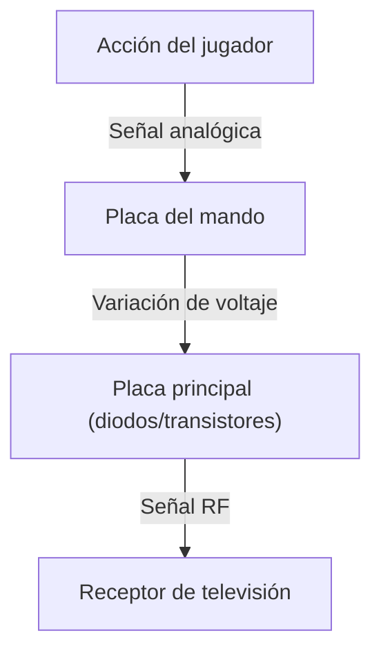
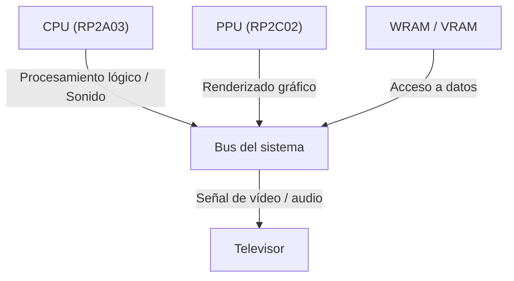

# De los pitidos a mundos virtuales fotorrealistas: 50 años de evolución e innovaciones tecnológicas en las consolas de videojuegos

La historia de las consolas de videojuegos domésticas es, en esencia, la historia de la propia tecnología informática. Desde los primitivos circuitos lógicos iniciales hasta los sistemas modernos que aprovechan GPU avanzadas y almacenamiento SSD de altísima velocidad, el ritmo de las innovaciones técnicas ha sido asombroso. En este artículo, analizamos en profundidad la evolución de las videoconsolas durante los últimos 50 años desde una perspectiva técnica.

## 1. La era pionera: De los circuitos lógicos a los microprocesadores (década de 1970)

Las primeras consolas domésticas nacieron en una época en la que el software no se "ejecutaba", sino que los propios circuitos lógicos del hardware funcionaban directamente como la lógica del juego.

### Magnavox Odyssey y la lógica por hardware
Lanzada en 1972 como la primera consola doméstica del mundo, la "Magnavox Odyssey" carecía de CPU. Funcionaba mediante una lógica puramente cableada a base de diodos y transistores interconectados, generando puntos de luz en la pantalla que los jugadores controlaban mediante diales mecánicos.



### Atari 2600 y la introducción del microprocesador
Aparecida en 1977, la "Atari 2600" incorporaba una CPU (MOS Technology 6507) y el chip TIA (Television Interface Adapter) para procesar gráficos y sonido. Sentó las bases de las consolas modernas al permitir intercambiar programas almacenados en cartuchos ROM.

```assembly
; Ejemplo de ensamblador 6502 para Atari 2600 (limpieza de memoria / pantalla)
ClearMem:
    LDA #0
    STA $00
    STA $01
    STA $02
    ; ... (continúa)
```

## 2. Los albores de la era de 8 bits y el Family Computer (década de 1980)

La llegada en 1983 del "Family Computer (Famicom / NES)" marcó un punto de inflexión decisivo en la historia de las consolas de videojuegos.

### Refinamiento de la arquitectura
La Famicom integraba una CPU personalizada fabricada por Ricoh (RP2A03, basada en el 6502) y una PPU (Picture Processing Unit). La inclusión de la PPU hizo posible el renderizado de sprites y un desplazamiento de pantalla (scrolling) por hardware suave y eficiente.



Expresado matemáticamente, la cantidad de sprites $S$ que la PPU podía procesar simultáneamente y el número de píxeles dibujables $P$ estaban estrictamente limitados por el ancho de banda de memoria $B$ de la época:
$$ P = \sum_{i=1}^{S} (w_i \times h_i) \le \frac{B}{f} $$
($f$ representa la tasa de refresco de fotogramas, habitualmente 60 Hz).

## 3. La batalla de los 16 bits: Mega Drive y Super Famicom (primera mitad de la década de 1990)

Al entrar en la era de los 16 bits, el aumento del ancho del bus y de los registros de la CPU multiplicó la capacidad de procesamiento, y se generalizó la adopción de coprocesadores dedicados y chips de sonido avanzados.

### Arquitecturas de sonido exclusivas
La Super Famicom (Super Nintendo / SNES) incorporaba el chip de sonido "SPC700" desarrollado por Sony, permitiendo reproducir música con calidad orquestal mediante audio por muestreo (samples PCM). Por su parte, la Mega Drive (Sega Genesis) equipaba el chip de síntesis FM "YM2612" de Yamaha, generando un sonido metálico potente y característico.

## 4. La revolución de los gráficos 3D y los discos ópticos (segunda mitad de la década de 1990)

Con la irrupción de la primera PlayStation, la Sega Saturn y Nintendo 64, los videojuegos dieron el salto definitivo del 2D al 3D, y los soportes de almacenamiento pasaron de los cartuchos ROM a los CD-ROM.

### Renderizado poligonal y cálculo geométrico
El fundamento de los gráficos 3D radica en la transformación matricial de coordenadas de vértices. Un punto $V (x,y,z,1)$ en el espacio tridimensional se proyecta como un punto $V'$ sobre la pantalla bidimensional mediante el producto sucesivo de las matrices de transformación del modelo, de la vista y de proyección:

$$ V' = P \cdot V_{view} \cdot M \cdot V $$

PlayStation incorporó un coprocesador dedicado denominado "GTE (Geometry Transfer Engine)", diseñado para ejecutar estas operaciones matriciales a gran velocidad.


## 5. La era de los sombreadores programables y la alta definición (décadas de 2000 y 2010)

Durante la generación de PlayStation 3 y Xbox 360, las consolas adoptaron sombreadores programables (programmable shaders) de propósito general, lo que permitió iluminación compleja y renderizado basado en física (PBR) a nivel de píxel.

### El auge de los procesadores multinúcleo
El procesador "Cell Broadband Engine" de PS3 implementó una arquitectura multinúcleo asimétrica compuesta por un núcleo PowerPC (PPE) y ocho procesadores de cómputo vectorial (SPE).

```cpp
// Pseudocódigo de procesamiento para SPE en el procesador Cell
void spe_main() {
    float4 vector_a = spu_splats(1.0f);
    float4 vector_b = spu_splats(2.0f);
    float4 result = spu_add(vector_a, vector_b);
    // Transferencia DMA para escribir de vuelta en la memoria principal
}
```

## 6. Arquitectura moderna y almacenamiento de ultra alta velocidad (década de 2020)

En las consolas más recientes, como PlayStation 5 y Xbox Series X/S, la arquitectura de hardware ha convergido hacia diseños muy cercanos a los de un PC (basados en x86-64); sin embargo, la mayor innovación reside en la altísima velocidad de E/S alcanzada mediante controladores SSD propietarios personalizados.

### Trazado de rayos y aceleración por hardware
La tecnología de trazado de rayos (ray tracing), que simula con precisión física el comportamiento de la luz, su reflexión y refracción, se encuentra implementada a nivel de hardware, posibilitando una iluminación fotorrealista en tiempo real.

### Mirando hacia el futuro
Aunque la forma física de las consolas continúa transformándose con la integración del juego en la nube (cloud gaming) y la realidad virtual y aumentada (VR/AR), la filosofía central de "proporcionar el mejor entretenimiento mediante hardware especializado" se ha mantenido inmutable desde los días de la Magnavox Odyssey hasta nuestros días.
