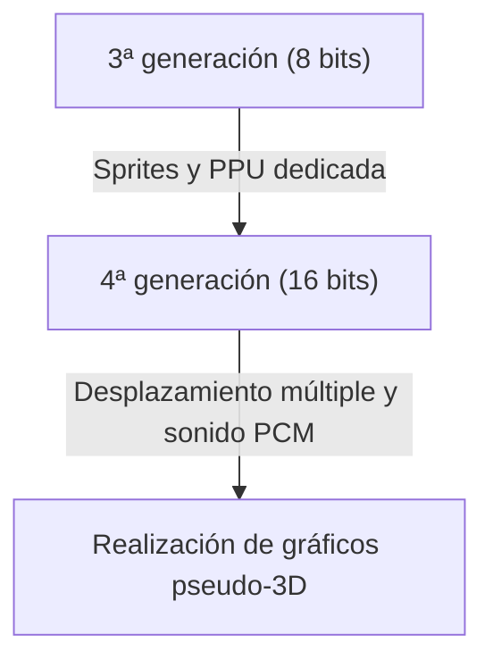

# De los pitidos a los mundos virtuales fotorrealistas: 50 años de evolución e innovación tecnológica de las consolas de videojuegos

La historia de las consolas de videojuegos para el hogar está estrechamente ligada a la evolución de la tecnología informática. Desde la época en que eran una mera colección de componentes electrónicos hasta alcanzar la altísima potencia de procesamiento y el trazado de rayos en tiempo real actuales, las consolas han evolucionado continuamente durante aproximadamente 50 años. En este artículo, repasamos esta historia generación tras generación y exploramos las innovaciones tecnológicas que han tenido lugar.

## 1. Los albores: La ausencia de CPU y la lógica de hardware (1ª generación)

La historia de las consolas domésticas se remonta a la década de 1970. La "Magnavox Odyssey" (1972), considerada la primera consola del mundo, no contaba con una CPU (Unidad Central de Procesamiento) tal y como la conocemos hoy.

En su lugar, estaba compuesta exclusivamente por circuitos lógicos de hardware puro mediante transistores y diodos, y solo podía mostrar y mover puntos en blanco y negro en la pantalla. La anécdota de que se pegaban láminas superpuestas de plástico directamente en la pantalla del televisor para representar los fondos o escenarios del juego es un reflejo de las limitaciones técnicas de la época.

## 2. La aparición de los microprocesadores y la era de los 8 bits (2ª a 3ª generación)

Desde finales de los años 70 hasta los 80, la caída del precio de los microprocesadores (CPU) provocó la transición de las consolas al estilo moderno de cargar software (cartuchos ROM) y ejecutar programas.

Las consolas de segunda generación como la Atari 2600 solo tenían unos pocos kilobytes de memoria y gráficos muy simples. Sin embargo, la situación cambió radicalmente con la "Family Computer (Famicom/NES)", lanzada por Nintendo en 1983. Al incorporar una PPU (Picture Processing Unit) dedicada y hacer posible la función de "sprites" (tecnología para mover personajes independientemente del fondo), la gente pudo disfrutar en casa de juegos de acción fluidos y coloridos.

## 3. La innovación de los 16 bits y el salto a los gráficos 3D (4ª generación)

La década de 1990 marcó la llegada de la era de los 16 bits, representada por la Super Nintendo Entertainment System (Super Famicom) y la Sega Genesis (Mega Drive).

El aumento espectacular de la capacidad de procesamiento permitió más colores en pantalla, el desplazamiento múltiple o "scroll parallax" (técnica que divide el fondo en múltiples capas que se mueven a diferentes velocidades para crear un efecto de profundidad) y representaciones pseudo-3D (como el "Modo 7" de Super Nintendo). Además, en el apartado sonoro, la adopción de fuentes de sonido PCM mejoró drásticamente la capacidad expresiva, permitiendo música de fondo orquestal y la reproducción de voces reales.

## 4. El impacto de los polígonos 3D y el CD-ROM (5ª generación)

1994 se considera uno de los mayores puntos de inflexión para las consolas, con la llegada de la "PlayStation" y la "Sega Saturn".

La principal característica de esta generación es la transición completa del 2D (arte de píxeles) a los polígonos 3D. La capacidad de renderizar en tiempo real modelos 3D con mapeado de texturas revolucionó por completo la experiencia de juego hasta ese momento. Además, el cambio de soporte de almacenamiento, de cartuchos ROM a CD-ROM, aumentó la capacidad de datos cientos de veces. Esto permitió incluir escenas de eventos con voces completas y largas y hermosas secuencias de video prerrenderizadas (CGI), evolucionando los juegos hacia una experiencia más "cinematográfica".

## 5. Conexión a Internet y entrada en la era HD (6ª a 7ª generación)

A principios de los 2000, con la sexta generación (PlayStation 2, Nintendo GameCube, la primera Xbox), el uso del DVD y las partidas multijugador en línea a través de Internet comenzaron a popularizarse de manera gradual.

En la siguiente séptima generación (PlayStation 3, Xbox 360, Wii), por fin se soportó la resolución HD (alta definición). Se introdujeron de lleno los shaders programables, lo que hizo que la física de la luz y las sombras evolucionara drásticamente, mostrando de manera realista la textura de los metales o los reflejos en la superficie del agua. Además, en esta época se sentaron las bases de las consolas actuales como plataformas, incluyendo la compra de juegos descargables en tiendas en línea y las actualizaciones de firmware.

## 6. Mundos virtuales fotorrealistas y la actualidad (8ª a 9ª generación)

Al llegar a la PlayStation 4 y Xbox One (8ª generación), y a las actuales PlayStation 5 y Xbox Series X/S (9ª generación), las consolas de juegos se están integrando cada vez más con arquitecturas de PC de altísimo rendimiento.

Las tecnologías destacadas de la última generación son las siguientes:

- **Trazado de rayos en tiempo real**: Tecnología que calcula la refracción y el reflejo de la luz, y las sombras complejas de la misma manera que en el mundo real, para generar imágenes extremadamente fotorrealistas.
- **SSD ultrarrápidos**: Al cargar datos a una velocidad incomparable con la de los HDD tradicionales, se eliminaron virtualmente las pantallas de carga, permitiendo el movimiento continuo por enormes mundos abiertos.
- **Retroalimentación háptica (táctil)**: Controla de manera precisa las vibraciones del mando, transmitiendo directamente a las manos del jugador la sensación de las gotas de lluvia al caer o la resistencia al tensar un arco.

## Conclusión

En medio siglo, las consolas de videojuegos para el hogar han experimentado una evolución extraordinaria, pasando de ser "máquinas que mueven puntos de luz" a "ordenadores que simulan mundos indistinguibles de la realidad". Esta evolución es el resultado de la tecnología de semiconductores, las API de gráficos y el ingenio de los creadores de juegos apasionados.

En el futuro, la naturaleza de las consolas se diversificará aún más con los juegos en la nube, la tecnología de IA y una mayor integración con la RV/RA. Sin embargo, el objetivo fundamental de buscar la mejor experiencia de entretenimiento nunca cambiará.
