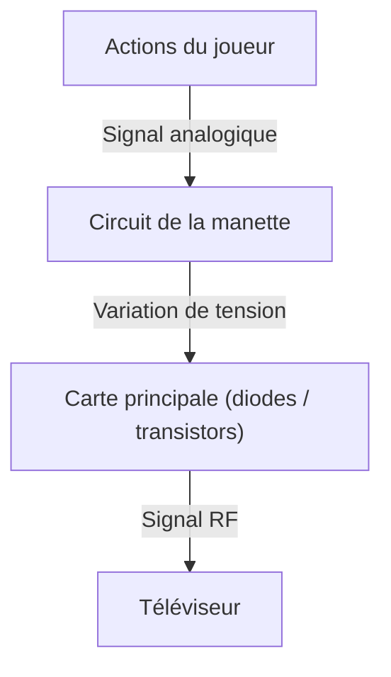
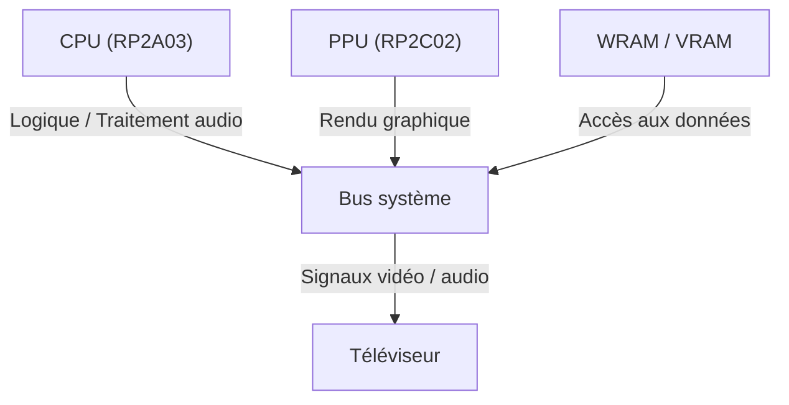
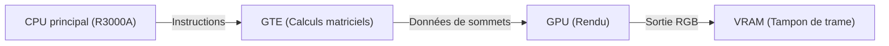

# Des bips électroniques aux mondes virtuels photoréalistes : 50 ans d'évolution et d'innovations techniques des consoles de salon

L'histoire des consoles de jeux vidéo de salon est indissociable de celle de l'informatique elle-même. Des premiers circuits logiques élémentaires jusqu'aux systèmes de pointe exploitant des GPU ultra-performants et des SSD sur mesure, les ruptures technologiques ont été spectaculaires. Dans cet article, nous analysons en détail l'évolution des consoles de jeux de salon au cours des cinquante dernières années sous l'angle de l'ingénierie et de l'architecture matérielle.

## 1. L'ère pionnière : des circuits logiques aux microprocesseurs (années 1970)

Les premières consoles de salon n'« exécutaient » pas de logiciels au sens moderne du terme : les circuits logiques matériels constituaient la logique même du jeu.

### La Magnavox Odyssey et la logique matérielle câblée
Lancée en 1972, la première console de jeux vidéo de salon au monde, la « Magnavox Odyssey », était totalement dépourvue de processeur (CPU). Grâce à une logique matérielle pure associant diodes et transistors, la machine générait des points lumineux à l'écran, que les joueurs manipulaient à l'aide de potentiomètres.



### L'Atari 2600 et l'introduction du microprocesseur
Sortie en 1977, l'« Atari 2600 » a intégré un processeur central (le MOS Technology 6507) ainsi qu'un circuit dédié au traitement des graphismes et du son, le TIA (*Television Interface Adapter*). En introduisant la possibilité de charger différents programmes via des cartouches ROM interchangeables, elle a posé les fondations des consoles modernes.

```assembly
; Exemple d'assembleur 6502 pour Atari 2600 (effacement de la mémoire d'affichage)
ClearMem:
    LDA #0
    STA $00
    STA $01
    STA $02
    ; ... (suite)
```

## 2. L'avènement de l'ère 8-bits et la Famicom / NES (années 1980)

Le lancement de la « Family Computer (Famicom) » en 1983 (commercialisée sous le nom de NES en Occident) marque un tournant décisif dans l'histoire des consoles.

### Un raffinement architectural
La Famicom intégrait un processeur personnalisé conçu par Ricoh (le RP2A03, dérivé du 6502) ainsi qu'un processeur graphique dédié, le PPU (*Picture Processing Unit*). L'introduction du PPU a rendu possible l'affichage matériel de sprites et un défilement d'écran (*scrolling*) fluide géré par le matériel.



D'un point de vue mathématique, le nombre de sprites $S$ que le PPU pouvait traiter simultanément et le nombre de pixels affichables $P$ étaient soumis à des contraintes strictes imposées par la bande passante mémoire $B$ de l'époque :
$$ P = \sum_{i=1}^{S} (w_i \times h_i) \le \frac{B}{f} $$
($f$ représentant la fréquence de rafraîchissement, généralement 60 Hz)

## 3. La guerre du 16-bits : Mega Drive contre Super Famicom (début des années 1990)

Avec l'avènement de l'ère 16 bits, l'élargissement de la largeur de bus et des registres CPU a décuplé la puissance de calcul, tandis que des puces sonores dédiées et des coprocesseurs spécialisés faisaient leur apparition.

### Des architectures sonores distinctives
La Super Famicom (Super Nintendo / SNES) embarquait la puce « SPC700 » de Sony, permettant l'utilisation de sons échantillonnés pour générer des bandes-son quasi orchestrales. En face, la Mega Drive (Sega Genesis) intégrait le processeur de synthèse FM « YM2612 » de Yamaha, délivrant des sonorités métalliques, percutantes et reconnaissables entre toutes.

## 4. La révolution de la 3D et le support optique (fin des années 1990)

Cette génération, marquée par l'arrivée de la première PlayStation, de la Sega Saturn et de la Nintendo 64, a vu le jeu vidéo basculer de la 2D vers la 3D polygonale, et le support de stockage passer de la cartouche ROM au CD-ROM.

### Rendu polygonal et calculs géométriques
Le fondement de l'imagerie 3D repose sur la transformation matricielle des coordonnées de sommets (*vertices*). Dans l'espace tridimensionnel, un point $V (x,y,z,1)$ est projeté sur l'écran 2D sous forme d'un point $V'$ par la multiplication successive des matrices de modélisation, de vue et de projection :

$$ V' = P \cdot V_{view} \cdot M \cdot V $$

La PlayStation intégrait un coprocesseur géométrique dédié, le « GTE (*Geometry Transfer Engine*) », capable d'effectuer ces opérations matricielles à très haute cadence.



## 5. L'ère des shaders programmables et de la haute définition (années 2000 - 2010)

Avec l'arrivée de la PlayStation 3 et de la Xbox 360, les consoles ont adopté des shaders programmables polyvalents, ouvrant la voie à des éclairages complexes au niveau du pixel et au rendu basé sur la physique (*Physically Based Rendering* ou PBR).

### L'essor des architectures multicœurs
Le processeur « Cell Broadband Engine » de la PS3 utilisait une architecture multicœur asymétrique novatrice, combinant un cœur PowerPC principal (PPE) et huit coprocesseurs vectoriels (SPE).

```cpp
// Pseudo-code illustrant un traitement vectoriel sur SPE pour le processeur Cell
void spe_main() {
    float4 vector_a = spu_splats(1.0f);
    float4 vector_b = spu_splats(2.0f);
    float4 result = spu_add(vector_a, vector_b);
    // Réécriture dans la mémoire principale via un transfert DMA
}
```

## 6. Architectures modernes et E/S ultra-rapides (années 2020)

Avec la PlayStation 5 et les Xbox Series X/S, l'architecture matérielle s'est rapprochée de celle des PC modernes (fondée sur le x86-64). Néanmoins, la véritable rupture technique provient des contrôleurs SSD personnalisés et de sous-systèmes d'E/S ultra-rapides.

### Lancer de rayons (Ray Tracing) et accélération matérielle
Le lancer de rayons (*ray tracing*), qui calcule la physique de réfraction et de réflexion de la lumière de manière réaliste, est désormais accéléré directement au niveau matériel, offrant des éclairages et reflets fidèles en temps réel.

### Vers l'avenir
Bien que la forme des consoles continue d'évoluer avec l'essor du cloud gaming et la convergence avec la réalité virtuelle et augmentée (VR/AR), la philosophie centrale reste inchangée depuis l'Odyssey : « offrir la meilleure expérience de divertissement possible grâce à un matériel dédié sur mesure ».
