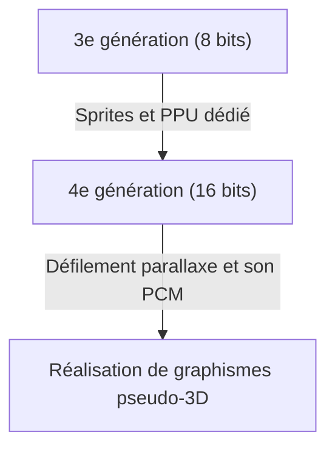

# Des bips aux mondes virtuels photoréalistes : 50 ans d'évolution et d'innovation technologique des consoles de jeux vidéo

L'histoire des consoles de jeux vidéo de salon est intimement liée à l'évolution de la technologie informatique. De l'époque où elles n'étaient qu'un simple assemblage de composants électroniques jusqu'à l'obtention des capacités de traitement ultra-performantes et du ray tracing en temps réel d'aujourd'hui, les consoles n'ont cessé d'évoluer depuis environ 50 ans. Dans cet article, nous revenons sur cette histoire génération par génération et explorons les innovations technologiques qui ont eu lieu.

## 1. L'aube : L'absence de processeur et la logique matérielle (1ère génération)

L'histoire des consoles de salon remonte aux années 1970. La « Magnavox Odyssey » (1972), considérée comme la première console de salon au monde, n'était pas équipée d'un CPU (processeur central) tel que nous le connaissons aujourd'hui.

Au lieu de cela, elle était composée exclusivement de circuits logiques purement matériels utilisant des transistors et des diodes, et ne pouvait qu'afficher et déplacer des points en noir et blanc sur l'écran. L'anecdote selon laquelle on collait directement des calques en plastique sur l'écran du téléviseur pour représenter les décors du jeu témoigne des limites techniques de l'époque.

## 2. L'avènement des microprocesseurs et l'ère des 8 bits (2e à 3e génération)

De la fin des années 1970 aux années 1980, la baisse des prix des microprocesseurs (CPU) a conduit les consoles à adopter le style moderne consistant à charger des logiciels (cartouches ROM) et à exécuter des programmes.

Les consoles de 2e génération comme l'Atari 2600 ne possédaient encore que quelques kilo-octets de mémoire et des graphismes très simples. Cependant, la situation a radicalement changé avec la sortie de la « Family Computer (Famicom/NES) » par Nintendo en 1983. En intégrant un PPU (Picture Processing Unit) dédié et en réalisant la fonction de « sprite » (technologie permettant de déplacer les personnages indépendamment du décor), elle a permis de profiter chez soi de jeux d'action fluides et colorés.

## 3. L'innovation du 16 bits et le tremplin vers la 3D (4e génération)

Les années 1990 ont marqué l'arrivée de l'ère du 16 bits, représentée par la Super Nintendo Entertainment System (Super Famicom) et la Sega Genesis (Mega Drive).

L'augmentation spectaculaire de la puissance de traitement a permis d'accroître le nombre de couleurs affichées, d'utiliser le défilement parallaxe (technologie qui divise le décor en plusieurs couches se déplaçant à des vitesses différentes pour créer une impression de profondeur) et de réaliser des représentations en pseudo-3D (comme le « Mode 7 » de la Super Nintendo). Sur le plan sonore, l'adoption de sources sonores PCM a considérablement amélioré l'expressivité, permettant de reproduire des musiques d'ambiance orchestrales et de véritables voix.

## 4. L'impact des polygones 3D et du CD-ROM (5e génération)

1994 est considérée comme l'un des plus grands tournants pour les consoles, avec l'arrivée de la « PlayStation » et de la « Sega Saturn ».

La caractéristique majeure de cette génération est le passage complet de la 2D (pixel art) aux polygones en 3D. La capacité de faire le rendu en temps réel de modèles 3D texturés a fondamentalement bouleversé l'expérience de jeu. De plus, le passage du support de stockage de la cartouche ROM au CD-ROM a multiplié par plusieurs centaines la capacité de données. Cela a permis d'inclure des scènes avec des dialogues entièrement doublés et de longues et magnifiques cinématiques précalculées (CGI), faisant évoluer le jeu vers une expérience plus « cinématographique ».

## 5. Connexion Internet et entrée dans l'ère de la HD (6e à 7e génération)

Au début des années 2000, la 6e génération (PlayStation 2, Nintendo GameCube, première Xbox) a vu la démocratisation progressive du DVD et du jeu multijoueur en ligne via Internet.

Avec la 7e génération qui a suivi (PlayStation 3, Xbox 360, Wii), la résolution HD (haute définition) a enfin été prise en charge. Les shaders programmables ont été pleinement intégrés, ce qui a fait considérablement évoluer le calcul physique de la lumière et des ombres, notamment pour la texture des métaux ou les reflets à la surface de l'eau. En outre, c'est à cette époque qu'ont été jetées les bases des consoles actuelles en tant que plates-formes, avec les achats de jeux en téléchargement sur les boutiques en ligne et les fonctionnalités de mise à jour du firmware.

## 6. Mondes virtuels photoréalistes et époque actuelle (8e à 9e génération)

Avec la PlayStation 4 et la Xbox One (8e génération), ainsi que les récentes PlayStation 5 et Xbox Series X/S (9e génération), les consoles de jeux fusionnent de plus en plus avec les architectures PC à ultra-hautes performances.

Les technologies phares de la dernière génération sont les suivantes :

- **Ray tracing en temps réel** : Technologie qui calcule la réfraction et la réflexion de la lumière ainsi que les ombres complexes de la même manière que dans le monde réel, générant ainsi des images extrêmement photoréalistes.
- **SSD ultra-rapides** : En chargeant les données à une vitesse incomparable avec celle des disques durs classiques, ils ont virtuellement supprimé les écrans de chargement et rendu possible le déplacement fluide dans de vastes mondes ouverts.
- **Retour haptique** : Contrôle avec précision les vibrations de la manette, transmettant directement aux mains du joueur la sensation des gouttes de pluie qui tombent ou la résistance lorsqu'il bande un arc.

## Conclusion

En un demi-siècle, les consoles de jeux vidéo de salon ont connu une évolution prodigieuse, passant de « machines déplaçant des points lumineux » à des « ordinateurs simulant des mondes indiscernables de la réalité ». Cette évolution est le fruit des technologies de semi-conducteurs, des API graphiques et de l'ingéniosité de créateurs de jeux passionnés.

À l'avenir, avec le cloud gaming, les technologies de l'IA et une intégration poussée de la VR/AR, la nature des consoles continuera de se diversifier. Cependant, l'objectif fondamental qui est d'offrir la meilleure expérience de divertissement restera toujours le même.
