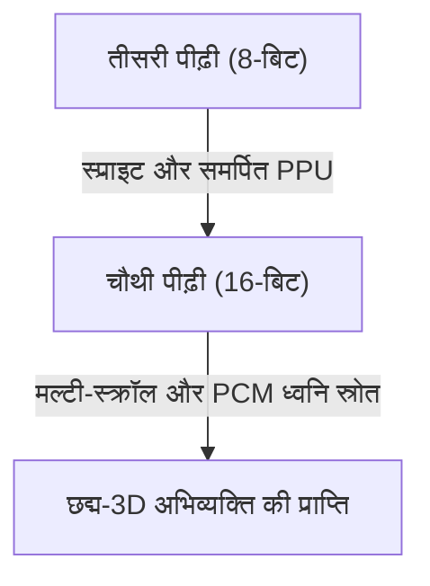
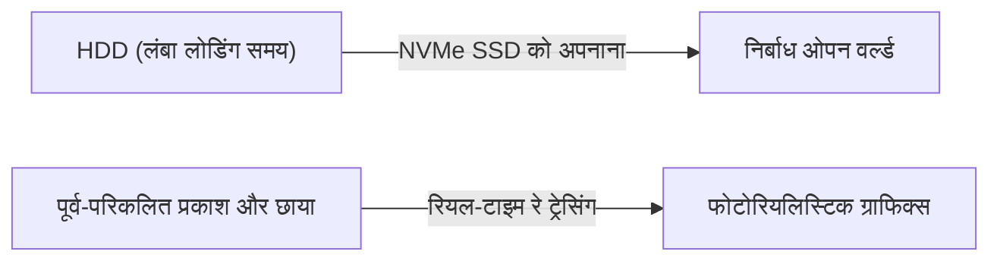

# बीप की आवाज़ से लेकर फोटोरियलिस्टिक वर्चुअल वर्ल्ड तक: वीडियो गेम कंसोल के विकास और तकनीकी नवाचार का 50 साल का इतिहास

होम वीडियो गेम कंसोल का इतिहास कंप्यूटिंग तकनीक के विकास से निकटता से जुड़ा हुआ है। एक ऐसे युग से जब वे केवल इलेक्ट्रॉनिक घटकों का एक संग्रह हुआ करते थे, आज के समय तक जहां वे अति-उच्च प्रदर्शन वाली कंप्यूटिंग शक्ति और रियल-टाइम रे ट्रेसिंग से लैस हैं, वीडियो गेम कंसोल पिछले 50 वर्षों में लगातार विकसित हुए हैं। इस लेख में, हम पीढ़ियों के इतिहास को देखते हुए तकनीकी नवाचारों का पता लगाएंगे।

## 1. शुरुआती युग: सीपीयू की अनुपस्थिति और हार्डवेयर लॉजिक (पहली पीढ़ी)

होम वीडियो गेम कंसोल का इतिहास 1970 के दशक का है। दुनिया का पहला होम वीडियो गेम कंसोल माना जाने वाला "मैग्नावॉक्स ओडिसी" (1972) में आज के समय जैसा सीपीयू (सेंट्रल प्रोसेसिंग यूनिट) नहीं था।

इसके बजाय, यह पूरी तरह से ट्रांजिस्टर और डायोड का उपयोग करने वाले हार्डवेयर लॉजिक सर्किट से बना था, और स्क्रीन पर केवल काले और सफेद बिंदुओं को प्रदर्शित और स्थानांतरित कर सकता था। खेल के बैकग्राउंड और मैदान को दर्शाने के लिए टीवी स्क्रीन पर सीधे प्लास्टिक ओवरले शीट चिपकाने की कहानी उस समय की तकनीकी सीमाओं को दर्शाती है।

## 2. माइक्रोप्रोसेसर का उदय और 8-बिट युग (दूसरी से तीसरी पीढ़ी)

1970 के दशक के अंत से लेकर 1980 के दशक तक, माइक्रोप्रोसेसर (CPU) की कीमतों में गिरावट के साथ, गेम कंसोल सॉफ्टवेयर (रोम कार्ट्रिज) पढ़ने और प्रोग्राम चलाने की आधुनिक शैली में स्थानांतरित हो गए।

अटारी 2600 जैसे दूसरी पीढ़ी के गेम कंसोल में अभी भी केवल कुछ किलोबाइट मेमोरी और बहुत ही सरल ग्राफिक्स थे। हालाँकि, 1983 में निंटेंडो द्वारा "फैमिली कंप्यूटर (फेमिकॉम)" जारी होने के साथ स्थिति काफी बदल गई। एक समर्पित पीपीयू (पिक्चर प्रोसेसिंग यूनिट) से लैस और स्प्राइट फ़ंक्शन (बैकग्राउंड से स्वतंत्र रूप से पात्रों को स्थानांतरित करने की तकनीक) को साकार करने से, घर पर सहज और रंगीन एक्शन गेम का आनंद लेना संभव हो गया।

## 3. 16-बिट नवाचार और 3D ग्राफिक्स की ओर कदम (चौथी पीढ़ी)

1990 के दशक में, 16-बिट कंसोल का युग आया, जिसका प्रतिनिधित्व सुपर निंटेंडो एंटरटेनमेंट सिस्टम (सुपर फेमिकॉम) और सेगा जेनेसिस (मेगा ड्राइव) ने किया।

प्रसंस्करण शक्ति में नाटकीय वृद्धि के साथ, स्क्रीन पर रंगों की संख्या बढ़ गई, और मल्टी-स्क्रॉलिंग (त्रि-आयामी प्रभाव देने के लिए बैकग्राउंड को कई परतों में विभाजित करने और उन्हें अलग-अलग गति से घुमाने की तकनीक) और छद्म-3D (Pseudo-3D) अभिव्यक्ति (जैसे सुपर निंटेंडो का "मोड 7") संभव हो गई। ध्वनि के संदर्भ में, पीसीएम ध्वनि स्रोतों को अपनाया गया, जिससे ऑर्केस्ट्रा शैली बीजीएम और वास्तविक मानव आवाज़ों का प्लेबैक संभव हो गया, जिससे अभिव्यक्ति की शक्ति नाटकीय रूप से बढ़ गई।

## 4. 3D बहुभुज और CD-ROM का प्रभाव (पांचवीं पीढ़ी)

1994 को "प्लेस्टेशन" और "सेगा सैटर्न" की शुरुआत के साथ गेम कंसोल के लिए सबसे बड़े टर्निंग पॉइंट में से एक माना जा सकता है।

इस पीढ़ी की सबसे बड़ी विशेषता 2D (पिक्सेल आर्ट) से 3D पॉलीगॉन (बहुभुज) में पूर्ण संक्रमण है। रियल-टाइम में टेक्सचर मैपिंग के साथ 3D मॉडल को रेंडर करने की क्षमता ने गेमिंग अनुभव को मौलिक रूप से बदल दिया। इसके अलावा, स्टोरेज मीडिया के रोम कार्ट्रिज से सीडी-रोम में स्थानांतरित होने के साथ, डेटा क्षमता सैकड़ों गुना बढ़ गई। पूर्ण आवाज़ वाले कटसीन और लंबे, सुंदर प्री-रेंडर किए गए मूवी (CGI) को शामिल करना संभव हो गया, और गेम अधिक "सिनेमाई" अनुभव में विकसित हुए।

## 5. इंटरनेट कनेक्शन और HD युग में प्रवेश (छठी से सातवीं पीढ़ी)

2000 के दशक की शुरुआत में छठी पीढ़ी (प्लेस्टेशन 2, निंटेंडो गेम क्यूब, मूल एक्सबॉक्स) में, डीवीडी का उपयोग और इंटरनेट के माध्यम से ऑनलाइन मल्टीप्लेयर धीरे-धीरे फैलने लगा।

बाद की सातवीं पीढ़ी (प्लेस्टेशन 3, एक्सबॉक्स 360, Wii) में, गेम अंततः HD (हाई डेफिनिशन) रिज़ॉल्यूशन का समर्थन करने लगे। प्रोग्राम करने योग्य शेडर्स को पूरी तरह से पेश किया गया था, और प्रकाश और छाया की भौतिक गणना, जैसे धातु की बनावट और पानी की सतह के प्रतिबिंब, नाटकीय रूप से विकसित हुए। इसके अलावा, एक मंच के रूप में आधुनिक गेम कंसोल की नींव इस युग में स्थापित की गई थी, जिसमें ऑनलाइन स्टोर से गेम डाउनलोड करने की सुविधा और फर्मवेयर अपडेट फ़ंक्शन शामिल थे।

## 6. फोटोरियलिस्टिक वर्चुअल वर्ल्ड और वर्तमान (आठवीं से नौवीं पीढ़ी)

प्लेस्टेशन 4 और एक्सबॉक्स वन (8वीं पीढ़ी), और नवीनतम प्लेस्टेशन 5 और एक्सबॉक्स सीरीज़ X/S (9वीं पीढ़ी) तक आते-आते, गेम कंसोल को अल्ट्रा-हाई-परफॉर्मेंस पीसी आर्किटेक्चर के साथ तेजी से एकीकृत किया जा रहा है।

नवीनतम पीढ़ियों में प्रदर्शित तकनीकें इस प्रकार हैं:

- **रियल-टाइम रे ट्रेसिंग**: एक ऐसी तकनीक जो वास्तविक दुनिया की तरह ही प्रकाश के अपवर्तन, प्रतिबिंब और जटिल छाया अभिव्यक्तियों की गणना करके अत्यंत फोटोरियलिस्टिक छवियां उत्पन्न करती है।
- **अल्ट्रा-फास्ट SSD**: पारंपरिक एचडीडी की तुलना में बहुत तेज़ गति से डेटा लोड करके, लोडिंग स्क्रीन वस्तुतः समाप्त हो गई है, जिससे विशाल ओपन वर्ल्ड में सहजता से घूमना संभव हो गया है।
- **हैप्टिक फीडबैक**: नियंत्रक के कंपन को सटीक रूप से नियंत्रित करके, यह खिलाड़ियों को सीधे बारिश की बूंदों के गिरने या धनुष खींचते समय प्रतिरोध की भावना जैसे अहसास पहुंचाता है।

## निष्कर्ष

आधी सदी में, होम वीडियो गेम कंसोल "चमकते बिंदुओं को घुमाने वाली मशीनों" से "ऐसे कंप्यूटरों में विकसित हुए हैं जो एक ऐसी दुनिया का अनुकरण करते हैं जिसे वास्तविकता समझा जा सकता है"। यह विकास अर्धचालक प्रौद्योगिकी, ग्राफिक्स एपीआई और भावुक गेम निर्माताओं की रचनात्मकता का परिणाम है।

भविष्य में, क्लाउड गेमिंग, एआई तकनीक और वीआर/एआर के साथ और एकीकरण के साथ गेम कंसोल और भी अधिक विविध हो जाएंगे। हालाँकि, सर्वोत्तम मनोरंजन अनुभव प्रदान करने का मूल लक्ष्य कभी नहीं बदलेगा।
