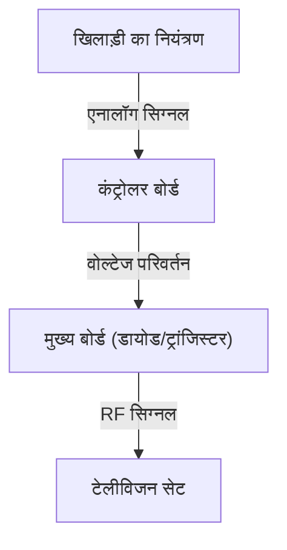
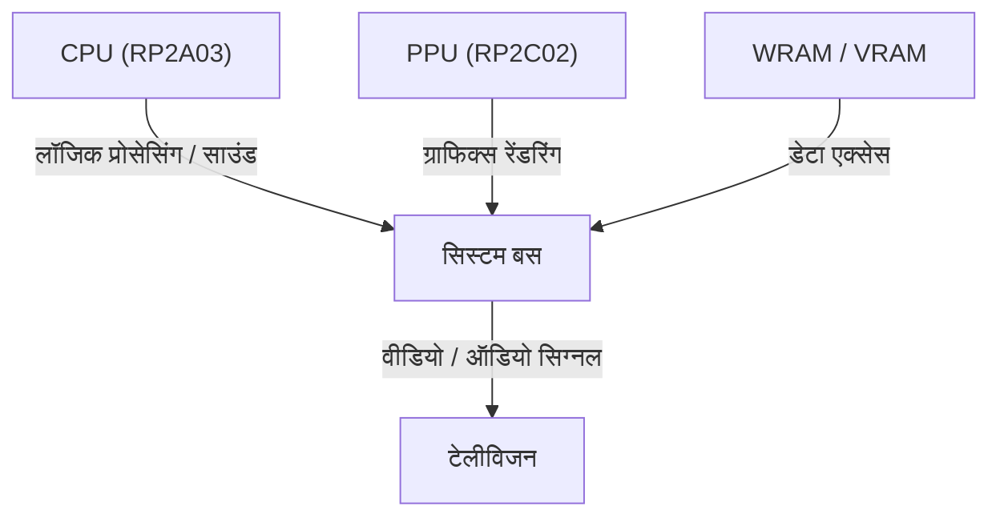
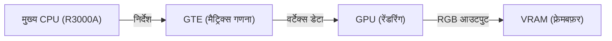

# पिको-पिको ध्वनियों से लेकर फोटोरियलिस्टिक आभासी दुनिया तक: घरेलू गेम कंसोल के 50 वर्षों का विकास और तकनीकी नवाचार

गेम कंसोल (घरेलू वीडियो गेम कंसोल) का इतिहास अनिवार्य रूप से कंप्यूटिंग तकनीक का ही इतिहास है। प्रारंभिक सरल लॉजिक सर्किट से लेकर आधुनिक उन्नत GPU और SSD पर आधारित प्रणालियों तक, यह तकनीकी नवाचार अभूतपूर्व रहा है। इस लेख में, हम पिछले 50 वर्षों में घरेलू गेम कंसोल के विकास का तकनीकी दृष्टिकोण से गहराई से विश्लेषण करेंगे।

## 1. प्रारंभिक युग: लॉजिक सर्किट से माइक्रोप्रोसेसर तक (1970 का दशक)

घरेलू गेम कंसोल की शुरुआत उस दौर से हुई थी जब सॉफ्टवेयर को "निष्पादित" (execute) करने के बजाय हार्डवेयर के लॉजिक सर्किट स्वयं गेम लॉजिक के रूप में कार्य करते थे।

### Magnavox Odyssey और हार्डवेयर लॉजिक
1972 में लॉन्च किया गया दुनिया का पहला घरेलू गेम कंसोल "Magnavox Odyssey" था, जिसमें कोई CPU नहीं था। डायोड और ट्रांजिस्टर के संयोजन से बने शुद्ध हार्डवेयर लॉजिक के माध्यम से स्क्रीन पर प्रकाश के बिंदु (dots) उत्पन्न किए जाते थे, जिन्हें खिलाड़ी डायल की सहायता से नियंत्रित करते थे।



### Atari 2600 और माइक्रोप्रोसेसर का आगमन
1977 में प्रस्तुत किए गए "Atari 2600" में एक CPU (MOS Technology 6507) और ग्राफिक्स व साउंड को प्रोसेस करने वाला TIA (Television Interface Adapter) शामिल था। इसने ROM कार्ट्रिज के माध्यम से प्रोग्राम बदलने की सुविधा देकर आधुनिक गेम कंसोल की नींव रखी।

```assembly
; Atari 2600 6502 असेंबली का उदाहरण (स्क्रीन मेमोरी साफ़ करना)
ClearMem:
    LDA #0
    STA $00
    STA $01
    STA $02
    ; ... (जारी)
```

## 2. 8-बिट युग की शुरुआत और Family Computer (1980 का दशक)

1983 में "Family Computer (Famicom / NES)" का आगमन गेम कंसोल के इतिहास में एक महत्वपूर्ण मोड़ साबित हुआ।

### आर्किटेक्चर का परिष्कार
फैमीकॉम में Ricoh द्वारा निर्मित एक कस्टम CPU (RP2A03, 6502 कस्टम) और PPU (Picture Processing Unit) शामिल था। PPU की उपस्थिति के कारण स्प्राइट (sprites) का प्रदर्शन और स्मूथ हार्डवेयर स्क्रॉलिंग संभव हो सकी।



गणितीय रूप से, PPU द्वारा एक समय में प्रोसेस किए जा सकने वाले स्प्राइट्स की संख्या $S$ और रेंडर किए जा सकने वाले पिक्सल $P$ पर तत्कालीन मेमोरी बैंडविड्थ $B$ द्वारा सख्त सीमाएं थीं:
$$ P = \sum_{i=1}^{S} (w_i \times h_i) \le \frac{B}{f} $$
($f$ फ्रेम दर है, आमतौर पर 60Hz)

## 3. 16-बिट की प्रतिस्पर्धा: Mega Drive और Super Famicom (1990 के दशक का पूर्वार्द्ध)

16-बिट युग में प्रवेश के साथ, CPU की बिट चौड़ाई के विस्तार से प्रोसेसिंग क्षमता में उल्लेखनीय वृद्धि हुई और समर्पित साउंड चिप्स व सह-प्रोसेसर (co-processors) को शामिल किया गया।

### अनूठी साउंड वास्तुकला (Sound Architecture)
Super Famicom (SNES) में Sony की "SPC700" चिप शामिल थी, जिसने सैंपलिंग ऑडियो का उपयोग करके ऑर्केस्ट्रा जैसी पृष्ठभूमि संगीत (BGM) संभव बनाया। दूसरी ओर, Mega Drive में Yamaha की FM साउंड चिप "YM2612" थी, जिसने अपनी विशिष्ट धात्विक (metallic) और ऊर्जावान ध्वनि प्रस्तुत की।

## 4. 3D ग्राफिक्स क्रांति और ऑप्टिकल डिस्क (1990 के दशक का उत्तरार्द्ध)

मूल PlayStation, Sega Saturn और NINTENDO64 के आगमन के इस दौर में, गेम 2D से 3D में बदले और स्टोरेज मीडिया ROM कार्ट्रिज से CD-ROM में परिवर्तित हुआ।

### पॉलीगॉन रेंडरिंग और ज्यामिति गणना (Geometry Calculations)
3D ग्राफिक्स का आधार शीर्ष निर्देशांकों (vertex coordinates) का मैट्रिक्स परिवर्तन (matrix transformation) है। 3D स्पेस के किसी बिंदु $V (x,y,z,1)$ को मॉडल ट्रांसफ़ॉर्म, व्यू ट्रांसफ़ॉर्म और प्रोजेक्शन ट्रांसफ़ॉर्म मैट्रिक्स से गुणा करके 2D स्क्रीन पर बिंदु $V'$ में बदला जाता है:

$$ V' = P \cdot V_{view} \cdot M \cdot V $$

PlayStation में "GTE (Geometry Transfer Engine)" नामक एक समर्पित को-प्रोसेसर शामिल था, जो इन मैट्रिक्स गणनाओं को तीव्र गति से निष्पादित करता था।



## 5. प्रोग्रामेबल शेडर्स और HD का युग (2000 से 2010 का दशक)

PlayStation 3 और Xbox 360 के दौर में, कंसोल ने बहुउद्देशीय "प्रोग्रामेबल शेडर्स" को अपनाया, जिससे पिक्सल स्तर पर जटिल प्रकाश व्यवस्था (lighting) और भौतिक-आधारित रेंडरिंग (PBR) जैसी सतह बनावट संभव हुई।

### मल्टी-कोर प्रोसेसर का उदय
PS3 के "Cell Broadband Engine" में एक PowerPC कोर (PPE) और आठ वेक्टर प्रोसेसिंग प्रोसेसर (SPE) के साथ एक असममित (asymmetric) मल्टी-कोर आर्किटेक्चर का उपयोग किया गया था।

```cpp
// Cell प्रोसेसर में SPE प्रोसेसिंग के लिए स्यूडोकॉड
void spe_main() {
    float4 vector_a = spu_splats(1.0f);
    float4 vector_b = spu_splats(2.0f);
    float4 result = spu_add(vector_a, vector_b);
    // DMA ट्रांसफर के माध्यम से मुख्य मेमोरी में वापस लिखना
}
```

## 6. आधुनिक आर्किटेक्चर और अल्ट्रा-फास्ट I/O (2020 का दशक)

PlayStation 5 और Xbox Series X/S जैसी नवीनतम पीढ़ी में, हार्डवेयर आर्किटेक्चर काफी हद तक PC के समान (x86-64 आधारित) संरचना में परिवर्तित हो गया है, लेकिन कस्टम SSD कंट्रोलर के जरिए अल्ट्रा-फास्ट I/O इस पीढ़ी का सबसे बड़ा नवाचार साबित हुआ।

### रे ट्रेसिंग और हार्डवेयर त्वरण (Hardware Acceleration)
प्रकाश के अपवर्तन (refraction) और परावर्तन (reflection) की भौतिक रूप से सटीक गणना करने वाली रे ट्रेसिंग तकनीक हार्डवेयर स्तर पर लागू की गई है, जिससे वास्तविक दुनिया के बेहद करीब लाइटिंग रीयल-टाइम में संभव हो गई है।

### भविष्य की ओर
क्लाउड गेमिंग, VR/AR का एकीकरण जैसे बदलावों के साथ कंसोल का स्वरूप निरंतर बदल रहा है, लेकिन "समर्पित हार्डवेयर के माध्यम से सर्वश्रेष्ठ मनोरंजन प्रदान करने" का विचार Odyssey के दौर से लेकर आज तक अटूट रूप से बना हुआ है।
