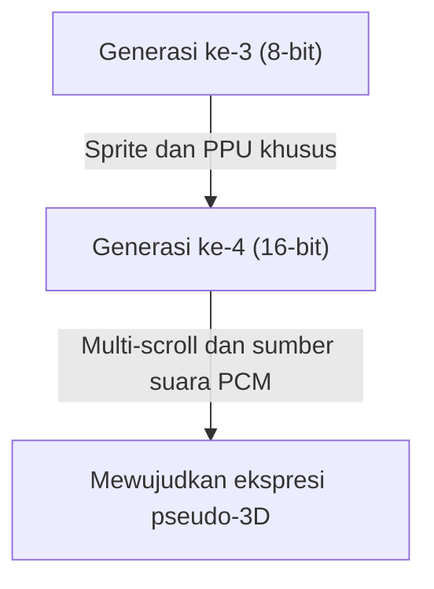
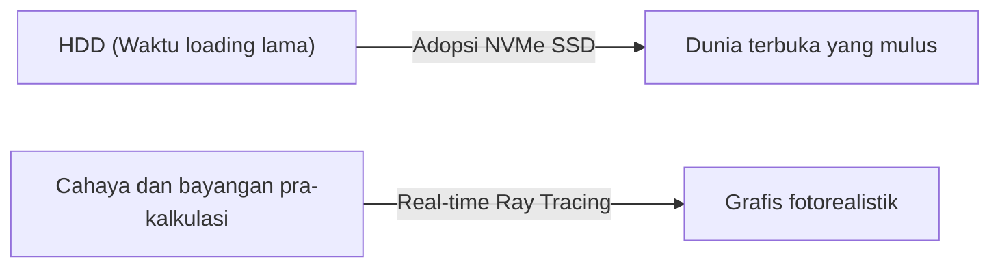

# Dari Suara Bip hingga Dunia Virtual Fotorealistik: 50 Tahun Sejarah Evolusi dan Inovasi Teknologi Konsol Video Game

Sejarah konsol video game rumahan berkaitan erat dengan evolusi teknologi komputasi. Dari era ketika konsol hanya berupa kumpulan komponen elektronik hingga sekarang dilengkapi dengan kemampuan pemrosesan komputasi super tinggi dan *ray tracing* secara real-time, konsol game terus berkembang selama sekitar 50 tahun. Artikel ini akan menelusuri inovasi teknologi yang terjadi sambil melihat kembali sejarahnya dari generasi ke generasi.

## 1. Era Awal: Ketidakadaan CPU dan Logika Perangkat Keras (Generasi ke-1)

Sejarah konsol video game rumahan dimulai pada tahun 1970-an. "Magnavox Odyssey" (1972), yang dianggap sebagai konsol video game rumahan pertama di dunia, tidak dilengkapi dengan CPU (Central Processing Unit) seperti yang kita kenal sekarang.

Sebagai gantinya, konsol ini hanya terdiri dari sirkuit logika perangkat keras murni yang menggunakan transistor dan dioda, dan hanya mampu menampilkan dan menggerakkan titik-titik hitam putih di layar. Kisah tentang lembaran *overlay* plastik yang ditempelkan langsung ke layar TV untuk mewakili latar belakang dan area permainan menunjukkan keterbatasan teknologi pada masa itu.

## 2. Munculnya Mikroprosesor dan Era 8-bit (Generasi ke-2 hingga ke-3)

Dari akhir 1970-an hingga 1980-an, seiring dengan penurunan harga mikroprosesor (CPU), konsol game beralih ke gaya modern yang membaca perangkat lunak (kartrid ROM) dan mengeksekusi program.

Konsol game generasi kedua seperti Atari 2600 masih memiliki memori hanya beberapa kilobyte dan grafis yang sangat sederhana. Namun, dengan dirilisnya "Family Computer (Famicom)" oleh Nintendo pada tahun 1983, situasinya berubah drastis. Dengan dilengkapi PPU (Picture Processing Unit) khusus dan mewujudkan fitur *sprite* (teknologi untuk menggerakkan karakter terlepas dari latar belakang), game aksi yang halus dan penuh warna dapat dinikmati di rumah.

## 3. Inovasi 16-bit dan Langkah Menuju Grafis 3D (Generasi ke-4)

Memasuki tahun 1990-an, tibalah era konsol 16-bit yang diwakili oleh Super Nintendo Entertainment System (Super Famicom) dan Sega Genesis (Mega Drive).

Dengan peningkatan kapasitas pemrosesan yang dramatis, jumlah warna di layar meningkat, dan teknologi seperti *multi-scroll* (teknik membagi latar belakang menjadi beberapa lapisan dan menggerakkannya pada kecepatan berbeda untuk memberikan efek tiga dimensi) dan pseudo-3D (seperti "Mode 7" pada Super Nintendo) menjadi mungkin. Selain itu, dari segi suara, sumber suara PCM diadopsi, memungkinkan pemutaran BGM bergaya orkestra dan suara manusia sungguhan, yang secara dramatis meningkatkan daya ekspresi.

## 4. Poligon 3D dan Dampak CD-ROM (Generasi ke-5)

Tahun 1994 dapat dikatakan sebagai salah satu titik balik terbesar bagi konsol game dengan hadirnya "PlayStation" dan "Sega Saturn".

Ciri khas terbesar dari generasi ini adalah transisi penuh dari 2D (*pixel art*) ke poligon 3D. Kemampuan untuk me-render model 3D dengan *texture mapping* secara real-time mengubah pengalaman bermain game dari akarnya. Selain itu, seiring dengan peralihan media penyimpanan dari kartrid ROM ke CD-ROM, kapasitas data meningkat ratusan kali lipat. Adegan *cutscene* dengan pengisi suara penuh dan film pra-render (CGI) berdurasi panjang dan indah dapat disertakan, membuat game berevolusi menjadi pengalaman yang lebih "sinematik".

## 5. Koneksi Internet dan Memasuki Era HD (Generasi ke-6 hingga ke-7)

Pada generasi keenam di awal tahun 2000-an (PlayStation 2, Nintendo GameCube, Xbox pertama), penggunaan DVD dan pertandingan online melalui internet mulai menyebar secara bertahap.

Di generasi ketujuh berikutnya (PlayStation 3, Xbox 360, Wii), game akhirnya mendukung resolusi HD (High Definition). *Programmable shader* mulai diperkenalkan secara penuh, dan perhitungan fisika cahaya dan bayangan, seperti tekstur logam dan pantulan permukaan air, berevolusi secara dramatis. Selanjutnya, fondasi konsol game modern sebagai platform didirikan di era ini, dengan fitur-fitur seperti mengunduh dan membeli game dari toko online dan fungsi pembaruan *firmware*.

## 6. Dunia Virtual Fotorealistik dan Masa Kini (Generasi ke-8 hingga ke-9)

Memasuki era PlayStation 4 dan Xbox One (generasi ke-8), serta PlayStation 5 dan Xbox Series X/S terbaru (generasi ke-9), konsol game semakin terintegrasi dengan arsitektur PC yang memiliki performa sangat tinggi.

Teknologi unggulan pada generasi terbaru meliputi:

- **Real-time Ray Tracing**: Teknologi yang menghitung pembiasan, pantulan cahaya, dan ekspresi bayangan kompleks seperti di dunia nyata untuk menghasilkan gambar yang sangat fotorealistik.
- **SSD Super Cepat**: Memuat data pada kecepatan yang tak tertandingi oleh HDD tradisional, secara praktis menghilangkan layar *loading* dan memungkinkan perpindahan mulus di dunia terbuka (open world) yang luas.
- **Haptic Feedback**: Mengontrol getaran kontroler secara akurat, secara langsung menyampaikan sensasi seperti tetesan hujan yang jatuh atau hambatan saat menarik busur kepada pemain.

## Kesimpulan

Selama setengah abad, konsol video game telah mengalami evolusi luar biasa dari "mesin penggerak titik terang" menjadi "komputer yang menyimulasikan dunia yang tampak nyata". Evolusi ini merupakan hasil dari teknologi semikonduktor, API grafis, serta kreativitas para kreator game yang penuh semangat.

Di masa depan, konsep konsol game akan semakin beragam dengan adanya *cloud gaming*, teknologi AI, serta integrasi lebih lanjut dengan VR/AR. Namun, tujuan dasar untuk mengejar pengalaman hiburan terbaik tidak akan pernah berubah.
