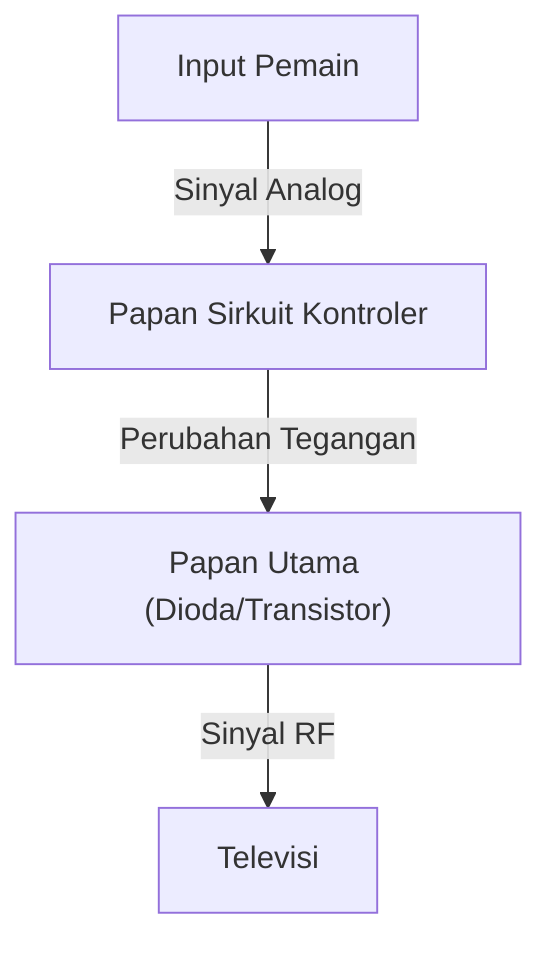
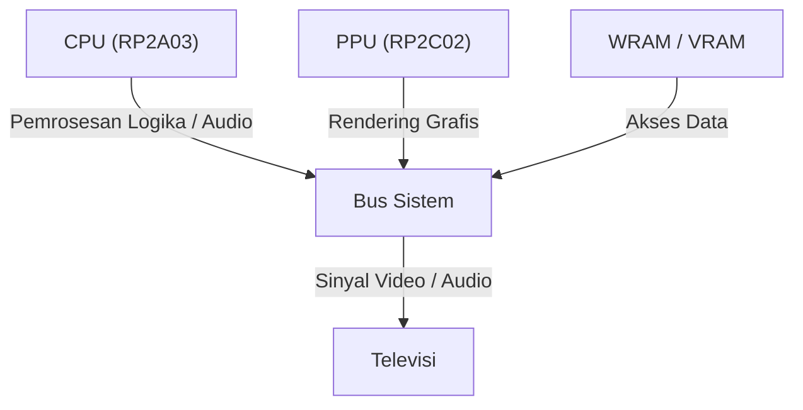
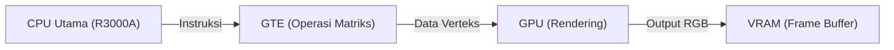

# Dari Suara Bip hingga Dunia Virtual Fotorealistis: 50 Tahun Sejarah Evolusi dan Inovasi Teknologi Konsol Game Rumahan

Sejarah konsol game (*game console* / konsol game rumahan) pada hakikatnya adalah sejarah teknologi komputasi itu sendiri. Dari sirkuit logika sederhana pada masa awal hingga sistem mutakhir yang memanfaatkan GPU canggih dan SSD berkecepatan tinggi, inovasi teknologinya sungguh luar biasa. Artikel ini mengupas secara mendalam evolusi konsol game rumahan selama 50 tahun terakhir dari sudut pandang teknis.

## 1. Era Awal: Dari Sirkuit Logika ke Mikroprosesor (1970-an)

Konsol game rumahan berawal dari era di mana perangkat keras tidak "menjalankan" perangkat lunak, melainkan sirkuit logika perangkat keras itu sendiri yang berfungsi sebagai logika permainan.

### Magnavox Odyssey dan Logika Perangkat Keras
Dirilis pada tahun 1972 sebagai konsol game rumahan pertama di dunia, "Magnavox Odyssey" sama sekali tidak memiliki CPU. Dengan logika perangkat keras murni yang menggabungkan dioda dan transistor, sistem ini menghasilkan titik-titik cahaya di layar, yang kemudian dikendalikan oleh pemain menggunakan kenop putar (*dial*).



### Atari 2600 dan Pengenalan Mikroprosesor
Hadir pada tahun 1977, "Atari 2600" dilengkapi dengan CPU (MOS Technology 6507) serta TIA (Television Interface Adapter) untuk memproses grafis dan audio. Konsol ini meletakkan fondasi bagi konsol game modern yang memungkinkan pertukaran program melalui kartrid ROM.

```assembly
; Contoh Assembler 6502 Atari 2600 (Membersihkan Memori Layar)
ClearMem:
    LDA #0
    STA $00
    STA $01
    STA $02
    ; ... (berlanjut)
```

## 2. Fajar Era 8-Bit dan Family Computer (1980-an)

Kemunculan "Family Computer (Famicom)" pada tahun 1983 menjadi titik balik yang sangat bersejarah dalam evolusi konsol game.

### Penyempurnaan Arsitektur
Famicom dibekali CPU kustom buatan Ricoh (RP2A03, modifikasi dari 6502) dan PPU (Picture Processing Unit). Kehadiran PPU memungkinkan penampilan *sprite* serta *scrolling* berbasis perangkat keras yang mulus.



Jika dinyatakan dalam rumus matematika, jumlah *sprite* $S$ yang dapat diproses PPU sekaligus dan jumlah piksel $P$ yang dapat dirender memiliki batasan ketat yang ditentukan oleh bandwidth memori $B$ pada masa itu:
$$ P = \sum_{i=1}^{S} (w_i \times h_i) \le \frac{B}{f} $$
(dengan $f$ adalah *frame rate*, biasanya 60Hz)

## 3. Persaingan 16-Bit: Mega Drive dan Super Famicom (Awal 1990-an)

Memasuki era 16-bit, kemampuan pemrosesan meningkat pesat berkat perluasan lebar bit CPU, disertai pengenalan cip audio khusus dan prosesor pendamping (*coprocessor*).

### Arsitektur Audio yang Unik
Super Famicom (SNES) dilengkapi dengan cip "SPC700" buatan Sony, yang memanfaatkan audio berbasis sampel (*sampling*) untuk menghadirkan musik latar megah layaknya orkestra. Sebaliknya, Mega Drive mengandalkan cip sintesis FM "YM2612" buatan Yamaha, menghasilkan suara metalik yang bertenaga dan khas.

## 4. Revolusi Grafis 3D dan Cakram Optik (Akhir 1990-an)

Di era hadirnya PlayStation generasi pertama, Sega Saturn, dan NINTENDO64 ini, video game berevolusi dari 2D ke 3D, dan media penyimpanan beralih dari kartrid ROM ke CD-ROM.

### Rendering Poligon dan Kalkulasi Geometri
Fondasi grafis 3D adalah transformasi matriks pada koordinat verteks. Titik dalam ruang 3D $V (x,y,z,1)$ ditransformasikan menjadi titik pada layar 2D $V'$ melalui perkalian matriks transformasi model, transformasi *view*, dan transformasi proyeksi:

$$ V' = P \cdot V_{view} \cdot M \cdot V $$

PlayStation menyematkan prosesor pendamping khusus bernama "GTE (Geometry Transfer Engine)" untuk mempercepat kalkulasi matriks ini secara signifikan.



## 5. Era Programmable Shader dan Definisi Tinggi (HD) (2000-an - 2010-an)

Pada era PlayStation 3 dan Xbox 360, konsol game mulai mengadopsi *programmable shader* serbaguna, memungkinkan pencahayaan kompleks per piksel serta representasi material yang realistis (*Physically Based Rendering* / PBR).

### Kebangkitan Prosesor Multi-Core
"Cell Broadband Engine" pada PS3 mengadopsi arsitektur multi-core asimetris yang terdiri dari satu core PowerPC (PPE) dan delapan prosesor komputasi vektor (SPE).

```cpp
// Kode semu untuk pemrosesan SPE pada prosesor Cell
void spe_main() {
    float4 vector_a = spu_splats(1.0f);
    float4 vector_b = spu_splats(2.0f);
    float4 result = spu_add(vector_a, vector_b);
    // Menulis kembali ke memori utama melalui transfer DMA
}
```

## 6. Arsitektur Modern dan I/O Berkecepatan Ultra-Tinggi (2020-an)

Pada generasi terbaru seperti PlayStation 5 dan Xbox Series X/S, arsitektur perangkat keras semakin berkonvergensi dengan arsitektur PC (berbasis x86-64). Namun demikian, pengontrol SSD kustom yang menghadirkan I/O berkecepatan ultra-tinggi menjadi inovasi paling revolusioner.

### Ray Tracing dan Akselerasi Perangkat Keras
Teknologi *ray tracing*, yang menghitung pembiasan dan pantulan cahaya secara akurat secara fisik, kini diimplementasikan pada tingkat perangkat keras, memungkinkan pencahayaan yang sangat mendekati dunia nyata secara *real-time*.

### Menatap Masa Depan
Meski wujud konsol terus bertransformasi seiring perkembangan *cloud gaming* serta konvergensi VR/AR, filosofi dasar untuk "menyajikan hiburan terbaik melalui perangkat keras khusus" tetap diwariskan tanpa perubahan sejak era Odyssey hingga saat ini.
