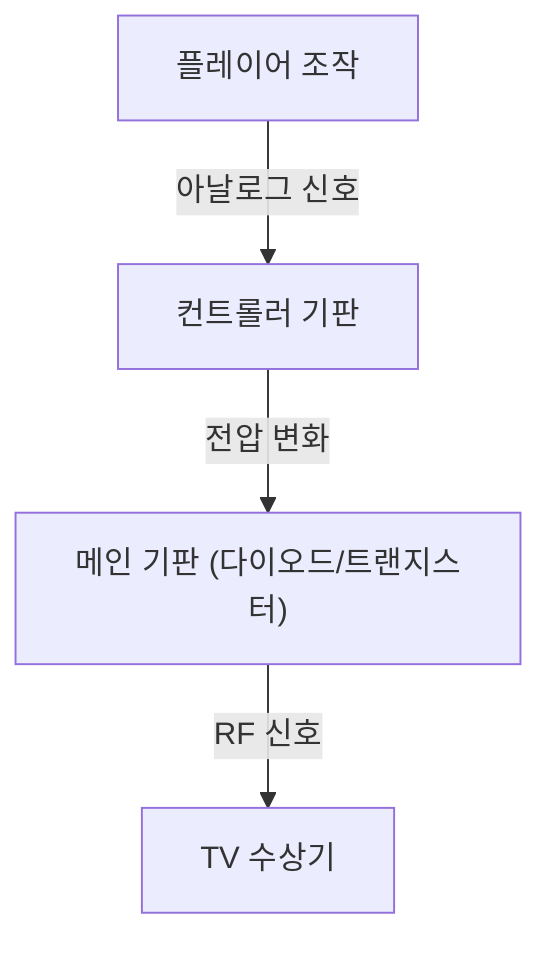
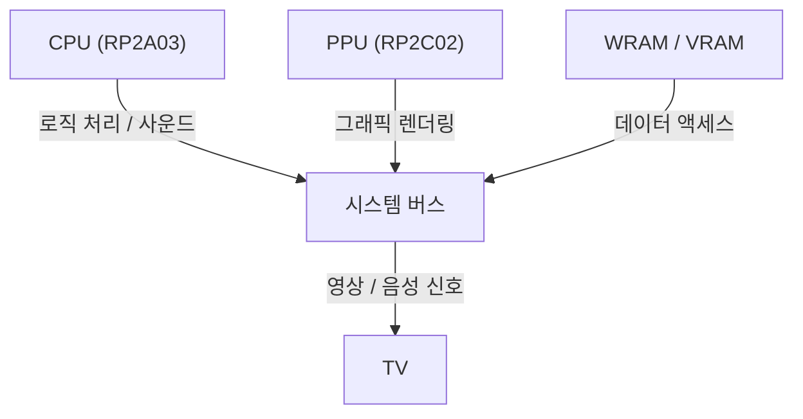

# 비프음에서 포토리얼한 가상 세계로: 가정용 게임기 50년의 진화사와 기술 혁신

게임 콘솔(가정용 게임기)의 역사는 곧 컴퓨팅 기술의 역사이기도 합니다. 초기의 단순한 논리 회로에서 최신 고성능 GPU와 SSD를 활용하는 시스템에 이르기까지 그 기술 혁신은 눈부실 정도입니다. 이 글에서는 지난 50년간 이어진 가정용 게임기의 진화를 기술적인 측면에서 자세히 살펴봅니다.

## 1. 여명기: 논리 회로에서 마이크로프로세서로 (1970년대)

가정용 게임기는 소프트웨어를 '실행'하는 것이 아니라 하드웨어의 논리 회로 자체가 게임 로직으로 작동하던 시대부터 시작되었습니다.

### Magnavox Odyssey와 하드웨어 로직
1972년에 출시된 세계 최초의 가정용 게임기 '마그나복스 오디세이(Magnavox Odyssey)'는 CPU가 없었습니다. 다이오드와 트랜지스터를 조합한 순수 하드웨어 로직을 통해 화면 위에 빛나는 점을 생성하고, 플레이어가 다이얼을 돌려 이를 조작하는 방식이었습니다.



### Atari 2600과 마이크로프로세서의 도입
1977년에 등장한 '아타리 2600(Atari 2600)'은 CPU(MOS Technology 6507)와 그래픽 및 사운드를 처리하는 TIA(Television Interface Adapter)를 탑재하여, ROM 카트리지를 통해 프로그램을 교체할 수 있는 현대적인 게임기의 기초를 마련했습니다.

```assembly
; Atari 2600 6502 어셈블리 예제 (화면 클리어)
ClearMem:
    LDA #0
    STA $00
    STA $01
    STA $02
    ; ... (계속)
```

## 2. 8비트 시대의 개막과 패밀리컴퓨터 (1980년대)

1983년 '패밀리컴퓨터(패미컴)'의 등장은 게임 콘솔 역사에서 주목할 만한 전환점이었습니다.

### 아키텍처의 고도화
패미컴은 리코(Ricoh)사의 커스텀 CPU(RP2A03, 6502 기반 커스텀)와 PPU(Picture Processing Unit)를 탑재했습니다. PPU의 도입 덕분에 스프라이트 표시와 매끄러운 하드웨어 스크롤이 가능해졌습니다.



수식으로 나타내면, PPU가 한 번에 처리할 수 있는 스프라이트 수 $S$와 렌더링 가능한 픽셀 수 $P$에는 당시 메모리 대역폭 $B$에 따른 엄격한 제약이 있었습니다.
$$ P = \sum_{i=1}^{S} (w_i \times h_i) \le \frac{B}{f} $$
($f$는 프레임 레이트, 일반적으로 60Hz)

## 3. 16비트의 경쟁: Mega Drive와 Super Famicom (1990년대 전반)

16비트 시대에 접어들면서 CPU 비트 폭 확장에 따른 처리 능력 향상과 전용 사운드 칩 및 코프로세서 도입이 본격화되었습니다.

### 독자적인 사운드 아키텍처
슈퍼패미컴(SNES)은 소니의 'SPC700'을 탑재하여 샘플링 음원을 활용한 오케스트라풍 BGM을 구현했습니다. 이에 맞선 메가드라이브(Mega Drive)는 야마하의 FM 음원 칩인 'YM2612'를 탑재하여 특유의 금속성 강렬한 사운드를 선보였습니다.

## 4. 3D 그래픽 혁명과 광디스크 (1990년대 후반)

초대 플레이스테이션(PlayStation), 세가 새턴(Sega Saturn), 닌텐도 64(NINTENDO64)가 등장한 이 시기에는 게임이 2D에서 3D로, 미디어 매체가 ROM 카트리지에서 CD-ROM으로 진화했습니다.

### 폴리곤 렌더링과 지오메트리 계산
3D 그래픽의 기본은 정점 좌표의 행렬 변환입니다. 3D 공간의 점 $V (x,y,z,1)$는 모델 변환, 뷰 변환, 프로젝션 변환 행렬을 곱하여 2D 화면상의 점 $V'$로 변환됩니다.

$$ V' = P \cdot V_{view} \cdot M \cdot V $$

플레이스테이션은 'GTE(Geometry Transfer Engine)'라는 전용 코프로세서를 탑재하여 이러한 행렬 연산을 초고속으로 수행했습니다.


## 5. 프로그래머블 셰이더와 HD의 시대 (2000년대~2010년대)

플레이스테이션 3(PlayStation 3)와 엑스박스 360(Xbox 360) 시대에 이르러 게임기는 범용 '프로그래머블 셰이더'를 탑재하여 픽셀 단위의 복잡한 라이팅과 재질 표현(물리 기반 렌더링, PBR)이 가능해졌습니다.

### 멀티코어 프로세서의 대두
PS3의 '셀 브로드밴드 엔진(Cell Broadband Engine)'은 1개의 PowerPC 코어(PPE)와 8개의 벡터 연산 프로세서(SPE)를 탑재한 비대칭 멀티코어 아키텍처를 채택했습니다.

```cpp
// Cell 프로세서의 SPE 처리 의사 코드
void spe_main() {
    float4 vector_a = spu_splats(1.0f);
    float4 vector_b = spu_splats(2.0f);
    float4 result = spu_add(vector_a, vector_b);
    // DMA 전송으로 메인 메모리에 다시 쓰기
}
```

## 6. 모던 아키텍처와 초고속 I/O (2020년대)

플레이스테이션 5(PlayStation 5)와 엑스박스 시리즈 X/S(Xbox Series X/S) 등 최신 세대에서는 하드웨어 아키텍처가 PC에 가까운 형태(x86-64 기반)로 수렴하고 있지만, 독자적인 커스텀 SSD 컨트롤러를 통한 초고속 I/O가 가장 큰 혁신으로 자리 잡았습니다.

### 레이 트레이싱과 하드웨어 가속
빛의 굴절과 반사를 물리적으로 정확하게 계산하는 레이 트레이싱 기술이 하드웨어 수준에서 구현되어 현실 세계에 가까운 조명 처리를 실시간으로 구현할 수 있게 되었습니다.

### 미래를 향하여
클라우드 게이밍, VR/AR과의 융합 등 콘솔의 형태는 계속해서 변화하고 있지만, '전용 하드웨어로 최고의 엔터테인먼트를 제공한다'는 철학은 오디세이(Odyssey) 시절부터 오늘날까지 변함없이 이어져 오고 있습니다.
