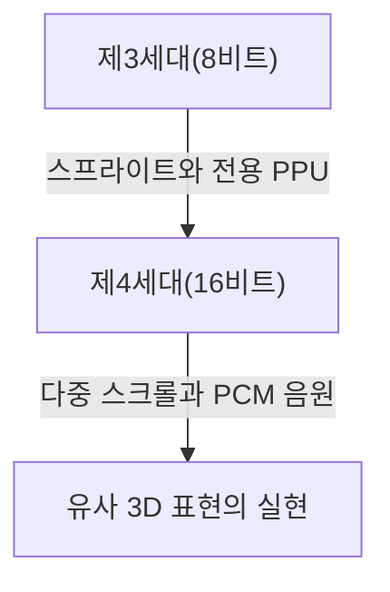
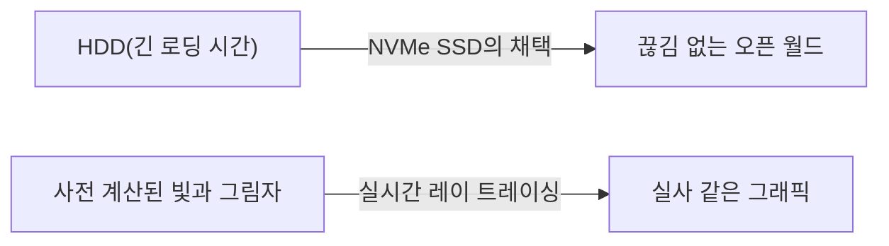

# 전자음에서 실사 같은 가상 세계로: 가정용 게임기 50년의 진화사와 기술 혁신

가정용 게임기(콘솔)의 역사는 컴퓨팅 기술의 진화와 밀접하게 맞닿아 있습니다. 단순한 전자 부품의 집합체였던 시대부터, 현재처럼 초고성능 연산 처리 능력과 실시간 레이 트레이싱을 갖추기까지 약 50년에 걸쳐 게임기는 진화를 거듭해 왔습니다. 본 기사에서는 그 역사를 세대별로 되돌아보며 어떠한 기술 혁신이 있었는지 살펴봅니다.

## 1. 여명기: CPU의 부재와 하드웨어 로직 (제1세대)

가정용 게임기의 역사는 1970년대로 거슬러 올라갑니다. 세계 최초의 가정용 게임기로 꼽히는 '마그나복스 오디세이(Magnavox Odyssey)'(1972년)에는 우리가 현재 알고 있는 CPU(중앙 처리 장치)가 탑재되어 있지 않았습니다.

대신, 트랜지스터와 다이오드를 사용한 순수한 하드웨어 논리 회로만으로 구성되어 있어 화면에 흑백 점을 표시하고 움직이는 것만 가능했습니다. 텔레비전 화면에 플라스틱 오버레이 시트를 직접 붙여서 게임의 배경이나 필드를 표현했다는 일화는 당시의 기술적 한계를 잘 보여줍니다.

## 2. 마이크로프로세서의 등장과 8비트 시대 (제2~제3세대)

1970년대 후반부터 1980년대에 걸쳐 마이크로프로세서(CPU)의 가격 하락으로, 게임기는 소프트웨어(ROM 카트리지)를 읽어 들여 프로그램을 실행하는 현대적인 스타일로 전환되었습니다.

아타리(Atari) 2600 등 제2세대 게임기는 아직 몇 킬로바이트의 메모리만 가지고 있었고 그래픽도 매우 단순했습니다. 하지만 1983년 닌텐도에서 출시한 '패밀리 컴퓨터(패미컴/NES)'로 인해 상황은 완전히 달라집니다. 전용 PPU(화상 처리 장치)를 탑재하고 스프라이트 기능(캐릭터를 배경과 독립적으로 움직이는 기술)을 구현함으로써 부드럽고 색채가 풍부한 액션 게임을 집에서 즐길 수 있게 된 것입니다.

## 3. 16비트의 혁신과 3D 그래픽을 향한 도약 (제4세대)

1990년대에 접어들면서 슈퍼 패미컴(Super NES)과 메가 드라이브(Sega Genesis)로 대표되는 16비트 기기의 시대가 도래합니다.

처리 능력이 비약적으로 향상되면서 화면의 발색 수가 증가했고, 다중 스크롤(배경을 여러 층으로 나누어 다른 속도로 움직여 입체감을 내는 기술)이나 유사 3D 표현(슈퍼 패미컴의 '모드 7' 등)이 가능해졌습니다. 또한, 사운드 측면에서도 PCM 음원이 채택되어 오케스트라풍의 BGM이나 사람의 목소리를 재생할 수 있게 되는 등 표현력이 극적으로 높아졌습니다.

## 4. 3D 폴리곤과 CD-ROM의 충격 (제5세대)

1994년은 게임기 역사에서 가장 큰 전환점 중 하나로 꼽을 수 있습니다. 바로 '플레이스테이션(PlayStation)'과 '세가 새턴(Sega Saturn)'의 등장입니다.

이 세대의 가장 큰 특징은 2D(도트 그래픽)에서 3D 폴리곤으로의 완전한 전환입니다. 텍스처 매핑을 적용한 3D 모델을 실시간으로 렌더링하는 능력은 기존의 게임 경험을 근본적으로 뒤집어 놓았습니다. 또한, 저장 매체가 ROM 카트리지에서 CD-ROM으로 전환되면서 데이터 용량이 수백 배로 증가했습니다. 풀 보이스의 이벤트 씬이나 길고 아름다운 프리렌더링 무비(CGI)를 수록할 수 있게 되어, 게임이 보다 '영화적인' 경험으로 진화했습니다.

## 5. 인터넷 연결과 HD 시대로의 돌입 (제6~제7세대)

2000년대 초반의 제6세대(플레이스테이션 2, 닌텐도 게임큐브, 초대 Xbox)에서는 DVD의 채택과 인터넷을 통한 온라인 대전이 서서히 보급되기 시작했습니다.

이어진 제7세대(플레이스테이션 3, Xbox 360, Wii)에서는 마침내 HD(하이비전) 해상도를 지원하게 되었습니다. 프로그래머블 셰이더가 본격적으로 도입되어 금속의 질감이나 수면의 반사 등 빛과 그림자의 물리 연산이 극적으로 진화했습니다. 나아가 온라인 스토어에서의 게임 다운로드 구매나 펌웨어 업데이트 기능 등 현대 게임기 플랫폼으로서의 기초가 이 시대에 확립되었습니다.

## 6. 실사 같은 가상 세계와 현재 (제8~제9세대)

플레이스테이션 4와 Xbox One(제8세대), 그리고 최신 플레이스테이션 5와 Xbox Series X/S(제9세대)에 이르러 게임기는 초고성능 PC 아키텍처와 통합되어 가고 있습니다.

최신 세대의 핵심 기술은 다음과 같습니다.

- **실시간 레이 트레이싱**: 빛의 굴절과 반사, 복잡한 그림자 표현을 현실 세계와 동일하게 계산하여 극히 실사 같은 영상을 생성하는 기술.
- **초고속 SSD**: 기존 HDD와는 비교할 수 없는 속도로 데이터를 읽어 들여 로딩 화면을 사실상 없애고, 광활한 오픈 월드를 끊김 없이(심리스하게) 이동할 수 있게 했습니다.
- **햅틱 피드백**: 컨트롤러의 진동을 정밀하게 제어하여 빗방울이 떨어지는 느낌이나 활을 당기는 저항감 등을 플레이어의 손에 직접 전달합니다.

## 결론

반세기 동안 가정용 게임기는 '빛나는 점을 움직이는 기계'에서 '현실과 분간할 수 없는 세계를 시뮬레이션하는 컴퓨터'로 엄청난 진화를 이룩했습니다. 이러한 진화는 반도체 기술, 그래픽 API, 그리고 열정적인 게임 크리에이터들의 창의적인 노력의 결정체입니다.

앞으로 클라우드 게이밍이나 AI 기술, 나아가 VR/AR과의 통합 등 게임기의 모습은 더욱 다양해질 것입니다. 하지만 최고의 엔터테인먼트 경험을 추구한다는 근본적인 목적은 앞으로도 변하지 않을 것입니다.
