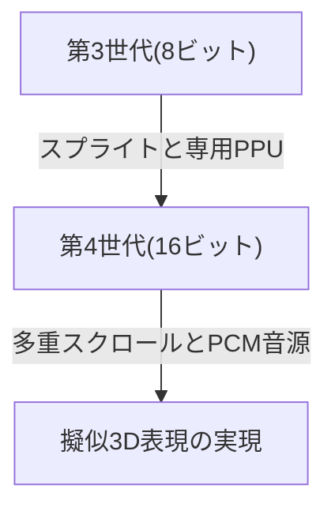
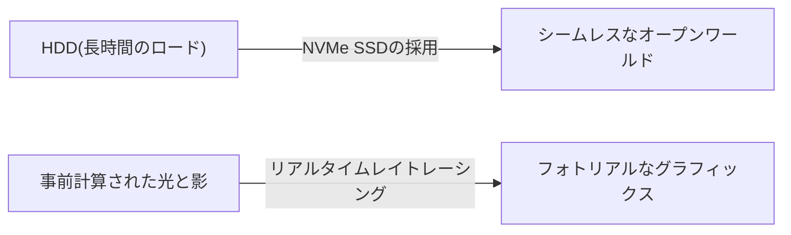

# ピコピコ音からフォトリアルな仮想世界へ：家庭用ゲーム機50年の進化史と技術革新

家庭用ゲーム機（コンソール）の歴史は、コンピューティング技術の進化と密接に結びついています。単なる電子部品の集合体であった時代から、現在のように超高性能な演算処理能力とリアルタイムレイトレーシングを備えるに至るまで、約50年にわたってゲーム機は進化を続けてきました。本記事では、その歴史を世代ごとに振り返りながら、どのような技術革新があったのかを探ります。

## 1. 黎明期：CPUの不在とハードウェアロジック（第1世代）

家庭用ゲーム機の歴史は1970年代に遡ります。世界初の家庭用ゲーム機とされる「Magnavox Odyssey」（1972年）には、現在私たちが知るようなCPU（中央演算処理装置）は搭載されていませんでした。

代わりに、トランジスタやダイオードを用いた純粋なハードウェアの論理回路のみで構成されており、画面上に白黒の点を表示して動かすことしかできませんでした。テレビの画面に直接プラスチックのオーバーレイシートを貼り付けて、ゲームの背景やフィールドを表現していたというエピソードは、当時の技術的な限界を物語っています。

## 2. マイクロプロセッサの登場と8ビット時代（第2〜第3世代）

1970年代後半から1980年代にかけて、マイクロプロセッサ（CPU）の価格低下により、ゲーム機はソフトウェア（ROMカートリッジ）を読み込んでプログラムを実行する現代のスタイルへと移行しました。

Atari 2600などの第2世代ゲーム機は、まだ数キロバイトのメモリしか持たず、グラフィックスも非常にシンプルでした。しかし、1983年に任天堂から発売された「ファミリーコンピュータ（ファミコン）」により、状況は一変します。専用のPPU（Picture Processing Unit）を搭載し、スプライト機能（キャラクターを背景とは独立して動かす技術）を実現したことで、滑らかで色彩豊かなアクションゲームが家庭で楽しめるようになったのです。

## 3. 16ビットの革新と3Dグラフィックスへの助走（第4世代）

1990年代に入ると、スーパーファミコン（Super Nintendo Entertainment System）やメガドライブ（Sega Genesis）に代表される16ビット機の時代が到来します。

処理能力が飛躍的に向上したことで、画面の発色数が増え、多重スクロール（背景を複数の層に分けて異なる速度で動かし、立体感を出す技術）や、擬似3D表現（スーパーファミコンの「モード7」など）が可能になりました。また、サウンド面でもPCM音源が採用され、オーケストラ調のBGMや肉声の再生ができるようになるなど、表現力は劇的に高まりました。

## 4. 3DポリゴンとCD-ROMの衝撃（第5世代）

1994年はゲーム機における最大の転換点の一つと言えます。「PlayStation」と「セガサターン」の登場です。

この世代の最大の特徴は、2D（ドット絵）から3Dポリゴンへの完全な移行です。テクスチャマッピングを施した3Dモデルをリアルタイムでレンダリングする能力は、これまでのゲーム体験を根本から覆しました。また、記憶媒体がROMカートリッジからCD-ROMに移行したことで、データ容量が数百倍に増加。フルボイスのイベントシーンや、長時間の美麗なプリレンダムービー（CGI）が収録可能になり、ゲームがより「映画的」な体験へと進化しました。

## 5. インターネット接続とHD時代への突入（第6〜第7世代）

2000年代初頭の第6世代（PlayStation 2、ニンテンドーゲームキューブ、初代Xbox）では、DVDの採用や、インターネットを介したオンライン対戦が徐々に普及し始めました。

続く第7世代（PlayStation 3、Xbox 360、Wii）においては、ついにHD（ハイビジョン）解像度に対応。プログラマブルシェーダーが本格的に導入され、金属の質感や水面の反射など、光と影の物理演算が劇的に進化しました。さらに、オンラインストアでのゲームのダウンロード購入や、ファームウェアのアップデート機能など、現在のゲーム機におけるプラットフォームとしての基礎がこの時代に確立されました。

## 6. フォトリアルな仮想世界と現在（第8〜第9世代）

PlayStation 4やXbox One（第8世代）、そして最新のPlayStation 5やXbox Series X/S（第9世代）に至ると、ゲーム機は超高性能なPCアーキテクチャと統合されつつあります。

最新世代の目玉技術は以下の通りです。

- **リアルタイムレイトレーシング**: 光の屈折や反射、複雑な影の表現を現実世界と同様に計算し、極めてフォトリアルな映像を生成する技術。
- **超高速SSD**: 従来のHDDとは比べ物にならない速度でデータを読み込むことで、ローディング画面を事実上消滅させ、広大なオープンワールドをシームレスに移動可能にしました。
- **ハプティック（触覚）フィードバック**: コントローラーの振動を緻密に制御し、雨粒が落ちる感覚や弓を引き絞る抵抗感などをプレイヤーの手に直接伝えます。

## まとめ

半世紀の間に、家庭用ゲーム機は「光る点を動かす機械」から「現実と見紛う世界をシミュレートするコンピュータ」へと途方もない進化を遂げました。この進化は、半導体技術、グラフィックスAPI、そして情熱的なゲームクリエイターたちの創意工夫の結晶です。

今後、クラウドゲーミングやAI技術、さらなるVR/ARとの統合など、ゲーム機のあり方はさらに多様化していくでしょう。しかし、最高のエンターテインメント体験を追求するという根源的な目的は、これからも変わることはありません。
