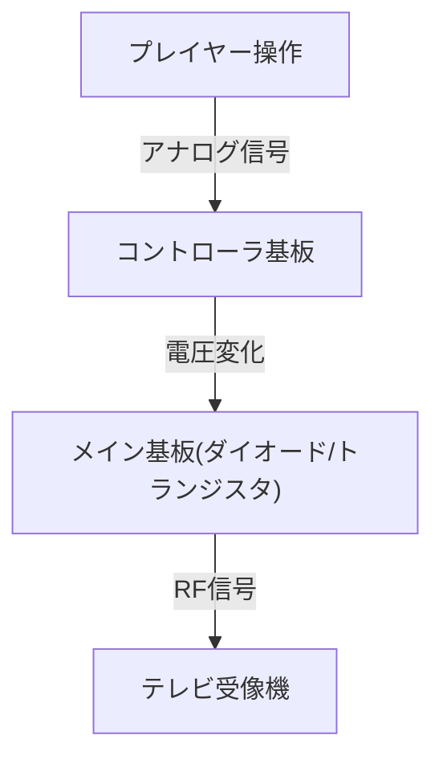
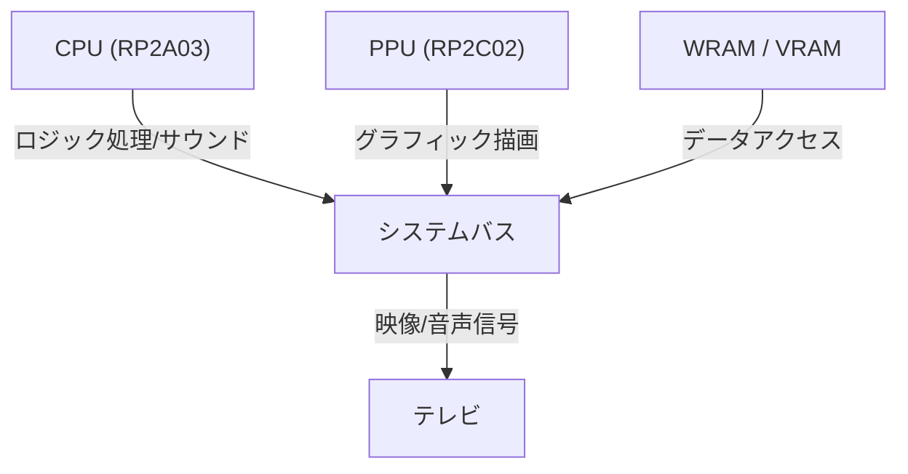
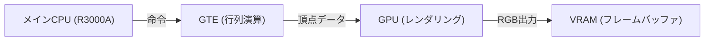

# ピコピコ音からフォトリアルな仮想世界へ：家庭用ゲーム機50年の進化史と技術革新

ゲームコンソール（家庭用ゲーム機）の歴史は、そのままコンピューティング技術の歴史でもあります。初期の単純な論理回路から、最新の高度なGPUやSSDを活用したシステムまで、その技術革新は目覚ましいものがあります。本記事では、過去50年にわたる家庭用ゲーム機の進化を技術的な側面から詳細に紐解きます。

## 1. 黎明期：論理回路からマイクロプロセッサへ (1970年代)

家庭用ゲーム機は、ソフトウェアを「実行」するのではなく、ハードウェアの論理回路そのものがゲームロジックとして機能していた時代から始まりました。

### Magnavox Odyssey とハードウェアロジック
1972年に発売された世界初の家庭用ゲーム機「Magnavox Odyssey」は、CPUを持っていませんでした。ダイオードやトランジスタを組み合わせた純粋なハードウェアロジックによって、画面上に光る点を生成し、プレイヤーがダイヤルでそれを操作するという仕組みでした。



### Atari 2600 とマイクロプロセッサの導入
1977年に登場した「Atari 2600」は、CPU（MOS Technology 6507）と、グラフィックスやサウンドを処理するTIA (Television Interface Adapter) を搭載し、ROMカートリッジによってプログラムを交換できる近代的なゲーム機の基礎を築きました。

```assembly
; Atari 2600 6502アセンブラの例 (画面のクリア)
ClearMem:
    LDA #0
    STA $00
    STA $01
    STA $02
    ; ... (続く)
```

## 2. 8ビット時代の幕開けとファミリーコンピュータ (1980年代)

1983年の「ファミリーコンピュータ（ファミコン）」の登場は、ゲームコンソールの歴史における特筆すべき転換点です。

### アーキテクチャの洗練
ファミコンは、リコー製のカスタムCPU（RP2A03、6502カスタム）とPPU（Picture Processing Unit）を搭載していました。PPUの存在により、スプライト表示やスムーズなハードウェアスクロールが可能となりました。



数式で表すと、PPUが一度に処理できるスプライトの数 $S$ と描画可能なピクセル数 $P$ には、当時のメモリ帯域 $B$ によって厳密な制約がありました：
$$ P = \sum_{i=1}^{S} (w_i \times h_i) \le \frac{B}{f} $$
（$f$ はフレームレート、通常60Hz）

## 3. 16ビットの競争：Mega Drive と Super Famicom (1990年代前半)

16ビット時代に入ると、CPUのビット幅拡張による処理能力向上と、専用のサウンドチップ・コプロセッサの導入が進みました。

### 独自のサウンドアーキテクチャ
スーパーファミコン（SNES）はソニー製の「SPC700」を搭載し、サンプリング音源を利用したオーケストラのようなBGMを可能にしました。対するメガドライブはヤマハ製のFM音源チップ「YM2612」を搭載し、独特の金属的で力強いサウンドを奏でました。

## 4. 3Dグラフィックス革命と光ディスク (1990年代後半)

初代PlayStationやセガサターン、NINTENDO64が登場したこの時代、ゲームは2Dから3Dへ、メディアはROMカートリッジからCD-ROMへと進化しました。

### ポリゴン描画とジオメトリ計算
3Dグラフィックスの基礎は、頂点座標の行列変換です。3D空間内の点 $V (x,y,z,1)$ は、モデル変換・ビュー変換・プロジェクション変換の各行列を掛け合わせることで、2D画面上の点 $V'$ に変換されます。

$$ V' = P \cdot V_{view} \cdot M \cdot V $$

PlayStationは「GTE (Geometry Transfer Engine)」という専用コプロセッサを搭載し、この行列計算を高速に行いました。



## 5. プログラマブルシェーダとHDの時代 (2000年代〜2010年代)

PlayStation 3やXbox 360の時代になると、ゲーム機は汎用的な「プログラマブルシェーダ」を搭載し、ピクセル単位での複雑なライティングや材質表現（物理ベースレンダリング）が可能になりました。

### マルチコアプロセッサの台頭
PS3の「Cell Broadband Engine」は、1つのPowerPCコア（PPE）と8つのベクトル演算プロセッサ（SPE）を搭載する非対称マルチコアアーキテクチャを採用していました。

```cpp
// CellプロセッサにおけるSPE向け処理の擬似コード
void spe_main() {
    float4 vector_a = spu_splats(1.0f);
    float4 vector_b = spu_splats(2.0f);
    float4 result = spu_add(vector_a, vector_b);
    // DMA転送でメインメモリへ書き戻す
}
```

## 6. モダンアーキテクチャと超高速I/O (2020年代)

PlayStation 5やXbox Series X/Sといった最新世代では、ハードウェアアーキテクチャがPCに近い形（x86-64ベース）に収斂しつつありますが、独自のカスタムSSDコントローラによる超高速なI/Oが最大のイノベーションとなりました。

### レイトレーシングとハードウェアアクセラレーション
光の屈折や反射を物理的に正しく計算するレイトレーシング技術がハードウェアレベルで実装され、現実世界に近いライティングがリアルタイムで可能になっています。

### 未来へ向けて
クラウドゲーミング、VR/ARの融合など、コンソールの形は変化し続けていますが、「専用のハードウェアで最高のエンターテインメントを提供する」という思想は、Odysseyの時代から今日まで変わらず受け継がれています。
