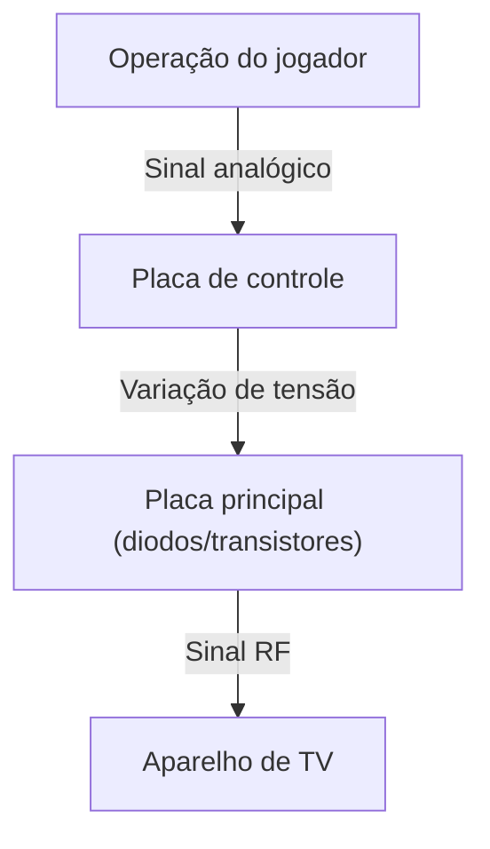
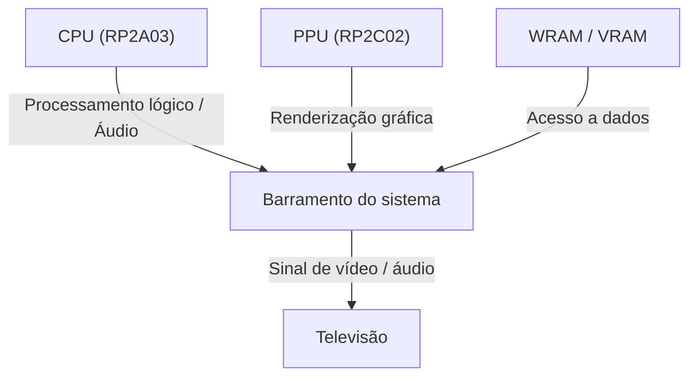

# Dos Sons em 8 Bits aos Mundos Virtuais Fotorrealistas: 50 Anos de Evolução e Inovações Tecnológicas nos Consoles de Videogame

A história dos consoles de videogame (consoles domésticos) é também a própria história da tecnologia da computação. Desde os primeiros circuitos lógicos simples até os sistemas modernos que utilizam GPUs avançadas e SSDs ultrarrápidos, as inovações tecnológicas têm sido extraordinárias. Neste artigo, analisamos em detalhes a evolução dos consoles de videogame ao longo dos últimos 50 anos sob uma perspectiva técnica.

## 1. A Era Pioneira: Dos Circuitos Lógicos aos Microprocessadores (Década de 1970)

Os consoles domésticos começaram em uma época na qual o hardware não "executava" software; em vez disso, os próprios circuitos lógicos do hardware funcionavam diretamente como a lógica do jogo.

### Magnavox Odyssey e a Lógica de Hardware
Lançado em 1972 como o primeiro console doméstico do mundo, o "Magnavox Odyssey" não possuía CPU. Seu funcionamento baseava-se em uma lógica de hardware pura combinando diodos e transistores para gerar pontos luminosos na tela, controlados pelos jogadores por meio de seletores giratórios (dials).



### Atari 2600 e a Introdução do Microprocessador
Lançado em 1977, o "Atari 2600" contava com uma CPU (MOS Technology 6507) e com o TIA (Television Interface Adapter) para processar gráficos e áudio, estabelecendo as bases dos consoles modernos onde os programas podiam ser trocados através de cartuchos ROM.

```assembly
; Exemplo de assembly 6502 do Atari 2600 (Limpeza de memória)
ClearMem:
    LDA #0
    STA $00
    STA $01
    STA $02
    ; ... (continua)
```

## 2. O Início da Era dos 8 Bits e o Family Computer (Década de 1980)

O lançamento do "Family Computer (Famicom)" em 1983 marcou um divisor de águas histórico na evolução dos consoles de videogame.

### Refinamento da Arquitetura
O Famicom era equipado com uma CPU customizada fabricada pela Ricoh (RP2A03, baseada no 6502) e uma PPU (Picture Processing Unit). A presença da PPU tornou possível a renderização de sprites e a rolagem suave por hardware (hardware scrolling).



Expressando matematicamente, o número de sprites $S$ que a PPU podia processar simultaneamente e o número de pixels desenháveis $P$ tinham limites rígidos determinados pela largura de banda da memória $B$ da época:
$$ P = \sum_{i=1}^{S} (w_i \times h_i) \le \frac{B}{f} $$
($f$ é a taxa de quadros por segundo, normalmente 60 Hz)

## 3. A Competição dos 16 Bits: Mega Drive e Super Famicom (Primeira Metade da Década de 1990)

Ao entrar na era dos 16 bits, houve uma ampliação na capacidade de processamento com o aumento da largura de bits da CPU, além da introdução de coprocessadores e chips de áudio dedicados.

### Arquitetura de Som Própria
O Super Famicom (SNES) incorporava o chip "SPC700" da Sony, viabilizando trilhas sonoras orquestrais ricas com áudio baseado em amostras (sampling). Em contraste, o Mega Drive contava com o chip de síntese FM "YM2612" da Yamaha, produzindo seu som característico, metálico e potente.

## 4. A Revolução dos Gráficos 3D e os Discos Ópticos (Segunda Metade da Década de 1990)

Com a chegada do PlayStation original, do Sega Saturn e do Nintendo 64, os jogos transitaram do 2D para o 3D, e as mídias evoluíram dos cartuchos ROM para os discos ópticos CD-ROM.

### Renderização de Polígonos e Cálculos Geométricos
A base dos gráficos 3D reside na transformação matricial das coordenadas dos vértices. Um ponto no espaço tridimensional $V (x,y,z,1)$ é transformado em um ponto $V'$ na tela 2D multiplicando-se sucessivamente pelas matrizes de transformação de modelo, visualização (view) e projeção:

$$ V' = P \cdot V_{view} \cdot M \cdot V $$

O PlayStation contava com um coprocessador dedicado denominado "GTE (Geometry Transfer Engine)", que executava esses cálculos matriciais em altíssima velocidade.


## 5. Shaders Programáveis e a Era da Alta Definição (Anos 2000 a 2010)

Na geração do PlayStation 3 e Xbox 360, os consoles passaram a incorporar "shaders programáveis" de uso geral, permitindo cálculos complexos de iluminação por pixel e renderização baseada em física (PBR - Physically Based Rendering) para representação fidedigna de materiais.

### A Ascensão dos Processadores Multi-core
O processador "Cell Broadband Engine" do PS3 adotou uma arquitetura multi-core assimétrica, equipada com um núcleo PowerPC (PPE) e oito coprocessadores de computação vetorial (SPEs).

```cpp
// Pseudocódigo para processamento direcionado a SPE no processador Cell
void spe_main() {
    float4 vector_a = spu_splats(1.0f);
    float4 vector_b = spu_splats(2.0f);
    float4 result = spu_add(vector_a, vector_b);
    // Gravação de volta na memória principal via transferência DMA
}
```

## 6. Arquitetura Moderna e E/S Ultrarrápida (Década de 2020)

Na geração mais recente, representada pelo PlayStation 5 e Xbox Series X/S, a arquitetura de hardware convergiu para padrões próximos aos de computadores pessoais (baseada em x86-64), mas controladores customizados de SSD proporcionando operações de E/S (I/O) em velocidades extremas representaram a maior inovação.

### Ray Tracing e Aceleração por Hardware
A tecnologia de ray tracing, que calcula fisicamente a refração e o reflexo da luz, passou a ser implementada diretamente em nível de hardware, possibilitando uma iluminação realista próxima ao mundo real em tempo real.

### Rumo ao Futuro
Com os jogos em nuvem (cloud gaming) e a convergência de VR/AR, os formatos dos consoles continuam evoluindo. Contudo, a filosofia de "oferecer o melhor entretenimento possível por meio de hardware dedicado" permanece viva e inalterada, desde a era do Odyssey até os dias de hoje.
