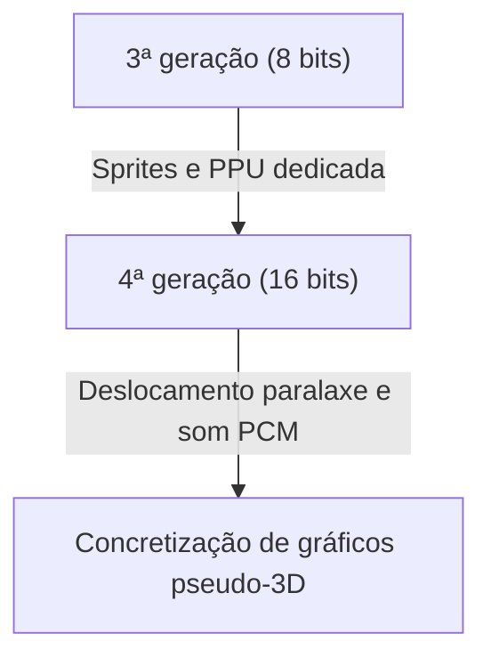

# Dos bipes aos mundos virtuais fotorrealistas: 50 anos de evolução e inovação tecnológica das consolas de videojogos

A história das consolas de videojogos domésticas está intimamente ligada à evolução da tecnologia de computação. Desde o tempo em que eram apenas um mero conjunto de componentes eletrónicos, até atingirem as capacidades de processamento de altíssimo desempenho e o ray tracing em tempo real dos dias de hoje, as consolas continuaram a evoluir ao longo de cerca de 50 anos. Neste artigo, revisitamos esta história geração após geração e exploramos as inovações tecnológicas que ocorreram.

## 1. Os primórdios: A ausência de CPU e a lógica de hardware (1ª geração)

A história das consolas domésticas remonta à década de 1970. A "Magnavox Odyssey" (1972), considerada a primeira consola doméstica do mundo, não possuía uma CPU (Unidade Central de Processamento) tal como a conhecemos atualmente.

Em vez disso, era composta exclusivamente por circuitos lógicos puramente de hardware com transístores e díodos, sendo apenas capaz de apresentar e mover pontos a preto e branco no ecrã. O facto de se colarem sobreposições de plástico diretamente no ecrã da televisão para representar os fundos ou os cenários dos jogos é revelador das limitações técnicas da época.

## 2. O surgimento dos microprocessadores e a era dos 8 bits (2ª a 3ª geração)

Desde o final dos anos 70 e durante a década de 80, a descida de preço dos microprocessadores (CPU) levou à transição das consolas para o estilo moderno de carregamento de software (cartuchos ROM) e execução de programas.

As consolas da 2ª geração, como a Atari 2600, possuíam ainda apenas alguns kilobytes de memória e gráficos muito simples. Contudo, a situação mudou radicalmente com a "Family Computer (Famicom/NES)", lançada pela Nintendo em 1983. Ao integrar uma PPU (Picture Processing Unit) dedicada e implementar a funcionalidade de "sprites" (tecnologia que permite mover as personagens independentemente do fundo), tornou-se possível desfrutar em casa de jogos de ação fluidos e coloridos.

## 3. A inovação dos 16 bits e o prelúdio para os gráficos 3D (4ª geração)

A década de 1990 marcou a chegada da era dos 16 bits, representada pela Super Nintendo Entertainment System (Super Famicom) e pela Sega Genesis (Mega Drive).

O aumento drástico na capacidade de processamento permitiu mais cores no ecrã, deslocamento paralaxe (uma técnica que divide o fundo em múltiplas camadas que se movem a velocidades diferentes para criar uma sensação de profundidade) e representações pseudo-3D (como o "Modo 7" da Super Nintendo). A nível sonoro, a adoção de fontes de som PCM melhorou substancialmente a expressividade, permitindo músicas de fundo orquestrais e a reprodução de vozes reais.

## 4. O impacto dos polígonos 3D e do CD-ROM (5ª geração)

1994 pode ser considerado um dos maiores pontos de viragem nas consolas, com o lançamento da "PlayStation" e da "Sega Saturn".

A característica principal desta geração foi a transição total do 2D (pixel art) para os polígonos 3D. A capacidade de renderizar modelos 3D com texturas em tempo real revolucionou fundamentalmente a experiência de jogo. Além disso, a mudança do suporte de armazenamento de cartuchos ROM para CD-ROM aumentou a capacidade de dados centenas de vezes. Isto possibilitou a inclusão de cenas com vozes integradas e de longas e belíssimas cinemáticas pré-renderizadas (CGI), fazendo com que os jogos evoluíssem para uma experiência mais "cinematográfica".

## 5. Ligação à Internet e a entrada na era HD (6ª a 7ª geração)

No início dos anos 2000, na 6ª geração (PlayStation 2, Nintendo GameCube, primeira Xbox), a utilização de DVDs e o modo multijogador online via Internet começaram gradualmente a popularizar-se.

Na geração seguinte (PlayStation 3, Xbox 360, Wii), a resolução HD (alta definição) foi finalmente suportada. Os shaders programáveis foram introduzidos em força, fazendo evoluir drasticamente o cálculo físico da luz e das sombras, tais como a textura dos metais ou os reflexos na superfície da água. Foi também nesta época que se estabeleceram as bases das consolas atuais enquanto plataformas, incluindo a compra de jogos digitais em lojas online e as funcionalidades de atualização de firmware.

## 6. Mundos virtuais fotorrealistas e a atualidade (8ª a 9ª geração)

Com a PlayStation 4 e a Xbox One (8ª geração), e as recentes PlayStation 5 e Xbox Series X/S (9ª geração), as consolas de videojogos estão cada vez mais integradas em arquiteturas de PC de desempenho ultraelevado.

As tecnologias em destaque da última geração são as seguintes:

- **Ray tracing em tempo real**: Tecnologia que calcula a refração e o reflexo da luz, bem como as sombras complexas da mesma forma que no mundo real, gerando imagens extremamente fotorrealistas.
- **SSDs ultrarrápidos**: Ao carregar dados a uma velocidade incomparável à dos discos rígidos convencionais, praticamente eliminaram os ecrãs de carregamento, permitindo a movimentação contínua e sem interrupções por vastos mundos abertos.
- **Feedback háptico**: Controla com precisão as vibrações do comando, transmitindo diretamente para as mãos do jogador a sensação das gotas de chuva a cair ou a resistência ao esticar um arco.

## Conclusão

Ao longo de meio século, as consolas de videojogos domésticas passaram por uma evolução formidável, deixando de ser "máquinas que movem pontos brilhantes" para se tornarem "computadores que simulam mundos indissociáveis da realidade". Esta evolução é o resultado da tecnologia de semicondutores, das APIs gráficas e da criatividade de apaixonados criadores de jogos.

No futuro, a natureza das consolas irá diversificar-se ainda mais com os jogos na nuvem (cloud gaming), a tecnologia de IA e uma maior integração com RV/RA. No entanto, o objetivo fundamental de procurar a melhor experiência de entretenimento nunca irá mudar.
