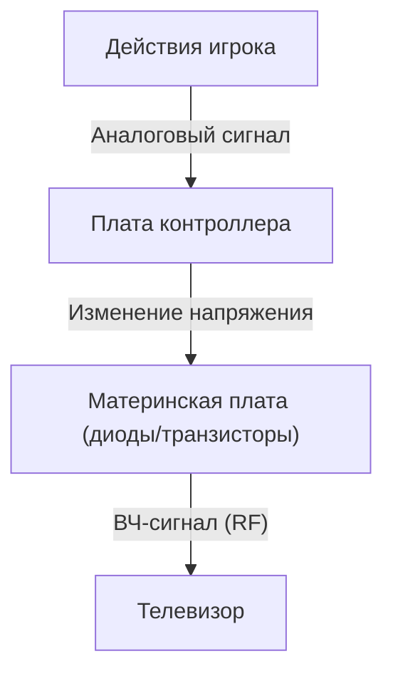
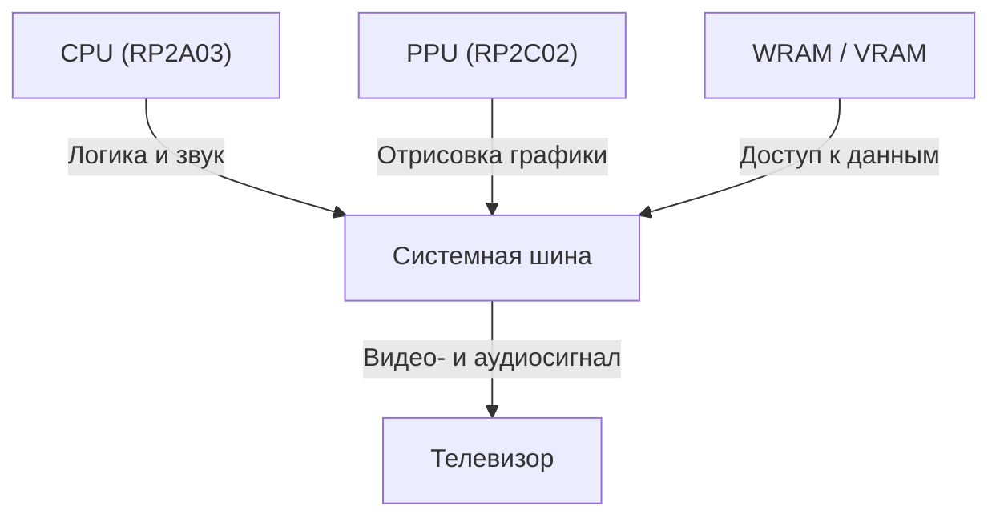

# От электронного писка до фотореалистичных виртуальных миров: 50 лет эволюции и технологических инноваций домашних игровых консолей

История игровых консолей (домашних игровых приставок) — это одновременно и история развития вычислительной техники. Путь от примитивных дискретных логических схем до современных систем с мощными GPU и сверхбыстрыми SSD полон впечатляющих технологических прорывов. В этой статье мы подробно рассмотрим эволюцию домашних игровых консолей за последние 50 лет с технической точки зрения.

## 1. Зарождение индустрии: от жесткой логики к микропроцессорам (1970-е годы)

История домашних игровых консолей началась в эпоху, когда программное обеспечение еще не «выполнялось» в привычном смысле — игровая логика реализовывалась непосредственно на уровне аппаратных схем.

### Magnavox Odyssey и аппаратная логика
Выпущенная в 1972 году первая в мире коммерческая домашняя игровая приставка «Magnavox Odyssey» не имела центрального процессора. Игровая логика строилась на чистой дискретной логике из диодов и транзисторов, которая генерировала светящиеся точки на экране, а игроки управляли ими с помощью аналоговых регуляторов.



### Atari 2600 и внедрение микропроцессоров
Появившаяся в 1977 году консоль «Atari 2600» оснащалась полноценным CPU (MOS Technology 6507) и специализированным чипом TIA (Television Interface Adapter), отвечавшим за графику и звук. Она заложила основу современных игровых приставок, позволив менять исполняемые программы с помощью сменных ROM-картриджей.

```assembly
; Пример ассемблерного кода MOS 6502 для Atari 2600 (очистка памяти)
ClearMem:
    LDA #0
    STA $00
    STA $01
    STA $02
    ; ... (продолжение)
```

## 2. Рассвет 8-битной эпохи и Family Computer (1980-е годы)

Выход консоли «Family Computer (Famicom)» в 1983 году стал ключевой поворотной точкой в истории игровых платформ.

### Архитектурные инновации
Famicom оснащался заказным процессором от Ricoh (RP2A03, модифицированное ядро 6502) и специализированным видеопроцессором PPU (Picture Processing Unit, RP2C02). Наличие PPU сделало возможным аппаратную обработку спрайтов и плавный аппаратный скроллинг фоновых изображений.



С точки зрения математической модели, количество спрайтов $S$, которое PPU мог обработать за один кадр, и суммарное число отрисовываемых пикселей $P$ строго ограничивались пропускной способностью памяти того времени $B$:
$$ P = \sum_{i=1}^{S} (w_i \times h_i) \le \frac{B}{f} $$
(где $f$ — частота кадров, как правило, 60 Гц)

## 3. Битва 16 бит: Mega Drive против Super Famicom (первая половина 1990-х)

С наступлением 16-битной эпохи расширение разрядности процессоров привело к существенному росту вычислительной мощности, а также к появлению специализированных звуковых чипов и математических сопроцессоров.

### Уникальные звуковые архитектуры
Super Famicom (SNES) оснащалась звуковым процессором SPC700 от Sony, что позволяло воспроизводить богатые сэмплированные музыкальные партии, близкие к оркестровому звучанию. В свою очередь, Sega Mega Drive использовала FM-синтезатор Yamaha YM2612, создававший характерный динамичный и «металлический» звук.

## 4. Революция 3D-графики и оптических дисков (вторая половина 1990-х)

В эту эпоху, ознаменованную выходом оригинальной PlayStation, Sega Saturn и NINTENDO64, видеоигры перешли из 2D в 3D, а основным физическим носителем вместо картриджей стали компакт-диски (CD-ROM).

### Отрисовка полигонов и геометрические вычисления
Фундаментом трехмерной графики являются матричные преобразования координат вершин. Точка в трехмерном пространстве $V (x,y,z,1)$ переносится в двумерные экранные координаты $V'$ путем перемножения матриц модели, вида и проекции:

$$ V' = P \cdot V_{view} \cdot M \cdot V $$

PlayStation оснащалась специализированным сопроцессором «GTE (Geometry Transfer Engine)», обеспечивавшим аппаратное ускорение этих матричных вычислений.


## 5. Эра программируемых шейдеров и HD (2000-е — 2010-е годы)

В поколении PlayStation 3 и Xbox 360 консоли получили программируемые шейдерные конвейеры общего назначения. Это открыло возможности попиксельного расчета сложного освещения и создания реалистичных материалов (включая физически корректный рендеринг, PBR).

### Расцвет многоядерных процессоров
Процессор «Cell Broadband Engine» в PS3 использовал асимметричную многоядерную архитектуру: одно управляющее ядро PowerPC (PPE) и восемь векторных сопроцессоров (SPE).

```cpp
// Псевдокод векторной обработки на SPE процессора Cell
void spe_main() {
    float4 vector_a = spu_splats(1.0f);
    float4 vector_b = spu_splats(2.0f);
    float4 result = spu_add(vector_a, vector_b);
    // Запись результатов обратно в основную память через DMA-передачу
}
```

## 6. Современная архитектура и сверхскоростной ввод-вывод (2020-е годы)

В актуальном поколении консолей (PlayStation 5 и Xbox Series X/S) аппаратная архитектура практически приблизилась к ПК (на базе x86-64). Однако ключевой инновацией стали специализированные кастомные контроллеры SSD, обеспечивающие беспрецедентную скорость ввода-вывода (I/O).

### Аппаратная трассировка лучей
Технология трассировки лучей (Ray Tracing), рассчитывающая физически корректное преломление и отражение света, теперь реализована на аппаратном уровне, обеспечивая освещение кинематографического уровня в реальном времени.

### Взгляд в будущее
С развитием облачного гейминга и интеграцией технологий VR/AR форм-факторы игровых систем продолжают меняться. Однако фундаментальная концепция — «предоставление бескомпромиссных интерактивных развлечений на специализированном аппаратном обеспечении» — сохраняется со времен Magnavox Odyssey и до наших дней.
