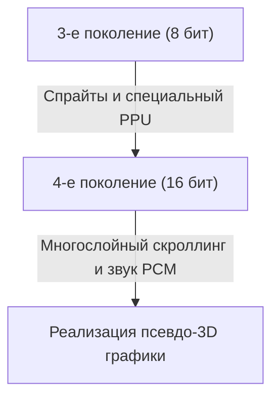

# От 8-битных звуков к фотореалистичным виртуальным мирам: 50 лет истории эволюции и технологических инноваций игровых консолей

История домашних игровых консолей тесно связана с эволюцией вычислительной техники. От эпохи, когда они были просто набором электронных компонентов, до наших дней, когда они обладают сверхвысокой вычислительной мощностью и трассировкой лучей в реальном времени, игровые консоли непрерывно развивались на протяжении примерно 50 лет. В этой статье мы проследим за технологическими инновациями, оглядываясь на историю каждого поколения.

## 1. Зарождение: отсутствие CPU и аппаратная логика (1-е поколение)

История домашних игровых консолей восходит к 1970-м годам. "Magnavox Odyssey" (1972 год), считающаяся первой в мире домашней игровой консолью, не была оснащена процессором (CPU) в том виде, в каком мы его знаем сегодня.

Вместо этого она состояла исключительно из аппаратных логических схем с использованием транзисторов и диодов, и могла лишь отображать и перемещать черно-белые точки на экране. История о прикреплении пластиковых накладок прямо на экран телевизора для представления игрового фона и поля демонстрирует технологические ограничения того времени.

## 2. Появление микропроцессоров и 8-битная эра (2-е и 3-е поколения)

С конца 1970-х по 1980-е годы, по мере снижения цен на микропроцессоры (CPU), игровые приставки перешли к современному стилю считывания программного обеспечения (картриджи ПЗУ) и выполнения программ.

Игровые приставки второго поколения, такие как Atari 2600, всё ещё имели лишь несколько килобайт памяти и очень простую графику. Однако с выпуском "Family Computer (Famicom)" от Nintendo в 1983 году ситуация кардинально изменилась. Оснащение специализированным PPU (модулем обработки изображений) и реализация функции спрайтов (технологии перемещения персонажей независимо от фона) позволили наслаждаться плавными и красочными экшн-играми дома.

## 3. 16-битные инновации и шаг к 3D-графике (4-е поколение)

В 1990-х годах наступила эра 16-битных консолей, представленная Super Nintendo Entertainment System (Super Famicom) и Sega Genesis (Mega Drive).

С резким увеличением вычислительной мощности возросло количество цветов на экране, стал возможен многослойный скроллинг (технология разделения фона на несколько слоев и их перемещения с разной скоростью для создания трехмерного эффекта) и псевдо-3D графика (например, "Mode 7" на Super Nintendo). Кроме того, в плане звука стали использоваться источники звука PCM, что позволило воспроизводить фоновую музыку в оркестровом стиле и настоящие человеческие голоса, тем самым значительно повысив выразительность.

## 4. 3D-полигоны и шок от CD-ROM (5-е поколение)

1994 год можно назвать одним из самых важных поворотных моментов для игровых консолей в связи с появлением "PlayStation" и "Sega Saturn".

Самой большой особенностью этого поколения стал полный переход от 2D (пиксель-арт) к 3D-полигонам. Способность рендерить 3D-модели с наложением текстур в реальном времени в корне изменила игровой опыт. Кроме того, с переходом носителей информации с картриджей ПЗУ на CD-ROM объем данных увеличился в сотни раз. Стало возможным включение кат-сцен с полной озвучкой и длинных красивых предварительно отрендеренных видеороликов (CGI), а игры эволюционировали в более "кинематографичный" опыт.

## 5. Подключение к интернету и вступление в эпоху HD (6-е и 7-е поколения)

В начале 2000-х годов в шестом поколении (PlayStation 2, Nintendo GameCube, оригинальный Xbox) постепенно стало распространяться использование DVD-дисков и соревновательные игры по сети интернет.

В последовавшем 7-м поколении (PlayStation 3, Xbox 360, Wii) игры наконец-то стали поддерживать разрешение HD (высокой четкости). Были полномасштабно внедрены программируемые шейдеры, а физические вычисления света и тени, такие как текстура металла и отражение поверхности воды, значительно улучшились. Кроме того, именно в эту эпоху были заложены основы современных игровых консолей как платформ, включая возможность загрузки игр из онлайн-магазинов и функции обновления прошивки.

## 6. Фотореалистичные виртуальные миры и настоящее время (8-е и 9-е поколения)

С появлением PlayStation 4 и Xbox One (8-е поколение), а также новейших PlayStation 5 и Xbox Series X/S (9-е поколение) игровые консоли всё больше интегрируются со сверхпроизводительной архитектурой ПК.

Ключевыми технологиями в последних поколениях являются:

- **Трассировка лучей в реальном времени**: технология, которая вычисляет преломление, отражение света и сложные выражения теней так же, как в реальном мире, для создания чрезвычайно фотореалистичных изображений.
- **Сверхбыстрые SSD**: благодаря загрузке данных на скоростях, не сравнимых с традиционными жесткими дисками (HDD), экраны загрузки практически исчезли, что сделало возможным плавное перемещение в огромных открытых мирах.
- **Тактильная отдача (Haptic Feedback)**: точное управление вибрацией контроллера, которое напрямую передает игрокам такие ощущения, как падение капель дождя или сопротивление натяжению тетивы лука.

## Заключение

За полвека домашние игровые консоли совершили невероятную эволюцию от "машин для перемещения светящихся точек" до "компьютеров, моделирующих миры, которые можно спутать с реальностью". Эта эволюция является результатом развития полупроводниковых технологий, графических API и творческой изобретательности увлеченных создателей игр.

В будущем, благодаря облачному геймингу, технологиям искусственного интеллекта и дальнейшей интеграции с VR/AR, игровые консоли станут еще более разнообразными. Однако фундаментальная цель — обеспечение наилучшего развлекательного опыта — никогда не изменится.
