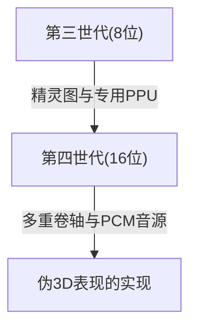
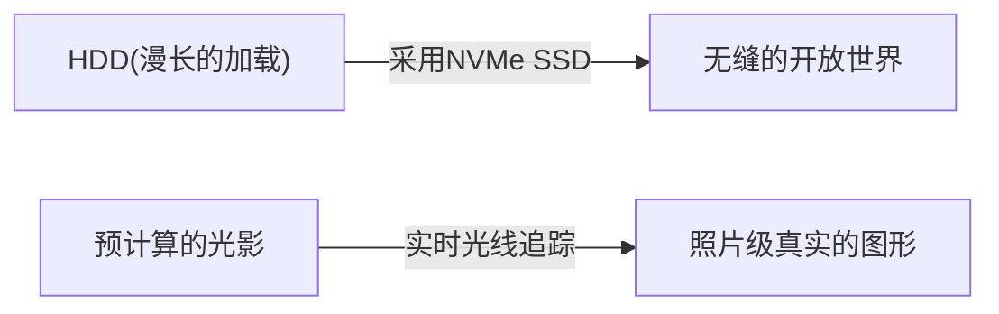

# 从电子音到照片级真实的虚拟世界：家用游戏机50年进化史与技术革新

家用游戏机（主机）的历史与计算机技术的进化密切相关。从一个纯粹的电子元件集合体的时代，到如今具备超高性能的运算处理能力和实时光线追踪技术，在过去的大约50年里，游戏机一直在不断进化。本文将按世代回顾这段历史，探讨其间发生了哪些技术革新。

## 1. 黎明期：CPU的缺席与硬件逻辑（第一世代）

家用游戏机的历史可以追溯到20世纪70年代。被认为是世界上第一台家用游戏机的“Magnavox Odyssey”（1972年），并没有搭载我们现在所熟知的CPU（中央处理器）。

取而代之的是，它完全由使用晶体管和二极管的纯硬件逻辑电路构成，只能在屏幕上显示和移动黑白色的点。当时甚至需要玩家直接将塑料覆盖片贴在电视屏幕上，以此来表现游戏的背景和场地，这个插曲充分说明了当时的技术局限性。

## 2. 微处理器的出现与8位时代（第二至第三世代）

从20世纪70年代末到80年代，随着微处理器（CPU）价格的下降，游戏机转变为加载软件（ROM卡带）并执行程序的现代风格。

Atari 2600等第二世代游戏机仍然只有几千字节的内存，图形也非常简单。然而，1983年任天堂发售的“Family Computer（红白机/FC）”彻底改变了这一局面。通过搭载专用的PPU（图像处理单元）并实现精灵图功能（使角色独立于背景移动的技术），让玩家在家里就能享受到流畅且色彩丰富的动作游戏。

## 3. 16位的革新与3D图形的助跑（第四世代）

进入20世纪90年代，以超级任天堂（Super Famicom/SNES）和世嘉Mega Drive（Sega Genesis）为代表的16位机时代到来。

处理能力的大幅提升增加了屏幕的发色数，并使得多重卷轴（将背景分为多层以不同速度移动，营造立体感的技术）以及伪3D表现（如超级任天堂的“Mode 7”）成为可能。此外，在声音方面采用了PCM音源，能够播放管弦乐风格的背景音乐和人声，表现力得到了戏剧性的提升。

## 4. 3D多边形与CD-ROM的冲击（第五世代）

1994年可以说是游戏机历史上最大的转折点之一，标志是“PlayStation”和“世嘉土星（Sega Saturn）”的登场。

这一世代最大的特征是从2D（像素画）向3D多边形的完全过渡。实时渲染带有纹理映射的3D模型的能力，从根本上颠覆了以往的游戏体验。此外，存储介质从ROM卡带向CD-ROM转移，使得数据容量增加了数百倍。游戏中可以包含全语音的事件场景和长时间精美的预渲染动画（CGI），使游戏向更具“电影感”的体验进化。

## 5. 互联网连接与迈入高清时代（第六至第七世代）

在2000年代初的第六世代（PlayStation 2、任天堂GameCube、初代Xbox）中，DVD的采用和通过互联网进行的在线对战开始逐渐普及。

在随后的第七世代（PlayStation 3、Xbox 360、Wii）中，终于支持了HD（高清）分辨率。可编程着色器被正式引入，金属的质感和水面的反射等光影的物理运算得到了惊人的进化。此外，在线商店的游戏下载购买和固件更新功能等，奠定了现代游戏机作为平台的基础。

## 6. 照片级真实的虚拟世界与现在（第八至第九世代）

到了PlayStation 4和Xbox One（第八世代），以及最新的PlayStation 5和Xbox Series X/S（第九世代），游戏机正在与超高性能的PC架构融为一体。

最新世代的主打技术如下：

- **实时光线追踪**：如同现实世界一样计算光线的折射、反射和复杂的阴影表现，生成极其逼真的图像的技术。
- **超高速SSD**：以传统HDD无法比拟的速度读取数据，实质上消除了加载画面，使玩家能够在广阔的开放世界中无缝移动。
- **触觉反馈**：精密控制手柄的震动，将雨滴落下的感觉或拉满弓弦的阻力感直接传达到玩家的手中。

## 总结

在半个世纪的时间里，家用游戏机从“移动光点的机器”经历了惊人的进化，成为了“模拟出令人难辨真假的现实世界的计算机”。这种进化是半导体技术、图形API以及充满热情的游戏创作者们创意与心血的结晶。

未来，随着云游戏、AI技术以及与VR/AR的进一步融合，游戏机的形态将更加多样化。然而，追求极致娱乐体验这一根本目的，今后也不会改变。
