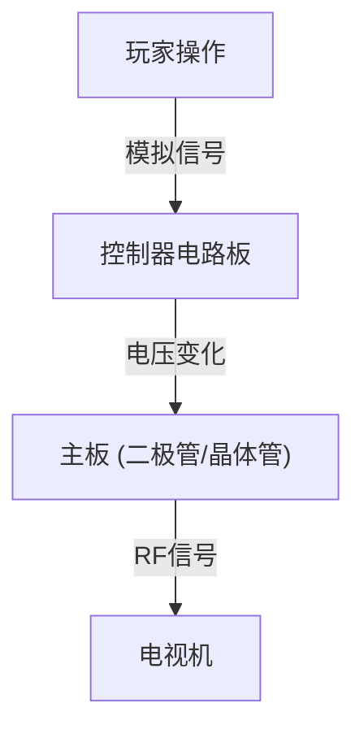
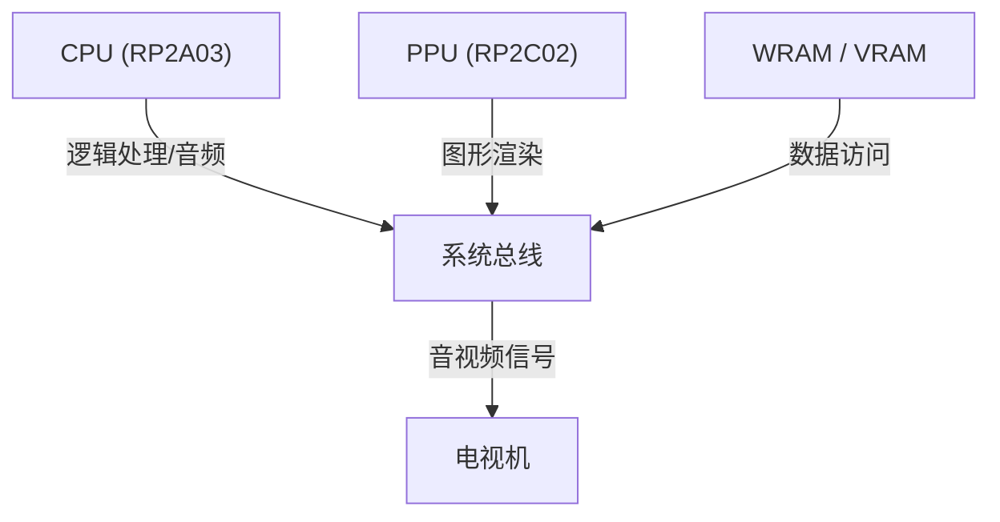

# 从电子蜂鸣音到逼真虚拟世界：家用游戏机50年进化史与技术革新

游戏主机（家用游戏机）的历史，同时也是计算技术本身的发展史。从早期简单的逻辑电路，到运用最新尖端GPU和固态硬盘（SSD）的高性能系统，其技术革新令人瞩目。本文将从技术角度深入剖析过去50年间家用游戏机的演进历程。

## 1. 黎明期：从逻辑电路到微处理器 (1970年代)

家用游戏机最初经历了一个硬件逻辑电路本身直接充当游戏逻辑的时代，而非由软件“执行”程序。

### Magnavox Odyssey 与硬件逻辑
1972年问世的全球首款家用游戏机“Magnavox Odyssey”并没有配备CPU。它完全依靠二极管和晶体管组合而成的纯硬件逻辑，在屏幕上生成发光光点，玩家通过旋钮进行操控。



### Atari 2600 与微处理器的引入
1977年推出的“Atari 2600”搭载了CPU（MOS Technology 6507）以及负责处理图像和声音的TIA（Television Interface Adapter），并通过ROM卡带实现程序更换，奠定了现代游戏机的基石。

```assembly
; Atari 2600 6502汇编示例 (清屏)
ClearMem:
    LDA #0
    STA $00
    STA $01
    STA $02
    ; ... (续)
```

## 2. 8位时代的序幕与红白机 (1980年代)

1983年“Family Computer（红白机/FC）”的诞生，是游戏主机历史上的一个重要转折点。

### 架构的精简与完善
红白机搭载了理光制造的定制CPU（RP2A03，定制版6502）和PPU（Picture Processing Unit，图像处理单元）。PPU的引入使得精灵图（Sprite）渲染以及平滑的硬件卷轴滚屏成为可能。



若用数学公式表示，PPU单次能够处理的精灵图数量 $S$ 与可绘制的像素数 $P$，受到当时内存带宽 $B$ 的严格限制：
$$ P = \sum_{i=1}^{S} (w_i \times h_i) \le \frac{B}{f} $$
（$f$ 为帧率，通常为 60Hz）

## 3. 16位之争：Mega Drive 与 Super Famicom (1990年代前半期)

步入16位时代后，随着CPU位宽的扩展带来了处理性能的跃升，专用的音频芯片与协处理器也相继登场。

### 独具特色的音频架构
超级任天堂（Super Famicom / SNES）搭载了索尼制造的“SPC700”，利用采样音源实现了宛如管弦乐般的背景音乐。而世嘉 Mega Drive（世嘉五代）则搭载了雅马哈制造的FM音源芯片“YM2612”，呈现出独特、金属质感且充满力量感的音效。

## 4. 3D图形革命与光盘介质 (1990年代后半期)

在初代PlayStation、世嘉土星（Sega Saturn）和NINTENDO 64相继问世的时代，游戏实现了从2D到3D的飞跃，存储介质也由ROM卡带转向了CD-ROM。

### 多边形渲染与几何变换计算
3D图形的基石是顶点坐标的矩阵变换。3D空间中的点 $V (x,y,z,1)$ 通过与模型变换、视图变换、投影变换各矩阵相乘，最终被映射转换为2D屏幕上的点 $V'$。

$$ V' = P \cdot V_{view} \cdot M \cdot V $$

PlayStation搭载了名为“GTE (Geometry Transfer Engine，几何传输引擎)”的专用协处理器，可高速完成上述矩阵运算。


## 5. 可编程着色器与高清时代 (2000年代〜2010年代)

到了PlayStation 3与Xbox 360时代，游戏机开始配备通用的“可编程着色器（Programmable Shader）”，实现了像素级别复杂的实时光照计算与材质表现（基于物理的渲染，PBR）。

### 多核处理器的崛起
PS3采用的“Cell Broadband Engine”是由1个PowerPC核心（PPE）与8个协同矢量运算处理器（SPE）组成的非对称多核架构。

```cpp
// Cell 处理器面向 SPE 处理的伪代码
void spe_main() {
    float4 vector_a = spu_splats(1.0f);
    float4 vector_b = spu_splats(2.0f);
    float4 result = spu_add(vector_a, vector_b);
    // 通过 DMA 传输写回主内存
}
```

## 6. 现代架构与超高速I/O (2020年代)

在PlayStation 5和Xbox Series X/S等最新一代主机中，硬件架构已逐渐向PC（基于x86-64）靠拢，但专门定制的超高速固态硬盘（SSD）控制器带来的极速I/O吞吐能力成为了最具划时代意义的技术创新。

### 光线追踪与硬件加速
以物理精准计算光线折射与反射的光线追踪（Ray Tracing）技术已在硬件层面上得以实现，使得呈现高度逼近现实世界的实时光影效果成为现实。

### 迈向未来
从云游戏到VR/AR深度融合，主机的形态虽然在不断演进，但“通过专用硬件提供顶级娱乐体验”这一核心设计哲学，自Odyssey诞生至今，始终未曾改变。
