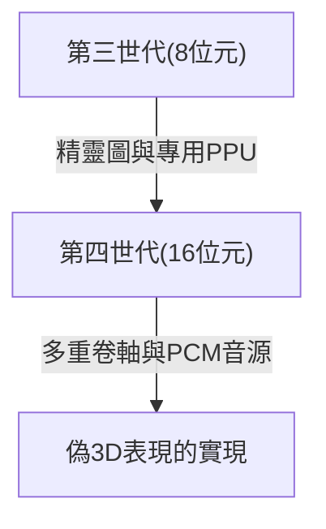

# 從電子音到照片級真實的虛擬世界：家用遊戲機50年進化史與技術革新

家用遊戲機（主機）的歷史與電腦技術的進化密切相關。從一個純粹的電子元件集合體的時代，到如今具備超高效能的運算處理能力和即時光線追蹤技術，在過去的大約50年裡，遊戲機一直在不斷進化。本文將按世代回顧這段歷史，探討其間發生了哪些技術革新。

## 1. 黎明期：CPU的缺席與硬體邏輯（第一世代）

家用遊戲機的歷史可以追溯到1970年代。被認為是世界上第一台家用遊戲機的「Magnavox Odyssey」（1972年），並沒有搭載我們現在所熟知的CPU（中央處理器）。

取而代之的是，它完全由使用電晶體和二極體的純硬體邏輯電路構成，只能在螢幕上顯示和移動黑白色的點。當時甚至需要玩家直接將塑膠覆蓋片貼在電視螢幕上，以此來表現遊戲的背景和場地，這個插曲充分說明了當時的技術侷限性。

## 2. 微處理器的出現與8位元時代（第二至第三世代）

從1970年代末到1980年代，隨著微處理器（CPU）價格的下降，遊戲機轉變為載入軟體（ROM卡匣）並執行程式的現代風格。

Atari 2600等第二世代遊戲機仍然只有幾千位元組的記憶體，圖形也非常簡單。然而，1983年任天堂發售的「Family Computer（紅白機/FC）」徹底改變了這一局面。透過搭載專用的PPU（圖像處理單元）並實現精靈圖功能（使角色獨立於背景移動的技術），讓玩家在家裡就能享受到流暢且色彩豐富的動作遊戲。

## 3. 16位元的革新與3D圖形的助跑（第四世代）

進入1990年代，以超級任天堂（Super Famicom/SNES）和世嘉Mega Drive（Sega Genesis）為代表的16位元機時代到來。

處理能力的大幅提升增加了螢幕的發色數，並使得多重卷軸（將背景分為多層以不同速度移動，營造立體感的技術）以及偽3D表現（如超級任天堂的「Mode 7」）成為可能。此外，在聲音方面採用了PCM音源，能夠播放管弦樂風格的背景音樂和人聲，表現力得到了戲劇性的提升。

## 4. 3D多邊形與CD-ROM的衝擊（第五世代）

1994年可以說是遊戲機歷史上最大的轉折點之一，標誌是「PlayStation」和「世嘉土星（Sega Saturn）」的登場。

這一世代最大的特徵是從2D（像素畫）向3D多邊形的完全過渡。即時渲染帶有紋理映射的3D模型的能力，從根本上顛覆了以往的遊戲體驗。此外，儲存媒體從ROM卡匣向CD-ROM轉移，使得資料容量增加了數百倍。遊戲中可以包含全語音的事件場景和長時間精美的預渲染動畫（CGI），使遊戲向更具「電影感」的體驗進化。

## 5. 網際網路連接與邁入高畫質時代（第六至第七世代）

在2000年代初的第六世代（PlayStation 2、任天堂GameCube、初代Xbox）中，DVD的採用和透過網際網路進行的線上對戰開始逐漸普及。

在隨後的第七世代（PlayStation 3、Xbox 360、Wii）中，終於支援了HD（高畫質）解析度。可程式化著色器被正式引入，金屬的質感和水面的反射等光影的物理運算得到了驚人的進化。此外，線上商店的遊戲下載購買和韌體更新功能等，奠定了現代遊戲機作為平台的基礎。

## 6. 照片級真實的虛擬世界與現在（第八至第九世代）

到了PlayStation 4和Xbox One（第八世代），以及最新的PlayStation 5和Xbox Series X/S（第九世代），遊戲機正在與超高效能的PC架構融為一體。

最新世代的主打技術如下：

- **即時光線追蹤**：如同現實世界一樣計算光線的折射、反射和複雜的陰影表現，生成極其逼真的影像的技術。
- **超高速SSD**：以傳統HDD無法比擬的速度讀取資料，實質上消除了載入畫面，使玩家能夠在廣闊的開放世界中無縫移動。
- **觸覺回饋**：精密控制控制器的震動，將雨滴落下的感覺或拉滿弓弦的阻力感直接傳達到玩家的手中。

## 總結

在半個世紀的時間裡，家用遊戲機從「移動光點的機器」經歷了驚人的進化，成為了「模擬出令人難辨真假的現實世界的電腦」。這種進化是半導體技術、圖形API以及充滿熱情的遊戲創作者們創意與心血的結晶。

未來，隨著雲端遊戲、AI技術以及與VR/AR的進一步融合，遊戲機的型態將更加多樣化。然而，追求極致娛樂體驗這一根本目的，今後也不會改變。
