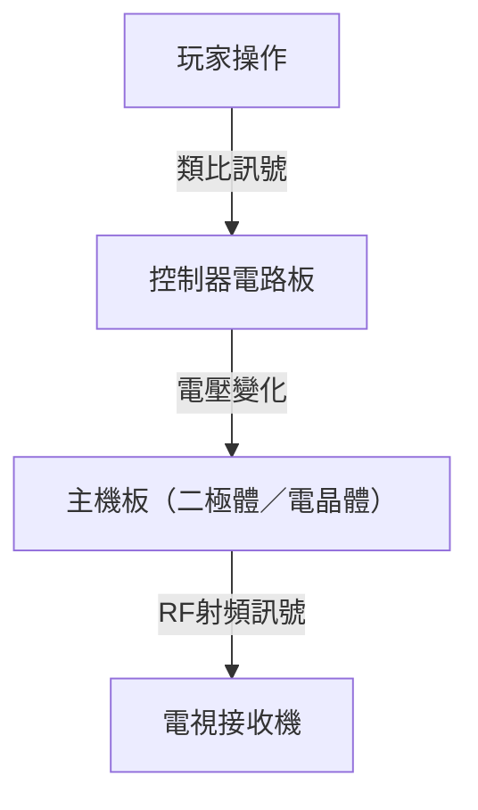
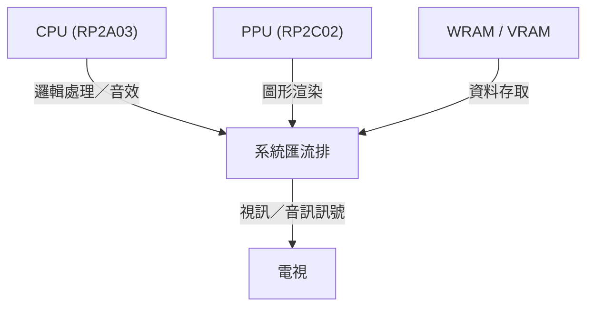

# 從嗶嗶電子音到擬真虛擬世界：家用遊戲主機50年的進化史與技術革新

家用遊戲機（主機）的歷史，本質上也就是電腦運算技術的發展史。從早期的簡單邏輯電路，到運用最新先進 GPU 與 SSD 的現代系統，其技術革新令人讚嘆。本文將從技術視角，深入剖析過去 50 年來家用遊戲機的演進歷程。

## 1. 黎明期：從邏輯電路到微處理器 (1970年代)

家用遊戲機的起步，源於硬體邏輯電路本身直接作為遊戲邏輯運作的時代，而非在硬體上「執行」軟體。

### Magnavox Odyssey 與硬體邏輯
1972 年問世的全球首款家用遊戲機「Magnavox Odyssey」並沒有搭載 CPU。它完全透過結合二極體與電晶體的純硬體邏輯電路，在螢幕上產生發光點，並讓玩家藉由轉盤控制器進行操作。



### Atari 2600 與微處理器的引入
1977 年推出的「Atari 2600」配備了 CPU（MOS Technology 6507）以及處理圖形與音效的 TIA（Television Interface Adapter），並開創了透過 ROM 卡匣更換遊戲程式的近代遊戲主機基礎架構。

```assembly
; Atari 2600 6502 組合語言範例 (清除畫面記憶體)
ClearMem:
    LDA #0
    STA $00
    STA $01
    STA $02
    ; ... (續)
```

## 2. 8 位元時代的序幕與紅白機 (1980年代)

1983 年「Family Computer（紅白機／FC）」的問世，是遊戲主機歷史上極具代表性的重要轉折點。

### 架構的精進與洗練
紅白機搭載了理光（Ricoh）製造的客製化 CPU（RP2A03，基於 6502 定製）與 PPU（Picture Processing Unit，圖形處理單元）。正是因為 PPU 的存在，才實現了精靈（Sprite）顯示以及流暢的硬體捲軸功能。



用數學公式表示，PPU 一次能處理的精靈數量 $S$ 與可繪製的像素數 $P$，受到當時記憶體頻寬 $B$ 的嚴格限制：
$$ P = \sum_{i=1}^{S} (w_i \times h_i) \le \frac{B}{f} $$
（$f$ 為影格率，通常為 60Hz）

## 3. 16 位元的競爭：Mega Drive 與超級任天堂 (1990年代前期)

進入 16 位元時代後，隨著 CPU 位元寬度的擴展帶來了處理效能的大幅提升，同時也推動了專用音效晶片與協同處理器（Coprocessor）的廣泛採用。

### 獨特的音效架構
超級任天堂（Super Famicom / SNES）搭載了由 Sony 製造的「SPC700」，利用取樣音源實現了宛如管弦樂般的背景音樂（BGM）。相較之下，Mega Drive 則配備了 Yamaha 生產的 FM 音源晶片「YM2612」，展現出獨特金屬質感且極具衝擊力的震撼音效。

## 4. 3D 圖形革命與光碟時代 (1990年代後期)

在初代 PlayStation、SEGA Saturn 以及 NINTENDO 64 陸續登場的這個時期，遊戲從 2D 邁向 3D，儲存媒介也由 ROM 卡匣逐步演進為 CD-ROM 光碟。

### 多邊形繪製與幾何運算
3D 圖形的基礎在於頂點座標的矩陣轉換。3D 空間中的一點 $V (x,y,z,1)$，透過接連相乘模型轉換（Model）、視圖轉換（View）以及投影轉換（Projection）等各項矩陣，最終轉換為 2D 螢幕上的座標點 $V'$。

$$ V' = P \cdot V_{view} \cdot M \cdot V $$

PlayStation 搭載了名為「GTE（Geometry Transfer Engine，幾何轉換引擎）」的專用協同處理器，能夠極為高速地進行這些矩陣運算。


## 5. 可程式化著色器與高畫質 (HD) 時代 (2000年代〜2010年代)

到了 PlayStation 3 與 Xbox 360 的世代，遊戲主機開始搭載通用的「可程式化著色器（Programmable Shader）」，使得逐像素（Per-pixel）的複雜光影計算與材質質感呈現（如物理基礎渲染 PBR）成為可能。

### 多核心處理器的崛起
PS3 採用的「Cell Broadband Engine」採用了非對稱多核心架構，由 1 個 PowerPC 核心（PPE）與 8 個向量運算協同處理器（SPE）所組成。

```cpp
// Cell 處理器中針對 SPE 處理的虛擬碼
void spe_main() {
    float4 vector_a = spu_splats(1.0f);
    float4 vector_b = spu_splats(2.0f);
    float4 result = spu_add(vector_a, vector_b);
    // 透過 DMA 傳輸寫回主記憶體
}
```

## 6. 現代化架構與超高速 I/O (2020年代)

在 PlayStation 5 與 Xbox Series X/S 等最新世代中，雖然硬體架構日益趨近於個人電腦（基於 x86-64 架構），但專屬的客製化 SSD 控制器所帶來的超高速 I/O，成為了本世代最大的革新突破。

### 光線追蹤與硬體加速
硬體層級全面導入了能依循物理法則精確計算光線折射與反射的「光線追蹤（Ray Tracing）」技術，讓逼近真實世界的即時光影渲染成為現實。

### 邁向未來
無論是雲端串流遊戲，或是與 VR/AR 的跨界融合，遊戲主機的型態雖然持續演變，但「以專用硬體打造極致娛樂體驗」的核心精神，自 Odyssey 時代至今始終未曾改變。
