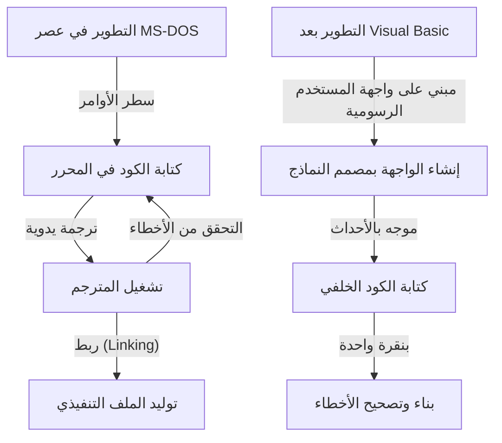
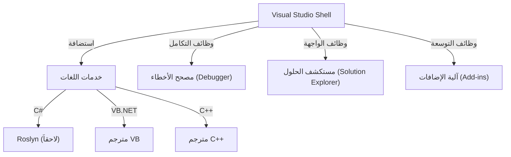

في تطوير البرمجيات الحديثة، تعد بيئة التطوير المتكاملة (IDE) «سلاحاً» لا غنى عنه للمبرمجين. ومن بين هذه البيئات، تواصل «Visual Studio» من Microsoft فرض هيمنتها كمعيار فعلي (De facto standard) في الصناعة لأكثر من ربع قرن.

في هذا المقال، نتعمق في التاريخ الملحمي لتطور Visual Studio، بدءاً من مجموعة المترجمات (Compilers) المنفصلة في عصر MS-DOS وحتى أحدث بيئات التطوير المتكاملة السحابية الأصلية المدعومة بالذكاء الاصطناعي، وذلك من منظور التحولات التقنية والبنية المعمارية.

## 1. البدايات: التحرر من سطر الأوامر وفجر «البرمجة المرئية»

بين أواخر ثمانينيات القرن الماضي وأوائل التسعينيات، كانت أدوات التطوير من Microsoft تُقدَّم كمنتجات مستقلة ومنفصلة، مثل مترجم C‏ (Microsoft C/C++) ومجمع لغة التجميع (MASM) و QuickBasic. وكان المبرمجون يكررون حلقة عمل تتضمن كتابة التعليمات البرمجية في محرر النصوص، واستدعاء المترجم عبر سطر الأوامر، ثم العودة مجدداً إلى المحرر عند ظهور أي أخطاء.

```cpp
/* برنامج بلغة C نموذجي في عصر MS-DOS (Microsoft C 6.0) */
#include <stdio.h>
#include <dos.h>

int main(void) {
    printf("Hello, MS-DOS World!\n");
    return 0;
}
```

وكان ظهور **Visual Basic 1.0** في عام 1991 بمثابة نقطة تحول جذرية غيّرت هذا الواقع تماماً. إذ أحدث النهج الرائد المتمثل في تصميم واجهات المستخدم الرسومية (GUI) عبر «السحب والإفلات» ثورة حقيقية في تطوير تطبيقات Windows آنذاك.



## 2. Visual Studio 97: ولادة بيئة تطوير «متكاملة» بحق

في عام 1997، أعلنت Microsoft عن **Visual Studio 97**، الذي جمع الأدوات التي كانت تُقدَّم مسبقاً بشكل منفصل — مثل Visual Basic و Visual C++ و Visual J++ و Visual FoxPro — في حزمة واحدة متكاملة. وكانت هذه هي نقطة الانطلاق لعلامة «Visual Studio» التجارية.

### تطور Visual C++ ومكتبة MFC
في ذلك الوقت، كانت البرمجة لنظام Windows بالتعامل المباشر مع Win32 API عملية معقدة ومرهقة للغاية. وقدمت Visual C++ مكتبة **MFC (Microsoft Foundation Classes)**، مما قدّم دعماً هائلاً لتطوير تطبيقات Windows باستخدام البرمجة كائنية التوجه (OOP).

```cpp
// البنية الأساسية لتطبيق Windows باستخدام MFC
#include <afxwin.h>

class CMyApp : public CWinApp {
public:
    virtual BOOL InitInstance();
};

class CMyFrame : public CFrameWnd {
public:
    CMyFrame() {
        Create(NULL, _T("Visual Studio History App"));
    }
};

BOOL CMyApp::InitInstance() {
    m_pMainWnd = new CMyFrame();
    m_pMainWnd->ShowWindow(SW_SHOW);
    return TRUE;
}

CMyApp theApp;
```

## 3. ظهور .NET Framework وإطلاق Visual Studio .NET (2002)

مع دخول الألفية الجديدة والانتشار الواسع للإنترنت، برزت الحاجة الملحة لدعم الحوسبة الموزعة. طرحت Microsoft استراتيجيتها «.NET»، معلنةً عن بيئة تشغيل جديدة كلياً وهي **.NET Framework**، إلى جانب لغة برمجة جديدة هي **C#**.

وشكّل إطلاق **Visual Studio .NET (2002)** بالتزامن مع ذلك أكبر نقطة تحول في تاريخ بيئات التطوير المتكاملة.

### تحديث شامل للبنية المعمارية
في VS .NET، تم توحيد بيئات IDE المنفصلة السابقة، وأصبحت مشاريع مختلف اللغات تعمل على غلاف موحد مشترك (Visual Studio Shell).



```csharp
// بداية البرمجة الحديثة مع C# 1.0
using System;

namespace VisualStudioHistory
{
    class Program
    {
        static void Main(string[] args)
        {
            Console.WriteLine("Hello, .NET World!");
        }
    }
}
```

## 4. Visual Studio 2010 والتحديث الشامل للواجهة باستخدام WPF

في Visual Studio 2010، أُعيدت كتابة واجهة مستخدم بيئة التطوير نفسها بالكامل باستخدام WPF (Windows Presentation Foundation)، مما حوّلها إلى واجهة جمالية قابلة للتوسع والتكيف مع مختلف دقات العرض اعتماداً على الرسوميات الشعاعية (Vector-based). كما تميز هذا الإصدار بتضمين لغة F# كجزء أساسي مدمج.

## 5. نحو عصر السحابة والذكاء الاصطناعي: من VS 2019 إلى VS 2022

في السنوات الأخيرة، انتقلت ساحة المعركة الرئيسية لتطوير البرمجيات إلى السحابة. واستجابت Visual Studio لهذا التحول من خلال تحقيق تكامل سلس وعميق مع Microsoft Azure.

علاوة على ذلك، تحولت بيئة التطوير في **Visual Studio 2022** أخيراً إلى تطبيق 64 بت (64-bit)، مما أتاح التعامل مع الحلول البرمجية الضخمة بسلاسة فائقة دون المعاناة من قيود الذاكرة.

### دعم كتابة الكود بالذكاء الاصطناعي: IntelliCode
كتطور طبيعي لميزة الإكمال التلقائي IntelliSense، تم تقديم **IntelliCode** المعتمدة على نماذج التعلم الآلي. إذ تقوم هذه الميزة بفهم سياق الكود البرمجي للمطور والتنبؤ بدقة عالية بالكود التالي الذي ينبغي إدخاله.

```csharp
// كتابة كود موجز باستخدام أحدث ميزات C# (C# 10 فما فوق)
var history = new List<string> { "VS97", "VS2002", "VS2022" };

// يقترح IntelliCode أسلوب LINQ الأمثل استناداً إلى السياق
var modernIDEs = history.Where(v => v.Contains("2022")).ToList();

Console.WriteLine($"The modern IDE is {modernIDEs.FirstOrDefault()}");
```

## الخلاصة: «أقوى سلاح» يواصل تطوره

بدءاً من أدوات سطر الأوامر البسيطة في عصر MS-DOS، مروراً بثورة واجهات المستخدم الرسومية، وولادة منصة .NET، وصولاً إلى تكامل الذكاء الاصطناعي في وقتنا الحاضر، ظلت Visual Studio تتطور باستمرار في طليعة مشهد تطوير البرمجيات.

وفي المستقبل، مع تزايد انتشار التطوير السحابي والمزيد من الاندماج مع الذكاء الاصطناعي التوليدي (مثل GitHub Copilot)، سيصبح «أقوى سلاح» للمبرمجين أكثر قوة وذكاءً بلا شك.
