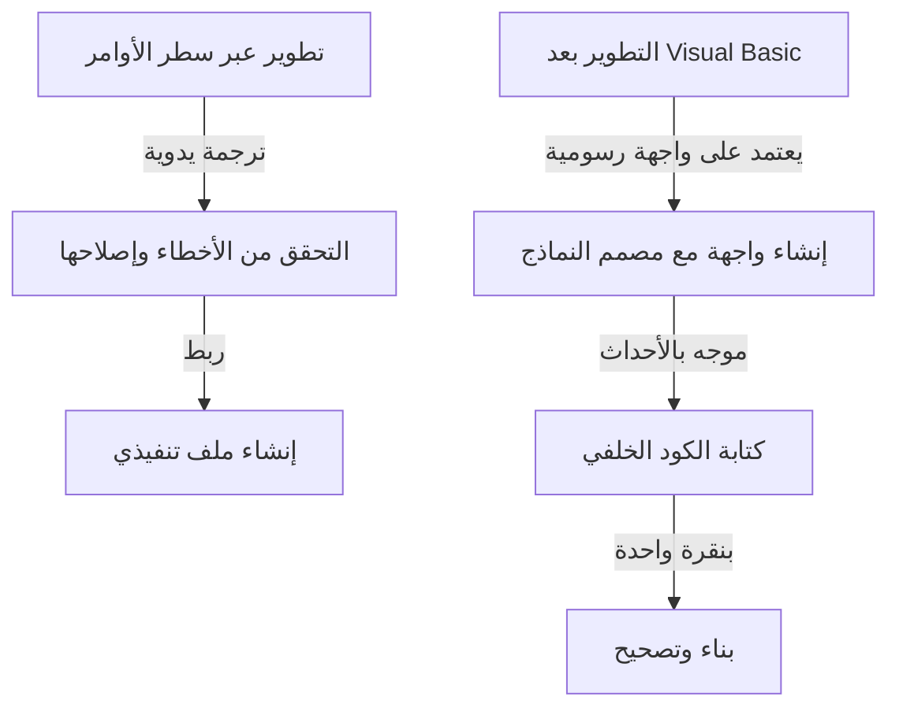

في تطوير البرمجيات الحديثة، تعتبر بيئة التطوير المتكاملة (IDE) "سلاحًا" لا غنى عنه للمبرمجين. ومن بين هذه البيئات، تربع "Visual Studio" من شركة مايكروسوفت على عرش المعيار الفعلي للصناعة لسنوات عديدة. يستعرض هذا المقال تاريخ تطور Visual Studio، من مجموعة من المترجمات المستقلة في عصر MS-DOS إلى أحدث بيئة تطوير متكاملة سحابية مدعومة بالذكاء الاصطناعي.

## 1. الفجر: من سطر الأوامر إلى واجهة المستخدم الرسومية

من الثمانينيات إلى أوائل التسعينيات، كانت أدوات التطوير تُقدم كمنتجات منفصلة مثل المترجمات (compilers) والمجمعات (assemblers). كان المبرمجون يكررون دورة كتابة التعليمات البرمجية في محرر النصوص، واستدعاء المترجم من سطر الأوامر، والعودة إلى المحرر في حالة حدوث خطأ.

```cpp
/* برنامج C نموذجي في عصر MS-DOS */
#include <stdio.h>

int main(void) {
    printf("Hello, MS-DOS World!\n");
    return 0;
}
```

تغير هذا الوضع تمامًا مع إطلاق "Visual Basic 1.0" في عام 1991. النهج الثوري لتصميم شاشات واجهة المستخدم الرسومية عن طريق السحب والإفلات أحدث ثورة في تطوير تطبيقات ويندوز في ذلك الوقت. حيث سمح للمطورين بإنشاء التطبيقات بشكل حدسي من خلال العمليات المرئية، ولاقى ترحيباً واسعاً من قبل العديد من المطورين.



## 2. Visual Studio 97: ولادة بيئة تطوير متكاملة حقيقية

في عام 1997، أعلنت مايكروسوفت عن "Visual Studio 97"، والذي دمج الأدوات التي كانت منفصلة سابقًا مثل Visual Basic و Visual C++ و Visual J++ في حزمة واحدة. كانت هذه بداية العلامة التجارية "Visual Studio".

أصبح بإمكان المطورين الآن العمل بلغات وتقنيات متعددة داخل نفس بيئة التطوير، مما أدى إلى تبسيط إدارة المشاريع وعملية البناء بشكل كبير. وعلى وجه الخصوص، سهّل تطور Visual C++ وإدخال MFC (Microsoft Foundation Classes) تطوير تطبيقات ويندوز المعقدة.

## 3. ظهور .NET Framework و Visual Studio .NET

في عام 2002، أصدرت مايكروسوفت ".NET Framework" و "Visual Studio .NET (2002)"، مما غيّر نموذج تطوير البرمجيات بشكل كبير. تم تقديم لغة جديدة وهي C#، مما مكن المطورين من كتابة تعليمات برمجية أكثر أمانًا وكفاءة.

تم خلال هذه الفترة ترسيخ الميزات الأساسية للغات البرمجة الحديثة، مثل مفهوم الكود المدار (managed code) وإدارة الذاكرة من خلال جمع القمامة (garbage collection). علاوة على ذلك، أصبح تطوير خدمات الويب عبر XML أسهل، مما أدى إلى تسريع تكامل الأنظمة عبر الإنترنت.


## 4. الدخول في عصر التطوير الرشيق (Agile) والسحابة

مع دخول العقد الأول من القرن الحادي والعشرين، تحولت منهجيات تطوير البرمجيات نحو التطوير الرشيق. وإلى جانب ذلك، تطور Visual Studio من مجرد بيئة تطوير متكاملة إلى منصة تدعم تطوير الفرق. من خلال التكامل مع "Team Foundation Server" (المعروف الآن باسم Azure DevOps)، بدأ يغطي دورة الحياة بأكملها، بما في ذلك التحكم في الإصدارات، والتكامل المستمر (CI)، والتسليم المستمر (CD).

بالإضافة إلى ذلك، مع صعود الحوسبة السحابية، تم تعزيز التكامل مع Azure، مما أسس لبيئة يمكن من خلالها تنفيذ كل شيء من التطوير إلى النشر بسلاسة.

## 5. موجة المنصات المتعددة والمصادر المفتوحة

في عام 2015، تم إطلاق محرر الأكواد الخفيف والسريع "Visual Studio Code (VS Code)" وأحدث تأثيرًا هائلاً. من خلال عمله ليس فقط على ويندوز ولكن أيضًا على macOS و Linux، وقدرته على دعم لغات وإطارات عمل متعددة من خلال مجموعة غنية من الإضافات، حظي VS Code على الفور بدعم المطورين في جميع أنحاء العالم.

أيضًا، مع تحويل .NET Core إلى مصدر مفتوح ودعمه للمنصات المتعددة، تجاوز Visual Studio نفسه حدوده التقليدية المقتصرة على ويندوز، واكتسب المرونة للتكيف مع نظام بيئي متنوع للتطوير.

## 6. نحو مستقبل يساعد فيه الذكاء الاصطناعي في البرمجة

في السنوات الأخيرة، مع إدخال مساعدي البرمجة بالذكاء الاصطناعي مثل "GitHub Copilot"، وصلت إنتاجية المطورين إلى مستويات غير مسبوقة. من الإكمال التلقائي للكود واكتشاف الأخطاء إلى اقتراح خوارزميات معقدة، أصبح الذكاء الاصطناعي يعمل كشريك قوي للمطورين.

بدءًا من سطر الأوامر في عصر MS-DOS، مرورًا بالتطوير المرئي عبر واجهة المستخدم الرسومية، والتحول النموذجي الذي أحدثته .NET، والتكامل مع السحابة، والآن مساعدة الذكاء الاصطناعي، تطور Visual Studio باستمرار إلى جانب طليعة تطوير البرمجيات. وسيستمر بلا شك في ترك بصمته في التاريخ باعتباره أقوى سلاح للمبرمج.
