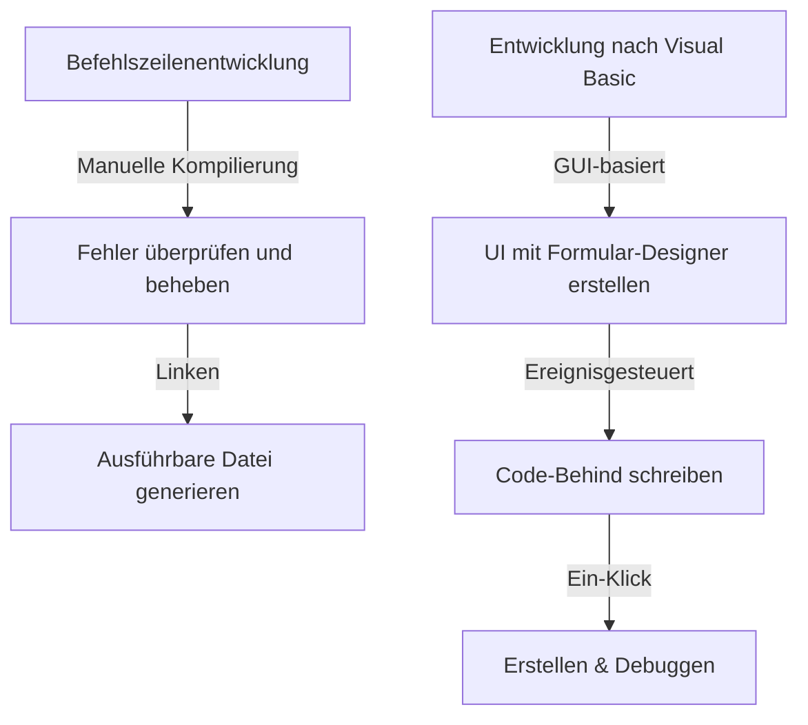
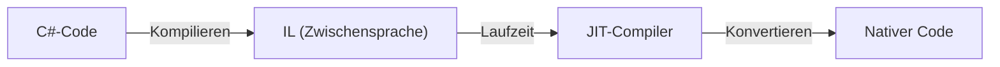

In der modernen Softwareentwicklung ist eine integrierte Entwicklungsumgebung (IDE) eine unverzichtbare "Waffe" für Programmierer. Unter ihnen hat sich Microsofts "Visual Studio" über viele Jahre hinweg als De-facto-Standard der Branche behauptet. Dieser Artikel blickt auf die Evolutionsgeschichte von Visual Studio zurück, von einer Ansammlung unabhängiger Compiler in der MS-DOS-Ära bis hin zur neuesten KI-gestützten Cloud-nativen IDE.

## 1. Die Anfänge: Von der Befehlszeile zur GUI

Von den 1980er bis in die frühen 1990er Jahre wurden Entwicklungswerkzeuge als separate Produkte wie Compiler und Assembler angeboten. Programmierer wiederholten den Zyklus: Code in einem Editor schreiben, den Compiler über die Befehlszeile aufrufen und bei Fehlern zum Editor zurückkehren.

```cpp
/* Ein typisches C-Programm in der MS-DOS-Ära */
#include <stdio.h>

int main(void) {
    printf("Hello, MS-DOS World!\n");
    return 0;
}
```

Diese Situation änderte sich grundlegend mit der Veröffentlichung von "Visual Basic 1.0" im Jahr 1991. Der bahnbrechende Ansatz, GUI-Bildschirme per Drag-and-Drop zu entwerfen, revolutionierte die damalige Windows-Anwendungsentwicklung. Er ermöglichte es Entwicklern, Anwendungen intuitiv durch visuelle Bedienung zu erstellen, und wurde von vielen Entwicklern begrüßt.



## 2. Visual Studio 97: Die Geburt einer wahren integrierten Entwicklungsumgebung

1997 kündigte Microsoft "Visual Studio 97" an, das zuvor separate Werkzeuge wie Visual Basic, Visual C++ und Visual J++ in einem einzigen Paket zusammenfasste. Dies war der Beginn der Marke "Visual Studio".

Entwickler konnten nun mehrere Sprachen und Technologien innerhalb derselben Entwicklungsumgebung nutzen, was das Projektmanagement und den Build-Prozess erheblich vereinfachte. Insbesondere die Weiterentwicklung von Visual C++ und die Einführung der MFC (Microsoft Foundation Classes) erleichterten die Entwicklung komplexer Windows-Anwendungen.

## 3. Die Einführung des .NET Frameworks und Visual Studio .NET

Im Jahr 2002 veröffentlichte Microsoft das ".NET Framework" und "Visual Studio .NET (2002)", was das Paradigma der Softwareentwicklung stark veränderte. Mit C# wurde eine neue Sprache eingeführt, die es Entwicklern ermöglichte, sichereren und effizienteren Code zu schreiben.

Essenzielle Konzepte für moderne Programmiersprachen, wie Managed Code und Speicherverwaltung durch Garbage Collection, wurden in dieser Zeit etabliert. Darüber hinaus wurde die Entwicklung von XML-Webdiensten vereinfacht, was die Systemintegration über das Internet beschleunigte.



## 4. Auf dem Weg in die Ära der agilen Entwicklung und Cloud

Zu Beginn der 2010er Jahre verlagerten sich die Methoden der Softwareentwicklung in Richtung agiler Entwicklung. Damit einhergehend entwickelte sich Visual Studio von einer reinen IDE zu einer Plattform zur Unterstützung der Teamentwicklung. Durch die Integration mit dem "Team Foundation Server" (heute Azure DevOps) deckte es nun den gesamten Lebenszyklus ab, einschließlich Versionskontrolle, kontinuierlicher Integration (CI) und kontinuierlicher Bereitstellung (CD).

Darüber hinaus wurde mit dem Aufstieg des Cloud-Computing die Integration mit Azure gestärkt, wodurch eine Umgebung geschaffen wurde, in der von der Entwicklung bis zur Bereitstellung alles nahtlos durchgeführt werden konnte.

## 5. Die Welle von Multi-Plattform und Open Source

2015 wurde der leichtgewichtige und schnelle Code-Editor "Visual Studio Code (VS Code)" veröffentlicht und sorgte für großes Aufsehen. VS Code lief nicht nur unter Windows, sondern auch unter macOS und Linux und unterstützte durch umfangreiche Erweiterungen eine Vielzahl von Sprachen und Frameworks, was ihm schnell die Unterstützung von Entwicklern weltweit einbrachte.

Mit der Open-Source-Umwandlung von .NET Core und dessen plattformübergreifender Unterstützung überschritt Visual Studio auch seine traditionellen, nur auf Windows beschränkten Grenzen und gewann die Flexibilität, sich an ein vielfältiges Entwicklungs-Ökosystem anzupassen.

## 6. Auf dem Weg in eine Zukunft, in der KI beim Programmieren hilft

In den letzten Jahren hat die Entwicklerproduktivität durch die Einführung von KI-Programmierassistenten wie "GitHub Copilot" ein beispielloses Niveau erreicht. Von der automatischen Codevervollständigung über die Fehlererkennung bis hin zum Vorschlagen komplexer Algorithmen fungiert KI inzwischen als starker Partner für Entwickler.

Angefangen bei der Befehlszeile der MS-DOS-Ära, über die visuelle Entwicklung per GUI, den Paradigmenwechsel durch .NET, die Cloud-Integration bis hin zur KI-Unterstützung hat sich Visual Studio stets an der Spitze der Softwareentwicklung weiterentwickelt. Es wird zweifellos weiterhin seine Spuren als stärkste Waffe des Programmierers in der Geschichte hinterlassen.
