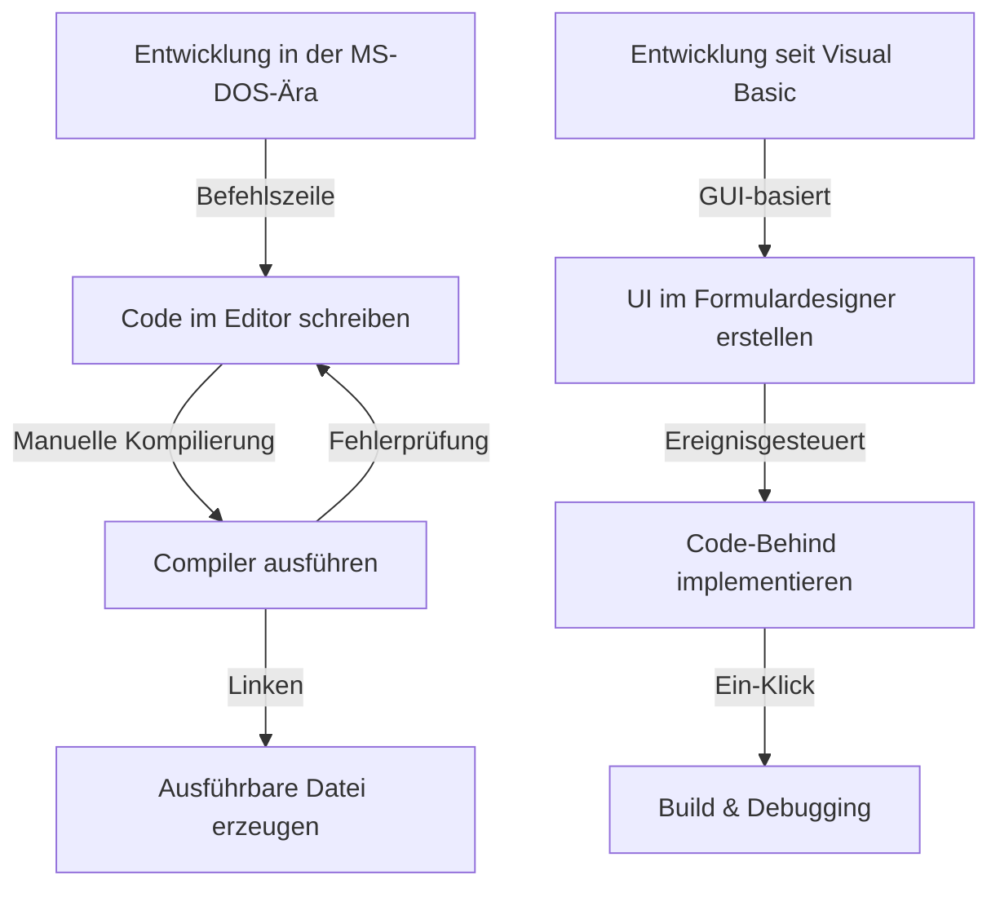
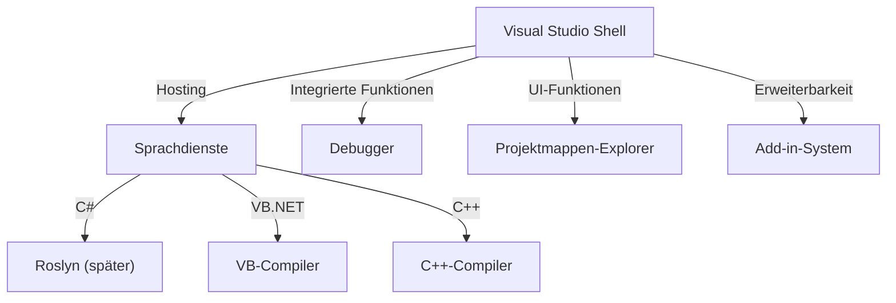

In der modernen Softwareentwicklung ist eine integrierte Entwicklungsumgebung (IDE) ein unverzichtbares Werkzeug für Programmierer. Unter ihnen gilt Microsofts „Visual Studio“ seit mehr als einem Vierteljahrhundert als De-facto-Standard der Branche.

In diesem Artikel beleuchten wir die faszinierende Entwicklungsgeschichte von Visual Studio – von isolierten Compilern der MS-DOS-Ära bis hin zur modernen, KI-gestützten und cloudnativen IDE – aus der Perspektive technischer Meilensteine und architektonischer Veränderungen im Detail.

## 1. Die Anfangsjahre: Abschied von der Befehlszeile und der Beginn der visuellen Entwicklung

In den späten 1980er und frühen 1990er Jahren wurden Microsofts Entwicklungswerkzeuge als separate Einzelprodukte angeboten, darunter C-Compiler (Microsoft C/C++), Assembler (MASM) und QuickBasic. Programmierer schrieben ihren Code in einem Editor, riefen den Compiler über die Befehlszeile auf und kehrten bei Fehlern wieder zum Editor zurück – ein ständiger Zyklus.

```cpp
/* Typisches C-Programm der MS-DOS-Ära (Microsoft C 6.0) */
#include <stdio.h>
#include <dos.h>

int main(void) {
    printf("Hello, MS-DOS World!\n");
    return 0;
}
```

Diese Situation änderte sich schlagartig mit der Veröffentlichung von **Visual Basic 1.0** im Jahr 1991. Der bahnbrechende Ansatz, GUI-Oberflächen per „Drag-and-Drop“ zu gestalten, revolutionierte damals die Windows-Anwendungsentwicklung.



## 2. Visual Studio 97: Die Geburt einer echten „integrierten“ Entwicklungsumgebung

Im Jahr 1997 brachte Microsoft **Visual Studio 97** auf den Markt und bündelte damit vormals eigenständige Tools wie Visual Basic, Visual C++, Visual J++ und Visual FoxPro in einem einzigen Paket. Dies markierte den Beginn der Marke „Visual Studio“.

### Die Evolution von Visual C++ und MFC
In der damaligen Windows-Programmierung war der direkte Zugriff auf die Win32-API äußerst mühsam und komplex. Visual C++ führte die **MFC (Microsoft Foundation Classes)** ein und förderte damit die objektorientierte Entwicklung von Windows-Anwendungen maßgeblich.

```cpp
// Grundlegende Struktur einer Windows-Anwendung mit MFC
#include <afxwin.h>

class CMyApp : public CWinApp {
public:
    virtual BOOL InitInstance();
};

class CMyFrame : public CFrameWnd {
public:
    CMyFrame() {
        Create(NULL, _T("Visual Studio History App"));
    }
};

BOOL CMyApp::InitInstance() {
    m_pMainWnd = new CMyFrame();
    m_pMainWnd->ShowWindow(SW_SHOW);
    return TRUE;
}

CMyApp theApp;
```

## 3. Das Aufkommen des .NET Frameworks und Visual Studio .NET (2002)

Mit dem Beginn der 2000er Jahre und der rasanten Verbreitung des Internets wurde die Unterstützung von verteilten Systemen zu einer dringenden Notwendigkeit. Microsoft stellte seine „.NET-Strategie“ vor und präsentierte mit dem **.NET Framework** eine völlig neue Laufzeitumgebung sowie mit **C#** eine neue Programmiersprache.

Das zeitgleich veröffentlichte **Visual Studio .NET (2002)** markierte den bedeutendsten Wendepunkt in der Geschichte der IDE.

### Erneuerung der Architektur
In VS .NET wurden die zuvor getrennten IDE-Umgebungen vereinheitlicht, sodass Projekte verschiedener Sprachen auf einer gemeinsamen Plattform (der Visual Studio Shell) ausgeführt und verwaltet werden konnten.



```csharp
// Beginn moderner Programmierung mit C# 1.0
using System;

namespace VisualStudioHistory
{
    class Program
    {
        static void Main(string[] args)
        {
            Console.WriteLine("Hello, .NET World!");
        }
    }
}
```

## 4. Visual Studio 2010 und die vollständige UI-Überarbeitung mit WPF

In Visual Studio 2010 wurde die Benutzeroberfläche der IDE vollständig mit WPF (Windows Presentation Foundation) neu geschrieben, was zu einer vektorbasierten, skalierbaren und modernen Oberfläche führte. Zudem war dies die Version, in der F# erstmals standardmäßig integriert wurde.

## 5. Aufbruch in das Cloud- und KI-Zeitalter: Von VS 2019 zu VS 2022

In den letzten Jahren hat sich der Schwerpunkt der Softwareentwicklung zunehmend in die Cloud verlagert. Visual Studio hat darauf mit einer nahtlosen Integration in Microsoft Azure reagiert.

Mit **Visual Studio 2022** wurde die IDE schließlich als native 64-Bit-Anwendung umgesetzt, wodurch auch bei sehr großen Projektmappen Speicherengpässe der Vergangenheit angehören und ein reibungsloses Arbeiten gewährleistet wird.

### KI-gestützte Programmierunterstützung: IntelliCode
Als Weiterentwicklung der automatischen Codevervollständigung IntelliSense wurde **IntelliCode** eingeführt, das auf Modellen des maschinellen Lernens basiert. Es versteht den Kontext des geschriebenen Codes und sagt mit hoher Genauigkeit voraus, welcher Code als Nächstes benötigt wird.

```csharp
// Prägnanter Code mit modernem C# (C# 10 oder neuer)
var history = new List<string> { "VS97", "VS2002", "VS2022" };

// IntelliCode schlägt anhand des Kontexts die optimale LINQ-Methode vor
var modernIDEs = history.Where(v => v.Contains("2022")).ToList();

Console.WriteLine($"The modern IDE is {modernIDEs.FirstOrDefault()}");
```

## Fazit: Die stetige Weiterentwicklung der „mächtigsten Waffe“

Von den spartanischen Befehlszeilentools der MS-DOS-Tage über die GUI-Revolution, das Aufkommen von .NET bis hin zur heutigen KI-Integration – Visual Studio hat sich an vorderster Front der Softwareentwicklung kontinuierlich weiterentwickelt.

Auch in Zukunft wird die „mächtigste Waffe“ der Programmierer durch die zunehmende Verbreitung von Cloud-Entwicklung und die tiefere Integration generativer KI (wie GitHub Copilot) noch leistungsfähiger und intelligenter werden.
