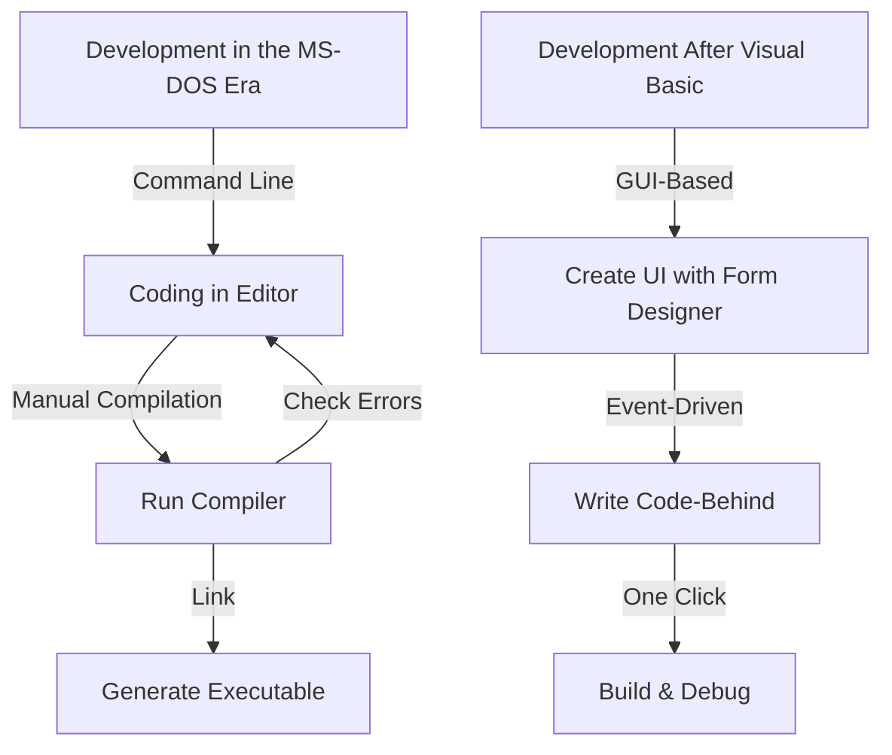
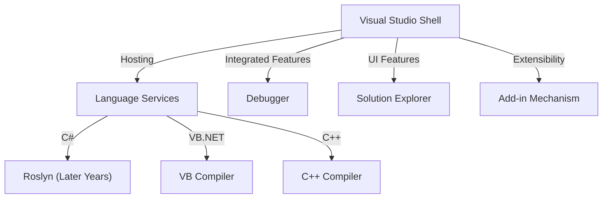

In modern software development, an Integrated Development Environment (IDE) is an indispensable "weapon" for programmers. Among them, Microsoft's Visual Studio has reigned as the industry's de facto standard for over a quarter of a century.

In this article, we delve deeply into the epic history of Visual Studio's evolution—from standalone compilers in the MS-DOS era to the latest AI-powered, cloud-native IDE—from the perspective of technical transitions and architecture.

## 1. The Dawn: Breaking Away from the Command Line and the Rise of "Visualization"

From the late 1980s to the early 1990s, Microsoft's development tools were provided as separate products, such as C compilers (Microsoft C/C++), assemblers (MASM), and QuickBASIC. Programmers wrote code in an editor, invoked the compiler from the command line, and went back to the editor if errors occurred—repeating this cycle.

```cpp
/* Typical C program in the MS-DOS era (Microsoft C 6.0) */
#include <stdio.h>
#include <dos.h>

int main(void) {
    printf("Hello, MS-DOS World!\n");
    return 0;
}
```

What revolutionized this situation was **Visual Basic 1.0**, introduced in 1991. Its groundbreaking approach of designing GUI screens via "drag and drop" revolutionized Windows application development at the time.



## 2. Visual Studio 97: The Birth of a True "Integrated" Development Environment

In 1997, Microsoft announced **Visual Studio 97**, which bundled previously separate tools such as Visual Basic, Visual C++, Visual J++, and Visual FoxPro into a single package. This marked the beginning of the "Visual Studio" brand.

### Evolution of Visual C++ and MFC
In Windows programming at the time, directly calling the Win32 API was extremely cumbersome. Visual C++ provided **MFC (Microsoft Foundation Classes)**, powerfully promoting Windows application development using object-oriented programming.

```cpp
// Basic structure of a Windows application using MFC
#include <afxwin.h>

class CMyApp : public CWinApp {
public:
    virtual BOOL InitInstance();
};

class CMyFrame : public CFrameWnd {
public:
    CMyFrame() {
        Create(NULL, _T("Visual Studio History App"));
    }
};

BOOL CMyApp::InitInstance() {
    m_pMainWnd = new CMyFrame();
    m_pMainWnd->ShowWindow(SW_SHOW);
    return TRUE;
}

CMyApp theApp;
```

## 3. The Arrival of the .NET Framework and Visual Studio .NET (2002)

Entering the 2000s, with the rapid spread of the Internet, supporting distributed computing became an urgent priority. Microsoft unveiled its ".NET strategy", introducing a completely new runtime environment, the **.NET Framework**, along with a new programming language, **C#**.

Released in tandem with this, **Visual Studio .NET (2002)** became the greatest turning point in the history of IDEs.

### Architectural Overhaul
In VS .NET, the previously separate IDE environments were unified, allowing projects across different languages to run on a common shell (Visual Studio Shell).



```csharp
// The dawn of modern programming with C# 1.0
using System;

namespace VisualStudioHistory
{
    class Program
    {
        static void Main(string[] args)
        {
            Console.WriteLine("Hello, .NET World!");
        }
    }
}
```

## 4. Visual Studio 2010 and the Complete UI Overhaul with WPF

In Visual Studio 2010, the IDE's UI itself was rewritten in WPF (Windows Presentation Foundation), evolving into a vector-based, scalable, and polished interface. This version also marked the standard inclusion of F#.

## 5. Into the Cloud and AI Era: From VS 2019 to VS 2022

In recent years, the primary battleground of software development has shifted to the cloud. Visual Studio responded accordingly, achieving seamless integration with Azure.

Furthermore, with **Visual Studio 2022**, the IDE itself finally transitioned to 64-bit architecture, running smoothly even on massive solutions without suffering from out-of-memory issues.

### AI-Powered Coding Assistance: IntelliCode
As an evolution of IntelliSense (code completion), **IntelliCode**, powered by machine learning models, was introduced. It understands the context of the developer's code and predicts the next code to type with high accuracy.

```csharp
// Concise coding utilizing modern C# (C# 10 and later)
var history = new List<string> { "VS97", "VS2002", "VS2022" };

// IntelliCode suggests the optimal LINQ method based on context
var modernIDEs = history.Where(v => v.Contains("2022")).ToList();

Console.WriteLine($"The modern IDE is {modernIDEs.FirstOrDefault()}");
```

## Summary: The "Ultimate Weapon" That Continues to Evolve

Starting from rugged command-line tools in the MS-DOS era, through the GUI revolution, the birth of .NET, and up to today's AI integration, Visual Studio has consistently evolved at the forefront of software development.

Going forward, through the proliferation of cloud development and deeper integration with generative AI (such as GitHub Copilot), the programmer's "ultimate weapon" will undoubtedly become even more powerful and intelligent.
