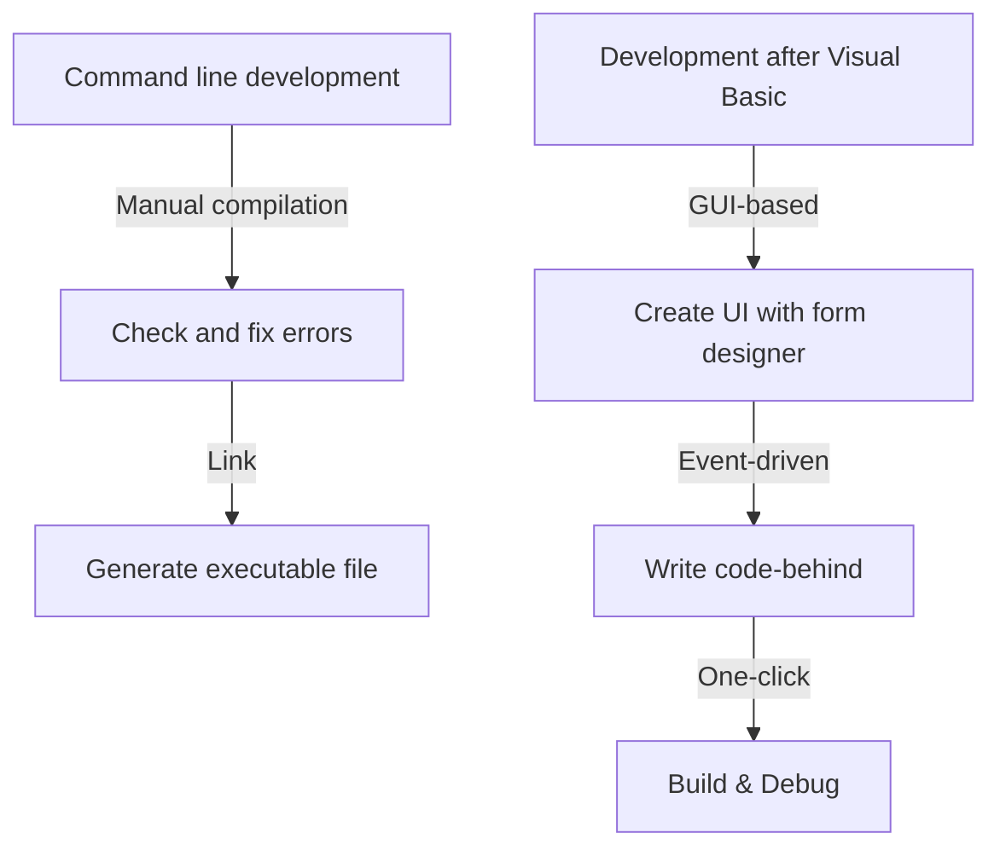
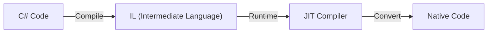

In modern software development, an Integrated Development Environment (IDE) is an indispensable "weapon" for programmers. Among them, Microsoft's "Visual Studio" has reigned as the de facto standard of the industry for many years. This article looks back on the evolutionary history of Visual Studio, from a collection of independent compilers in the MS-DOS era to the latest AI-powered cloud-native IDE.

## 1. The Dawn: From Command Line to GUI

From the 1980s to the early 1990s, development tools were provided as separate products such as compilers and assemblers. Programmers would repeat a cycle of writing code in an editor, calling the compiler from the command line, and returning to the editor if an error occurred.

```cpp
/* A typical C program in the MS-DOS era */
#include <stdio.h>

int main(void) {
    printf("Hello, MS-DOS World!\n");
    return 0;
}
```

This situation was completely changed by the release of "Visual Basic 1.0" in 1991. The groundbreaking approach of designing GUI screens with drag-and-drop revolutionized Windows application development at the time. It allowed developers to create applications intuitively through visual operations, and was welcomed by many developers.



## 2. Visual Studio 97: The Birth of a True Integrated Development Environment

In 1997, Microsoft announced "Visual Studio 97," which combined previously separate tools like Visual Basic, Visual C++, and Visual J++ into a single package. This was the beginning of the "Visual Studio" brand.

Developers were now able to work with multiple languages and technologies within the same development environment, significantly simplifying project management and the build process. In particular, the evolution of Visual C++ and the introduction of MFC (Microsoft Foundation Classes) made it easier to develop complex Windows applications.

## 3. The Advent of the .NET Framework and Visual Studio .NET

In 2002, Microsoft released the ".NET Framework" and "Visual Studio .NET (2002)," which greatly changed the paradigm of software development. A new language, C#, was introduced, enabling developers to write safer and more efficient code.

Essential features for modern programming languages, such as the concept of managed code and memory management through garbage collection, were established during this period. Furthermore, the development of XML Web services became easier, accelerating system integration over the Internet.



## 4. Into the Era of Agile Development and Cloud

Entering the 2010s, software development methodologies shifted toward agile development. Along with this, Visual Studio evolved from a simple IDE into a platform that supports team development. Through integration with "Team Foundation Server" (now Azure DevOps), it began to cover the entire lifecycle, including version control, continuous integration (CI), and continuous delivery (CD).

Furthermore, with the rise of cloud computing, integration with Azure was strengthened, establishing an environment where development to deployment could be performed seamlessly.

## 5. The Wave of Multi-platform and Open Source

In 2015, the lightweight and fast code editor "Visual Studio Code (VS Code)" was released and made a massive impact. Running not only on Windows but also on macOS and Linux, and capable of supporting various languages and frameworks through a rich set of extensions, VS Code instantly gathered support from developers worldwide.

Also, with the open-sourcing of .NET Core and its cross-platform support, Visual Studio itself transcended its traditional Windows-only boundaries, acquiring the flexibility to adapt to a diverse development ecosystem.

## 6. Toward a Future Where AI Assists Coding

In recent years, with the introduction of AI coding assistants like "GitHub Copilot," developer productivity has reached unprecedented levels. From automatic code completion and bug detection to even proposing complex algorithms, AI has come to function as a powerful partner for developers.

Starting from the command line in the MS-DOS era, moving through visual development via GUI, the paradigm shift brought by .NET, integration with the cloud, and now AI assistance, Visual Studio has continually evolved alongside the forefront of software development. It will undoubtedly continue to make its mark in history as the programmer's ultimate weapon.
