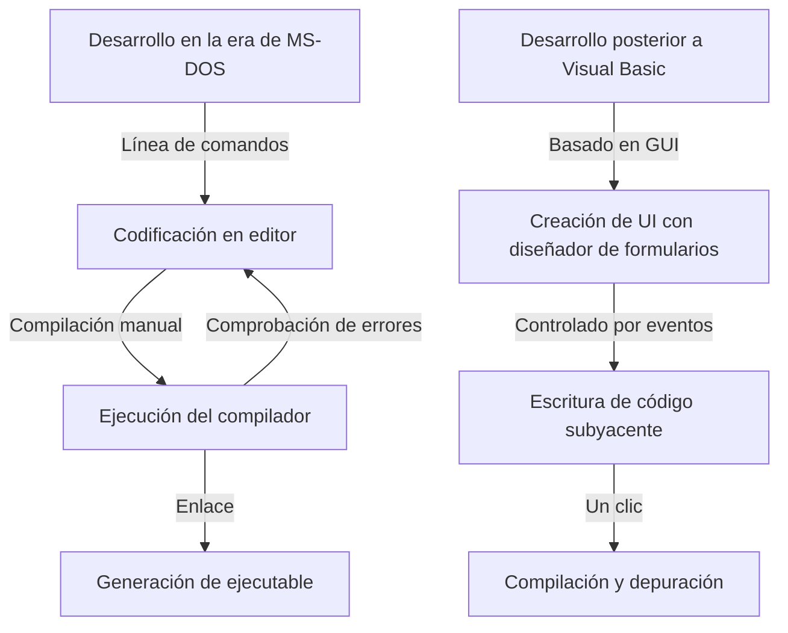
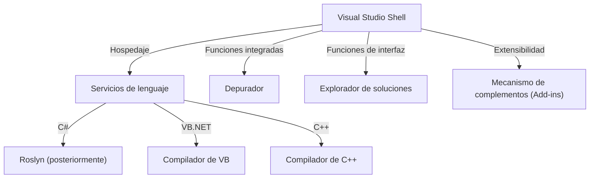

En el desarrollo de software moderno, el entorno de desarrollo integrado (IDE) es un «arma» indispensable para los programadores. Entre ellos, «Visual Studio» de Microsoft ha reinado como el estándar de facto de la industria durante más de un cuarto de siglo.

En este artículo, profundizaremos en la magnífica historia de la evolución de Visual Studio, desde el conjunto de compiladores independientes de la era de MS-DOS hasta los IDE nativos de la nube impulsados por IA más recientes, analizando las transiciones técnicas y las perspectivas arquitectónicas.

## 1. Los albores: La salida de la línea de comandos y el amanecer de la «visualización»

A finales de los años 80 y principios de los 90, las herramientas de desarrollo de Microsoft se ofrecían como productos independientes, tales como el compilador de C (Microsoft C/C++), el ensamblador (MASM) y QuickBasic. Los programadores escribían código en un editor, invocaban al compilador desde la línea de comandos y, si surgían errores, volvían al editor para corregirlos, repitiendo este ciclo una y otra vez.

```cpp
/* Programa típico en C de la era de MS-DOS (Microsoft C 6.0) */
#include <stdio.h>
#include <dos.h>

int main(void) {
    printf("Hello, MS-DOS World!\n");
    return 0;
}
```

Lo que cambió radicalmente esta situación fue la llegada de **Visual Basic 1.0** en 1991. Su enfoque innovador, que permitía diseñar pantallas de interfaz gráfica (GUI) mediante «arrastrar y soltar», revolucionó el desarrollo de aplicaciones para Windows de aquella época.



## 2. Visual Studio 97: El nacimiento de un verdadero entorno de desarrollo «integrado»

En 1997, Microsoft anunció **Visual Studio 97**, combinando en un único paquete herramientas que anteriormente se ofrecían por separado, como Visual Basic, Visual C++, Visual J++ y Visual FoxPro. Este fue el comienzo de la marca «Visual Studio».

### La evolución de Visual C++ y MFC
En la programación de Windows de aquella época, interactuar directamente con la API Win32 resultaba sumamente complejo y tedioso. Visual C++ ofreció **MFC (Microsoft Foundation Classes)**, impulsando con fuerza el desarrollo de aplicaciones para Windows mediante programación orientada a objetos.

```cpp
// Estructura básica de una aplicación de Windows con MFC
#include <afxwin.h>

class CMyApp : public CWinApp {
public:
    virtual BOOL InitInstance();
};

class CMyFrame : public CFrameWnd {
public:
    CMyFrame() {
        Create(NULL, _T("Visual Studio History App"));
    }
};

BOOL CMyApp::InitInstance() {
    m_pMainWnd = new CMyFrame();
    m_pMainWnd->ShowWindow(SW_SHOW);
    return TRUE;
}

CMyApp theApp;
```

## 3. La llegada de .NET Framework y Visual Studio .NET (2002)

Con la llegada de la década de 2000 y la expansión de Internet, la adaptación a la computación distribuida se convirtió en una necesidad urgente. Microsoft presentó su «estrategia .NET», dando a conocer un entorno de ejecución completamente nuevo, el **.NET Framework**, junto con un nuevo lenguaje: **C#**.

Lanzado junto con esta iniciativa, **Visual Studio .NET (2002)** se convirtió en el punto de inflexión más importante en la historia de los IDE.

### Renovación de la arquitectura
En VS .NET, los entornos de desarrollo individuales anteriores se unificaron, permitiendo que los proyectos de los distintos lenguajes funcionaran sobre un shell común (Visual Studio Shell).



```csharp
// El amanecer de la programación moderna con C# 1.0
using System;

namespace VisualStudioHistory
{
    class Program
    {
        static void Main(string[] args)
        {
            Console.WriteLine("Hello, .NET World!");
        }
    }
}
```

## 4. Visual Studio 2010 y la renovación total de la interfaz de usuario con WPF

En Visual Studio 2010, la interfaz de usuario del propio IDE se reescribió en WPF (Windows Presentation Foundation), evolucionando hacia una interfaz atractiva, escalable y basada en vectores. Además, fue en esta versión donde F# se incluyó de forma predeterminada.

## 5. Hacia la era de la nube y la IA: De VS 2019 a VS 2022

En los últimos años, el principal campo de batalla del desarrollo de software se ha trasladado a la nube. Visual Studio ha respondido en consecuencia, logrando una integración fluida con Azure.

Además, con **Visual Studio 2022**, el IDE finalmente pasó a ser de 64 bits de forma nativa, lo que permite trabajar cómodamente incluso con soluciones a gran escala sin sufrir problemas de falta de memoria.

### Asistencia de codificación mediante IA: IntelliCode
Como una evolución de IntelliSense (autocompletado de código), se introdujo **IntelliCode**, que aprovecha modelos de aprendizaje automático. Comprende el contexto del código del desarrollador y predice con alta precisión el siguiente código a escribir.

```csharp
// Codificación concisa aprovechando las características modernas de C# (C# 10 o superior)
var history = new List<string> { "VS97", "VS2002", "VS2022" };

// IntelliCode sugiere el método LINQ más adecuado según el contexto
var modernIDEs = history.Where(v => v.Contains("2022")).ToList();

Console.WriteLine($"The modern IDE is {modernIDEs.FirstOrDefault()}");
```

## Resumen: El «arma definitiva» que continúa evolucionando

Comenzando como herramientas de línea de comandos austeras en la era de MS-DOS, pasando por la revolución de la interfaz gráfica, el nacimiento de .NET y hasta la actual integración con la IA, Visual Studio siempre ha continuado evolucionando en la primera línea del desarrollo de software.

En el futuro, con la proliferación del desarrollo en la nube y una integración aún más estrecha con la IA generativa (como GitHub Copilot), el «arma definitiva» de los programadores sin duda se volverá más poderosa e inteligente.
```
