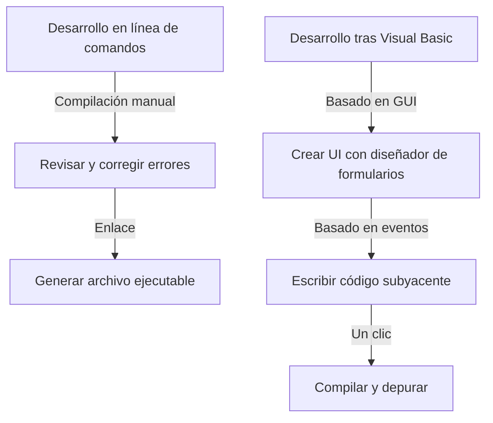

En el desarrollo de software moderno, un entorno de desarrollo integrado (IDE) es un "arma" indispensable para los programadores. Entre ellos, "Visual Studio" de Microsoft ha reinado como el estándar de facto de la industria durante muchos años. Este artículo repasa la historia evolutiva de Visual Studio, desde una colección de compiladores independientes en la era de MS-DOS hasta el último IDE nativo de la nube impulsado por IA.

## 1. Los inicios: De la línea de comandos a la interfaz gráfica (GUI)

Desde la década de 1980 hasta principios de la de 1990, las herramientas de desarrollo se proporcionaban como productos separados, como compiladores y ensambladores. Los programadores repetían un ciclo de escribir código en un editor, llamar al compilador desde la línea de comandos y volver al editor si ocurría un error.

```cpp
/* Un programa típico en C de la era MS-DOS */
#include <stdio.h>

int main(void) {
    printf("Hello, MS-DOS World!\n");
    return 0;
}
```

Esta situación cambió por completo con el lanzamiento de "Visual Basic 1.0" en 1991. El enfoque revolucionario de diseñar pantallas GUI arrastrando y soltando transformó el desarrollo de aplicaciones para Windows en ese momento. Permitió a los desarrolladores crear aplicaciones de forma intuitiva a través de operaciones visuales, y fue bien recibido por muchos programadores.



## 2. Visual Studio 97: El nacimiento de un verdadero entorno de desarrollo integrado

En 1997, Microsoft anunció "Visual Studio 97", que combinó herramientas anteriormente separadas como Visual Basic, Visual C++ y Visual J++ en un solo paquete. Este fue el comienzo de la marca "Visual Studio".

Los desarrolladores ahora podían trabajar con múltiples lenguajes y tecnologías dentro del mismo entorno de desarrollo, lo que simplificó significativamente la gestión de proyectos y el proceso de compilación. En particular, la evolución de Visual C++ y la introducción de MFC (Microsoft Foundation Classes) facilitaron el desarrollo de aplicaciones complejas para Windows.

## 3. La llegada de .NET Framework y Visual Studio .NET

En 2002, Microsoft lanzó ".NET Framework" y "Visual Studio .NET (2002)", que cambiaron en gran medida el paradigma del desarrollo de software. Se introdujo un nuevo lenguaje, C#, que permitía a los desarrolladores escribir código más seguro y eficiente.

Durante este período se establecieron características esenciales para los lenguajes de programación modernos, como el concepto de código administrado y la gestión de memoria a través del recolector de basura. Además, el desarrollo de servicios web XML se hizo más fácil, acelerando la integración de sistemas a través de Internet.


## 4. Hacia la era del desarrollo ágil y la nube

Al entrar en la década de 2010, las metodologías de desarrollo de software se orientaron hacia el desarrollo ágil. Junto con esto, Visual Studio evolucionó de un simple IDE a una plataforma que respalda el desarrollo en equipo. A través de la integración con "Team Foundation Server" (ahora Azure DevOps), comenzó a cubrir todo el ciclo de vida, incluido el control de versiones, la integración continua (CI) y la entrega continua (CD).

Además, con el auge de la computación en la nube, la integración con Azure se fortaleció, estableciendo un entorno donde desde el desarrollo hasta el despliegue se podía realizar sin problemas.

## 5. La ola de multiplataforma y código abierto

En 2015, se lanzó el editor de código ligero y rápido "Visual Studio Code (VS Code)" y tuvo un impacto masivo. Funcionando no solo en Windows, sino también en macOS y Linux, y capaz de admitir varios lenguajes y marcos a través de un rico conjunto de extensiones, VS Code reunió instantáneamente el apoyo de los desarrolladores de todo el mundo.

Además, con la conversión a código abierto de .NET Core y su soporte multiplataforma, el propio Visual Studio trascendió sus límites tradicionales exclusivos de Windows, adquiriendo la flexibilidad de adaptarse a un ecosistema de desarrollo diverso.

## 6. Hacia un futuro donde la IA ayuda en la programación

En los últimos años, con la introducción de asistentes de programación de IA como "GitHub Copilot", la productividad de los desarrolladores ha alcanzado niveles sin precedentes. Desde el autocompletado de código y la detección de errores hasta la propuesta de algoritmos complejos, la IA ha llegado a funcionar como un socio poderoso para los desarrolladores.

Comenzando desde la línea de comandos en la era de MS-DOS, pasando por el desarrollo visual a través de GUI, el cambio de paradigma traído por .NET, la integración con la nube y ahora la asistencia de IA, Visual Studio ha evolucionado continuamente junto a la vanguardia del desarrollo de software. Sin duda seguirá dejando su huella en la historia como el arma más poderosa del programador.
