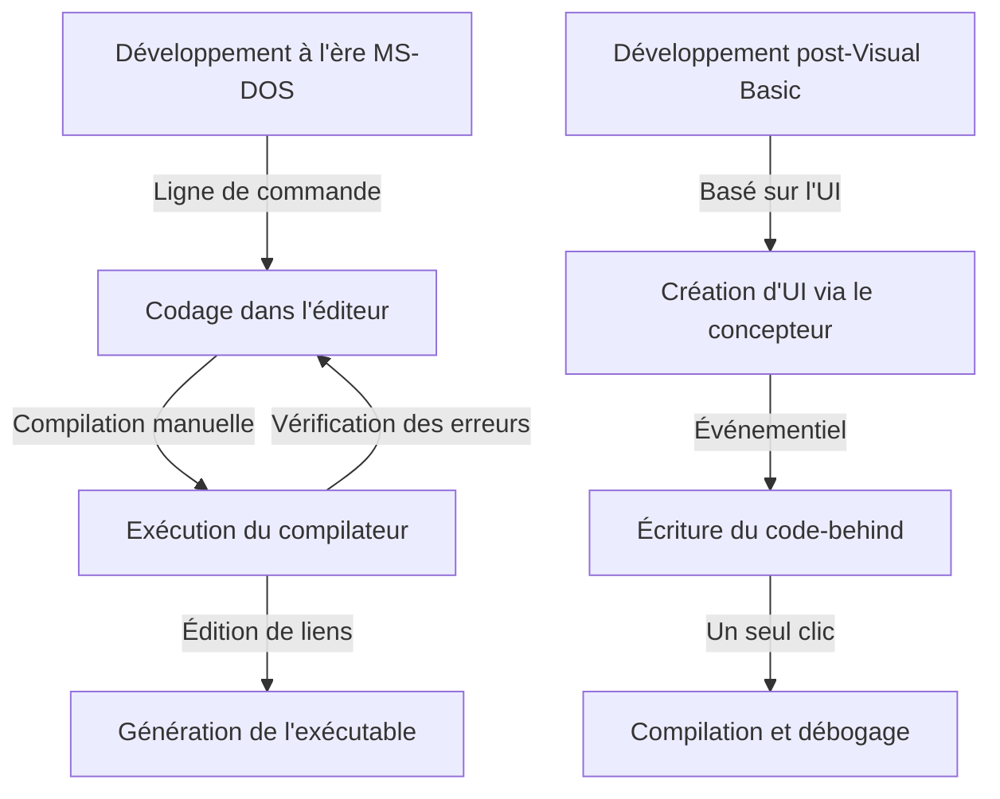
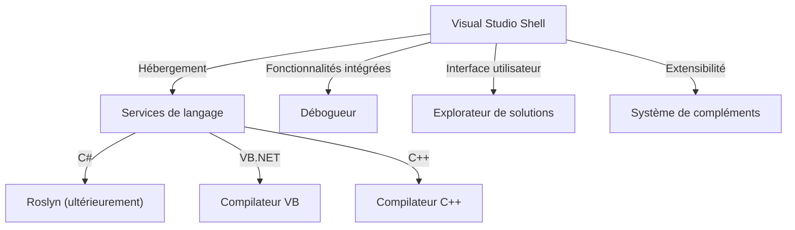

Dans le développement logiciel moderne, l'environnement de développement intégré (IDE) est une « arme » indispensable pour les développeurs. Parmi eux, « Visual Studio » de Microsoft règne en maître en tant que standard de facto de l'industrie depuis plus d'un quart de siècle.

Cet article explore en profondeur la formidable histoire de l'évolution de Visual Studio, depuis les compilateurs autonomes de l'ère MS-DOS jusqu'aux IDE cloud-native modernes dopés à l'IA, à travers ses mutations techniques et ses choix architecturaux.

## 1. Les débuts : l'abandon de la ligne de commande et l'avènement de la « programmation visuelle »

De la fin des années 1980 au début des années 1990, les outils de développement de Microsoft étaient distribués sous forme de produits séparés, tels que le compilateur C (Microsoft C/C++), l'assembleur (MASM) ou encore QuickBasic. Les développeurs écrivaient leur code dans un éditeur de texte, invoquaient le compilateur en ligne de commande, puis revenaient à l'éditeur en cas d'erreur, dans une boucle itérative fastidieuse.

```cpp
/* Programme C typique de l'ère MS-DOS (Microsoft C 6.0) */
#include <stdio.h>
#include <dos.h>

int main(void) {
    printf("Hello, MS-DOS World!\n");
    return 0;
}
```

L'arrivée de **Visual Basic 1.0** en 1991 a complètement changé la donne. Son approche révolutionnaire permettant de concevoir des interfaces graphiques par « glisser-déposer » a profondément transformé le développement d'applications Windows de l'époque.



## 2. Visual Studio 97 : La naissance d'un véritable environnement de développement « intégré »

En 1997, Microsoft a regroupé dans un seul ensemble des outils jusqu'alors commercialisés séparément, tels que Visual Basic, Visual C++, Visual J++ et Visual FoxPro, pour lancer **Visual Studio 97**. Ce fut le point de départ de la marque « Visual Studio ».

### L'évolution de Visual C++ et les MFC
À cette époque, programmer pour Windows en appelant directement l'API Win32 était extrêmement fastidieux. Visual C++ a introduit les **MFC (Microsoft Foundation Classes)**, facilitant grandement le développement d'applications Windows grâce à l'approche orientée objet.

```cpp
// Structure de base d'une application Windows utilisant les MFC
#include <afxwin.h>

class CMyApp : public CWinApp {
public:
    virtual BOOL InitInstance();
};

class CMyFrame : public CFrameWnd {
public:
    CMyFrame() {
        Create(NULL, _T("Visual Studio History App"));
    }
};

BOOL CMyApp::InitInstance() {
    m_pMainWnd = new CMyFrame();
    m_pMainWnd->ShowWindow(SW_SHOW);
    return TRUE;
}

CMyApp theApp;
```

## 3. L'avènement du .NET Framework et Visual Studio .NET (2002)

Au début des années 2000, avec l'essor d'Internet, la prise en charge de l'informatique distribuée est devenue une priorité absolue. Microsoft a alors dévoilé sa stratégie « .NET », introduisant un tout nouvel environnement d'exécution, le **.NET Framework**, ainsi qu'un nouveau langage : le **C#**.

Sorti pour accompagner cette révolution, **Visual Studio .NET (2002)** a marqué le tournant le plus décisif de l'histoire de l'IDE.

### Une refonte complète de l'architecture
Avec VS .NET, les environnements autrefois disparates ont été unifiés. Désormais, les projets de chaque langage s'exécutaient au sein d'un shell commun (Visual Studio Shell).



```csharp
// Les prémices de la programmation moderne avec C# 1.0
using System;

namespace VisualStudioHistory
{
    class Program
    {
        static void Main(string[] args)
        {
            Console.WriteLine("Hello, .NET World!");
        }
    }
}
```

## 4. Visual Studio 2010 et la refonte intégrale de l'interface avec WPF

Dans Visual Studio 2010, l'interface graphique de l'IDE lui-même a été entièrement réécrite en WPF (Windows Presentation Foundation), offrant une interface vectorielle, élégante et adaptable à toutes les résolutions. C'est également avec cette version que F# a été intégré en standard.

## 5. Vers l'ère du cloud et de l'IA : de VS 2019 à VS 2022

Ces dernières années, le cœur du développement logiciel s'est déplacé vers le cloud. Visual Studio s'y est adapté en offrant une intégration transparente avec Azure.

De plus, avec **Visual Studio 2022**, l'IDE est enfin devenu une application 64 bits native, permettant de manipuler de très volumineuses solutions sans se heurter aux limites de mémoire vive et en bénéficiant de performances fluides.

### L'assistance au codage par l'IA : IntelliCode
Évolution naturelle d'IntelliSense (la complétion de code), **IntelliCode** a fait son apparition en s'appuyant sur des modèles de machine learning. Il comprend le contexte du code rédigé par le développeur et prédit avec une grande précision le code à saisir.

```csharp
// Codage concis tirant parti des versions récentes de C# (C# 10 et ultérieur)
var history = new List<string> { "VS97", "VS2002", "VS2022" };

// IntelliCode suggère la méthode LINQ optimale en fonction du contexte
var modernIDEs = history.Where(v => v.Contains("2022")).ToList();

Console.WriteLine($"The modern IDE is {modernIDEs.FirstOrDefault()}");
```

## Conclusion : « L'arme ultime » en perpétuelle évolution

Des outils rudimentaires en ligne de commande de l'époque MS-DOS à la révolution graphique, en passant par l'émergence de .NET et l'intégration actuelle de l'IA, Visual Studio a constamment su évoluer à la pointe du développement logiciel.

À l'avenir, avec la généralisation du développement dans le cloud et une synergie encore plus étroite avec l'IA générative (comme GitHub Copilot), « l'arme ultime » des développeurs est appelée à devenir toujours plus puissante et intelligente.
