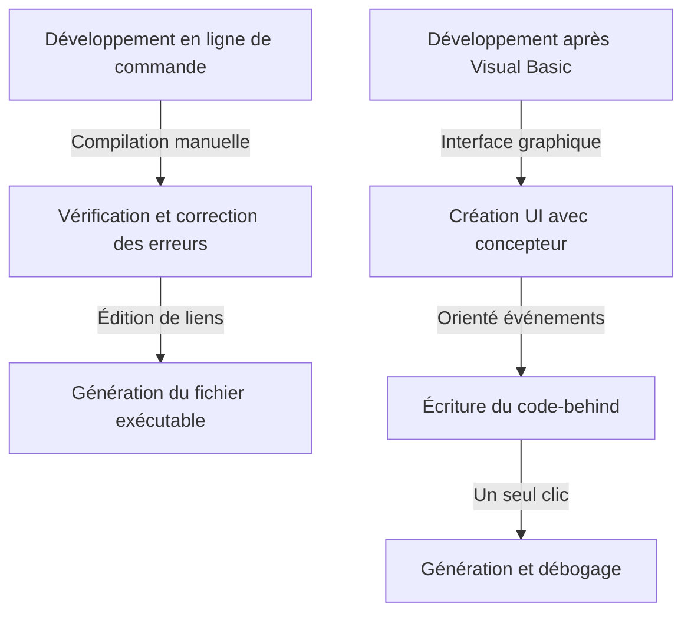

Dans le développement logiciel moderne, l'environnement de développement intégré (IDE) est une « arme » indispensable pour les programmeurs. Parmi eux, « Visual Studio » de Microsoft règne comme le standard de facto de l'industrie depuis de nombreuses années. Cet article retrace l'histoire de l'évolution de Visual Studio, des compilateurs indépendants de l'ère MS-DOS jusqu'au récent IDE cloud-natif propulsé par l'IA.

## 1. Les débuts : De la ligne de commande à l'interface graphique

Des années 1980 au début des années 1990, les outils de développement étaient fournis sous forme de produits individuels tels que des compilateurs et des assembleurs. Les programmeurs écrivaient du code dans un éditeur, appelaient le compilateur depuis la ligne de commande, et retournaient à l'éditeur en cas d'erreur, répétant ainsi ce cycle.

```cpp
/* Programme C typique de l'ère MS-DOS */
#include <stdio.h>

int main(void) {
    printf("Hello, MS-DOS World!\n");
    return 0;
}
```

Cette situation a radicalement changé avec l'arrivée de « Visual Basic 1.0 » en 1991. L'approche révolutionnaire permettant de concevoir des écrans graphiques par glisser-déposer a révolutionné le développement d'applications Windows de l'époque. Il est devenu possible de créer des applications de manière intuitive grâce à des opérations visuelles, ce qui a été salué par de nombreux développeurs.



## 2. Visual Studio 97 : La naissance d'un véritable environnement de développement intégré

En 1997, Microsoft a annoncé « Visual Studio 97 », qui regroupait des outils tels que Visual Basic, Visual C++, Visual J++, jusqu'alors proposés séparément, en un seul package. C'est le début de la marque « Visual Studio ».

Les développeurs ont pu utiliser plusieurs langages et technologies au sein du même environnement de développement, simplifiant considérablement la gestion de projet et le processus de génération (build). En particulier, l'évolution de Visual C++ et l'introduction des MFC (Microsoft Foundation Classes) ont facilité le développement d'applications Windows complexes.

## 3. L'avènement du .NET Framework et Visual Studio .NET

En 2002, Microsoft a publié le « .NET Framework » et « Visual Studio .NET (2002) », modifiant profondément le paradigme du développement logiciel. Un nouveau langage appelé C# a été introduit, permettant aux développeurs d'écrire du code plus sûr et plus efficace.

Des concepts tels que le code managé (managed code) et la gestion de la mémoire par le ramasse-miettes (garbage collection), essentiels aux langages de programmation modernes, ont été établis au cours de cette période. De plus, le développement de services Web XML a été facilité, accélérant l'intégration de systèmes via Internet.


## 4. Vers l'ère du développement agile et du cloud

Dans les années 2010, les méthodes de développement logiciel ont évolué vers le développement agile. Parallèlement, Visual Studio est passé d'un simple IDE à une plate-forme de support pour le développement en équipe. L'intégration avec « Team Foundation Server » (aujourd'hui Azure DevOps) a permis de couvrir l'ensemble du cycle de vie, y compris le contrôle de version, l'intégration continue (CI) et la livraison continue (CD).

De plus, l'essor du cloud computing a renforcé l'intégration avec Azure, créant un environnement transparent allant du développement au déploiement.

## 5. La wave du multiplateforme et de l'open source

En 2015, la sortie de l'éditeur de code léger et rapide « Visual Studio Code (VS Code) » a fait forte impression. VS Code, qui fonctionne non seulement sous Windows mais aussi sous macOS et Linux, et prend en charge divers langages et frameworks grâce à ses nombreuses extensions, a rapidement gagné le soutien des développeurs du monde entier.

De plus, avec la transition vers l'open source de .NET Core et la prise en charge multiplateforme, Visual Studio a également dépassé le cadre exclusif de Windows pour acquérir la flexibilité nécessaire pour s'adapter à un écosystème de développement diversifié.

## 6. Vers un avenir où l'IA aide au codage

Ces dernières années, l'introduction d'assistants de codage basés sur l'IA tels que « GitHub Copilot » a propulsé la productivité des développeurs à des niveaux sans précédent. De l'autocomplétion de code à la détection de bogues, en passant par la proposition d'algorithmes complexes, l'IA fonctionne désormais comme un puissant partenaire pour les développeurs.

Commençant par la ligne de commande à l'époque de MS-DOS, passant par le développement visuel via des interfaces graphiques, le changement de paradigme avec .NET, l'intégration avec le cloud, jusqu'à l'assistance par l'IA, Visual Studio a toujours évolué à la pointe du développement logiciel. Il continuera sans aucun doute à marquer l'histoire en tant qu'arme ultime pour les programmeurs.
