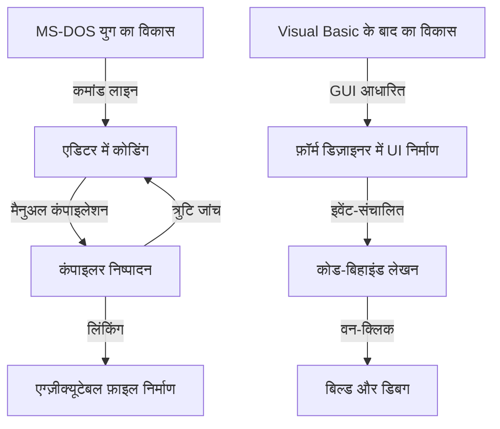
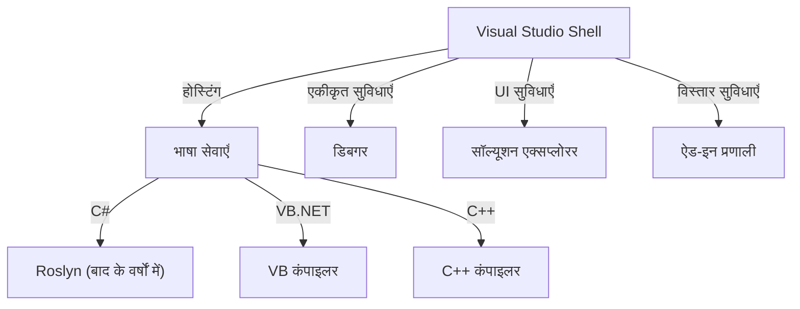

आधुनिक सॉफ्टवेयर विकास में, एकीकृत विकास परिवेश (IDE) प्रोग्रामर के लिए एक अनिवार्य "हथियार" है। इनमें से, Microsoft का "Visual Studio" पिछली एक चौथाई सदी से अधिक समय से उद्योग के वास्तविक मानक (डी-फैक्टो स्टैंडर्ड) के रूप में अपनी धाक जमाए हुए है।

इस लेख में, हम MS-DOS युग के स्वतंत्र कंपाइलरों के समूह से लेकर नवीनतम AI-संचालित क्लाउड-नेटिव IDE तक, Visual Studio के विकास के शानदार इतिहास का तकनीकी बदलावों और आर्किटेक्चर के दृष्टिकोण से गहराई से विश्लेषण करेंगे।

## 1. शुरुआती दौर: कमांड लाइन से मुक्ति और "विज़ुअलाइज़ेशन" की शुरुआत

1980 के दशक के उत्तरार्ध से 1990 के दशक की शुरुआत तक, Microsoft के विकास उपकरण C कंपाइलर (Microsoft C/C++), असेंबलर (MASM) और QuickBasic जैसे अलग-अलग उत्पादों के रूप में पेश किए जाते थे। प्रोग्रामर किसी एडिटर में कोड लिखते थे, कमांड लाइन से कंपाइलर को कॉल करते थे, और यदि कोई त्रुटि आती थी, तो फिर से एडिटर में लौटते थे—यह चक्र बार-बार दोहराया जाता था।

```cpp
/* MS-DOS युग का एक विशिष्ट C भाषा प्रोग्राम (Microsoft C 6.0) */
#include <stdio.h>
#include <dos.h>

int main(void) {
    printf("Hello, MS-DOS World!\n");
    return 0;
}
```

इस स्थिति को पूरी तरह बदलने वाला क्रांतिकारी कदम था 1991 में पेश किया गया **Visual Basic 1.0**। "ड्रैग एंड ड्रॉप" के ज़रिए GUI स्क्रीन को डिज़ाइन करने के इस अभिनव दृष्टिकोण ने तत्कालीन Windows एप्लिकेशन विकास में क्रांति ला दी।



## 2. Visual Studio 97: एक सच्चे "एकीकृत" विकास परिवेश का जन्म

1997 में, Microsoft ने अब तक अलग-अलग पेश किए जाने वाले टूल्स—Visual Basic, Visual C++, Visual J++, Visual FoxPro आदि—को एक ही पैकेज में समेटकर **Visual Studio 97** की घोषणा की। यहीं से "Visual Studio" ब्रांड की शुरुआत हुई।

### Visual C++ का विकास और MFC
उस समय की Windows प्रोग्रामिंग में, Win32 API को सीधे कॉल करना बेहद जटिल और श्रमसाध्य था। Visual C++ ने **MFC (Microsoft Foundation Classes)** की पेशकश की, जिसने ऑब्जेक्ट-ओरिएंटेड दृष्टिकोण के माध्यम से Windows एप्लिकेशन विकास को ज़बरदस्त बढ़ावा दिया।

```cpp
// MFC का उपयोग करते हुए Windows एप्लिकेशन की बुनियादी संरचना
#include <afxwin.h>

class CMyApp : public CWinApp {
public:
    virtual BOOL InitInstance();
};

class CMyFrame : public CFrameWnd {
public:
    CMyFrame() {
        Create(NULL, _T("Visual Studio History App"));
    }
};

BOOL CMyApp::InitInstance() {
    m_pMainWnd = new CMyFrame();
    m_pMainWnd->ShowWindow(SW_SHOW);
    return TRUE;
}

CMyApp theApp;
```

## 3. .NET Framework का आगमन और Visual Studio .NET (2002)

2000 के दशक में प्रवेश के साथ ही, इंटरनेट के प्रसार के कारण वितरित कंप्यूटिंग (डिस्ट्रिब्यूटेड कंप्यूटिंग) को अपनाना अनिवार्य हो गया। Microsoft ने अपनी ".NET रणनीति" प्रस्तुत की, और पूरी तरह से नए रनटाइम परिवेश **.NET Framework** और नई भाषा **C#** की घोषणा की।

इसके साथ ही रिलीज़ किया गया **Visual Studio .NET (2002)**, IDE के इतिहास में सबसे बड़ा मोड़ साबित हुआ।

### आर्किटेक्चर का कायाकल्प
VS .NET में, पुराने अलग-अलग IDE परिवेशों को एकीकृत किया गया, और एक साझा शेल (Visual Studio Shell) पर प्रत्येक भाषा के प्रोजेक्ट्स काम करने लगे।



```csharp
// C# 1.0 के साथ आधुनिक प्रोग्रामिंग की शुरुआत
using System;

namespace VisualStudioHistory
{
    class Program
    {
        static void Main(string[] args)
        {
            Console.WriteLine("Hello, .NET World!");
        }
    }
}
```

## 4. Visual Studio 2010 और WPF द्वारा UI का पूर्ण नवीनीकरण

Visual Studio 2010 में, IDE के अपने UI को WPF (Windows Presentation Foundation) के साथ फिर से लिखा गया, जिससे यह वेक्टर-आधारित, स्केलेबल और आकर्षक इंटरफ़ेस में विकसित हो गया। इसके अतिरिक्त, इसी संस्करण में F# को डिफ़ॉल्ट रूप से शामिल किया गया था।

## 5. क्लाउड और AI के युग की ओर: VS 2019 से VS 2022 तक

हाल के वर्षों में, सॉफ्टवेयर विकास का मुख्य केंद्र क्लाउड की ओर स्थानांतरित हो गया है। Visual Studio ने भी इसके अनुरूप खुद को ढालते हुए Azure के साथ सहज एकीकरण हासिल किया historic

इसके अलावा, **Visual Studio 2022** में IDE आखिरकार 64-बिट बन गया, जिससे बड़े पैमाने के सॉल्यूशंस में भी मेमोरी की कमी की चिंता किए बिना सुचारू रूप से काम करना संभव हो गया।

### AI द्वारा कोडिंग सहायता: IntelliCode
IntelliSense (कोड कंप्लीशन) के उन्नत रूप के रूप में, मशीन लर्निंग मॉडल का उपयोग करने वाला **IntelliCode** पेश किया गया। यह डेवलपर के कोड के संदर्भ को समझता है और अगली पंक्ति में लिखे जाने वाले कोड का उच्च सटीकता से अनुमान लगाता है।

```csharp
// आधुनिक C# (C# 10 और उसके बाद) का उपयोग करते हुए संक्षिप्त कोडिंग
var history = new List<string> { "VS97", "VS2002", "VS2022" };

// IntelliCode संदर्भ के आधार पर सर्वोत्तम LINQ मेथड का सुझाव देता है
var modernIDEs = history.Where(v => v.Contains("2022")).ToList();

Console.WriteLine($"The modern IDE is {modernIDEs.FirstOrDefault()}");
```

## निष्कर्ष: निरंतर विकसित होता "सबसे शक्तिशाली हथियार"

MS-DOS युग के साधारण कमांड-लाइन टूल्स से शुरुआत करके, GUI क्रांति, .NET का जन्म, और अब वर्तमान AI एकीकरण तक—Visual Studio ने हमेशा सॉफ्टवेयर विकास के अग्रिम मोर्चे पर रहकर निरंतर विकास किया है।

भविष्य में भी, क्लाउड विकास के विस्तार और जनरेटिव AI (जैसे GitHub Copilot) के साथ और गहरे समन्वय के माध्यम से, प्रोग्रामर का यह "सबसे शक्तिशाली हथियार" और भी अधिक सशक्त और बुद्धिमान बनता रहेगा।
