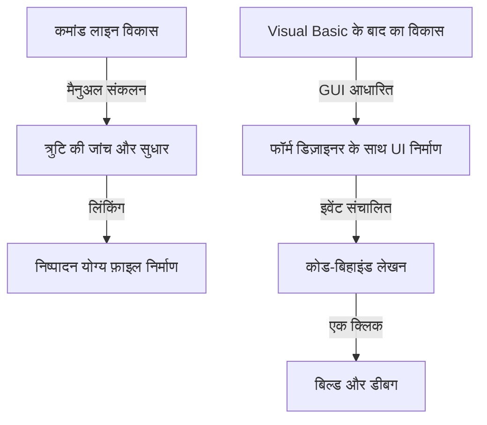

आधुनिक सॉफ़्टवेयर विकास में, एक एकीकृत विकास पर्यावरण (IDE) प्रोग्रामर्स के लिए एक अपरिहार्य "हथियार" है। उनमें से, Microsoft का "Visual Studio" कई वर्षों से उद्योग के डिफ़ॉल्ट मानक के रूप में राज कर रहा है। यह लेख MS-DOS युग में स्टैंडअलोन कंपाइलर्स से लेकर नवीनतम AI-संचालित क्लाउड-नेटिव IDE तक Visual Studio के विकास के इतिहास पर नज़र डालता है।

## 1. शुरुआती दिन: कमांड लाइन से GUI तक

1980 के दशक से 1990 के दशक की शुरुआत तक, विकास उपकरण कंपाइलर और असेंबलर जैसे व्यक्तिगत उत्पादों के रूप में प्रदान किए जाते थे। प्रोग्रामर्स एक संपादक में कोड लिखते थे, कमांड लाइन से कंपाइलर को कॉल करते थे, और अगर कोई त्रुटि होती थी तो संपादक में वापस आ जाते थे, इस चक्र को दोहराते थे।

```cpp
/* MS-DOS युग का एक विशिष्ट C भाषा कार्यक्रम */
#include <stdio.h>

int main(void) {
    printf("Hello, MS-DOS World!\n");
    return 0;
}
```

इस स्थिति को 1991 में "Visual Basic 1.0" के आगमन द्वारा पूरी तरह से बदल दिया गया था। ड्रैग और ड्रॉप द्वारा GUI स्क्रीन डिजाइन करने के क्रांतिकारी दृष्टिकोण ने उस समय विंडोज एप्लिकेशन विकास में क्रांति ला दी। इसने डेवलपर्स को दृश्य संचालन के साथ सहज रूप से एप्लिकेशन बनाने की अनुमति दी, जिसका कई डेवलपर्स द्वारा स्वागत किया गया।



## 2. Visual Studio 97: सच्चे एकीकृत विकास पर्यावरण का जन्म

1997 में, Microsoft ने "Visual Studio 97" की घोषणा की, जिसने Visual Basic, Visual C++, और Visual J++ जैसे उपकरणों को एक ही पैकेज में जोड़ दिया जो पहले अलग से प्रदान किए जाते थे। यहीं से "Visual Studio" ब्रांड की शुरुआत हुई।

डेवलपर्स एक ही विकास पर्यावरण के भीतर कई भाषाओं और तकनीकों के साथ काम करने में सक्षम हुए, जिससे परियोजना प्रबंधन और निर्माण प्रक्रिया बहुत सरल हो गई। विशेष रूप से, Visual C++ के विकास और MFC (Microsoft Foundation Classes) की शुरूआत ने जटिल विंडोज अनुप्रयोगों के विकास को आसान बना दिया।

## 3. .NET Framework का आगमन और Visual Studio .NET

2002 में, Microsoft ने ".NET Framework" और "Visual Studio .NET (2002)" जारी किया, जिसने सॉफ्टवेयर विकास प्रतिमान को महत्वपूर्ण रूप से बदल दिया। C# नामक एक नई भाषा पेश की गई, जिससे डेवलपर्स अधिक सुरक्षित और कुशल कोड लिखने में सक्षम हुए।

प्रबंधित कोड (managed code) की अवधारणाएं और कचरा संग्रहण (garbage collection) द्वारा स्मृति प्रबंधन जैसी आधुनिक प्रोग्रामिंग भाषाओं के लिए आवश्यक विशेषताएं इस अवधि के दौरान स्थापित की गईं। इसके अलावा, XML वेब सेवाओं का विकास आसान हो गया, और इंटरनेट के माध्यम से सिस्टम एकीकरण में तेजी आई।


## 4. एजाइल विकास और क्लाउड का युग

2010 के दशक में, सॉफ्टवेयर विकास के तरीके एजाइल विकास की ओर स्थानांतरित हो गए। इसके साथ, Visual Studio भी एक साधारण IDE से टीम विकास का समर्थन करने वाले मंच में विकसित हुआ। "Team Foundation Server (अब Azure DevOps)" के साथ एकीकरण द्वारा संस्करण नियंत्रण, निरंतर एकीकरण (CI), और निरंतर वितरण (CD) जैसे पूरे जीवनचक्र को कवर किया जाने लगा।

इसके अलावा, क्लाउड कंप्यूटिंग के उदय ने Azure के साथ एकीकरण को मजबूत किया, विकास से लेकर परिनियोजन (deployment) तक एक निर्बाध वातावरण तैयार किया।

## 5. मल्टी-प्लेटफॉर्म और ओपन सोर्स की लहर

2015 में, एक हल्का और तेज़ कोड संपादक "Visual Studio Code (VS Code)" जारी किया गया, जिसका बड़ा प्रभाव पड़ा। VS Code न केवल विंडोज पर, बल्कि macOS और Linux पर भी काम करता है, और अपने समृद्ध एक्सटेंशन के कारण विभिन्न भाषाओं और रूपरेखाओं का समर्थन कर सकता है। इसने दुनिया भर के डेवलपर्स का समर्थन जल्दी ही प्राप्त कर लिया।

इसके अलावा, .NET Core के ओपन सोर्सिंग और क्रॉस-प्लेटफ़ॉर्म समर्थन के साथ, Visual Studio ने अपने पारंपरिक विंडोज-केवल ढांचे को पार कर लिया और विविध विकास पारिस्थितिक तंत्रों के अनुकूल होने का लचीलापन प्राप्त किया।

## 6. ऐसा भविष्य जहां AI कोडिंग में सहायता करता है

हाल के वर्षों में, "GitHub Copilot" जैसी AI-आधारित कोडिंग सहायता सुविधाओं की शुरूआत के साथ, डेवलपर्स की उत्पादकता अभूतपूर्व स्तर तक पहुंच गई है। स्वचालित कोड पूर्णता (auto-completion), बग का पता लगाने से लेकर जटिल एल्गोरिदम के सुझाव तक, AI डेवलपर्स के एक शक्तिशाली भागीदार के रूप में कार्य कर रहा है।

MS-DOS युग में कमांड लाइन से शुरू होकर, GUI के साथ दृश्य विकास, .NET के साथ प्रतिमान बदलाव, क्लाउड के साथ एकीकरण, और AI के साथ समर्थन तक, Visual Studio हमेशा सॉफ्टवेयर विकास में सबसे आगे विकसित हुआ है। यह भविष्य में भी प्रोग्रामर के सबसे शक्तिशाली हथियार के रूप में अपना इतिहास बनाता रहेगा।
