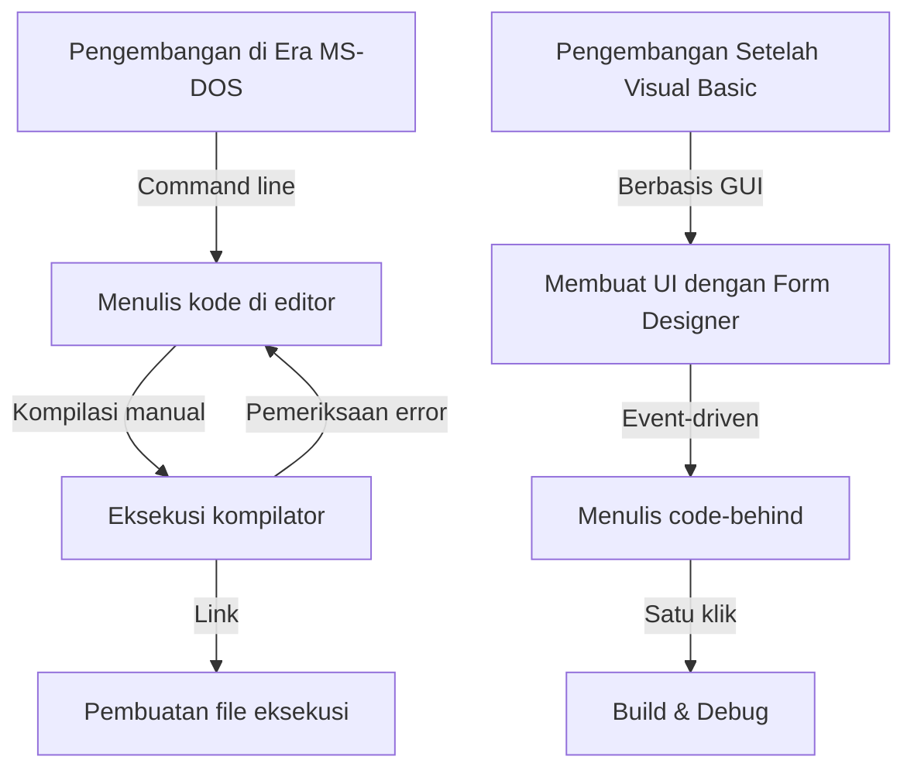
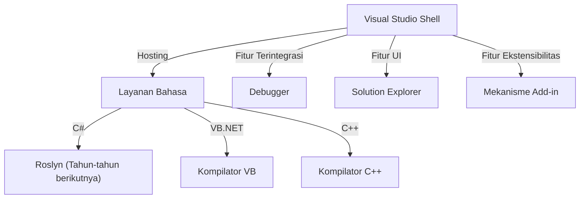

Dalam pengembangan perangkat lunak modern, Integrated Development Environment (IDE) adalah "senjata" yang tak terpisahkan bagi programmer. Di antaranya, Microsoft "Visual Studio" telah bertakhta sebagai standar de facto industri selama lebih dari seperempat abad.

Artikel ini mengupas tuntas sejarah evolusi luar biasa dari Visual Studio—mulai dari kumpulan kompilator mandiri di era MS-DOS hingga IDE cloud-native modern berdaya AI—dari sudut pandang transisi teknologi dan arsitekturnya.

## 1. Era Awal: Lepas dari Command Line dan Awal Mula "Visualisasi"

Dari akhir dekade 1980-an hingga awal 1990-an, perkakas pengembangan dari Microsoft disediakan sebagai produk terpisah seperti kompilator C (Microsoft C/C++), assembler (MASM), dan QuickBasic. Para programmer menulis kode di editor teks, memanggil kompilator melalui command line, dan jika terjadi kesalahan (error), mereka harus kembali ke editor—sebuah siklus yang terus berulang.

```cpp
/* Program bahasa C khas era MS-DOS (Microsoft C 6.0) */
#include <stdio.h>
#include <dos.h>

int main(void) {
    printf("Hello, MS-DOS World!\n");
    return 0;
}
```

Situasi ini berubah drastis dengan hadirnya **Visual Basic 1.0** pada tahun 1991. Pendekatan terobosan yang memungkinkan perancangan layar GUI melalui metode "drag and drop" membawa revolusi besar dalam pengembangan aplikasi Windows pada masa itu.



## 2. Visual Studio 97: Lahirnya Lingkungan Pengembangan yang Benar-Benar "Terpadu"

Pada tahun 1997, Microsoft merilis **Visual Studio 97**, yang menggabungkan rangkaian perkakas terpisah sebelumnya seperti Visual Basic, Visual C++, Visual J++, dan Visual FoxPro ke dalam satu paket terpadu. Inilah awal mula lahirnya merek "Visual Studio".

### Evolusi Visual C++ dan MFC
Dalam pemrograman Windows saat itu, memanggil Win32 API secara langsung sangatlah rumit dan merepotkan. Visual C++ menyediakan **MFC (Microsoft Foundation Classes)**, yang memberikan dorongan kuat bagi pengembangan aplikasi Windows menggunakan pendekatan berorientasi objek.

```cpp
// Struktur dasar aplikasi Windows menggunakan MFC
#include <afxwin.h>

class CMyApp : public CWinApp {
public:
    virtual BOOL InitInstance();
};

class CMyFrame : public CFrameWnd {
public:
    CMyFrame() {
        Create(NULL, _T("Visual Studio History App"));
    }
};

BOOL CMyApp::InitInstance() {
    m_pMainWnd = new CMyFrame();
    m_pMainWnd->ShowWindow(SW_SHOW);
    return TRUE;
}

CMyApp theApp;
```

## 3. Hadirnya .NET Framework dan Visual Studio .NET (2002)

Memasuki dekade 2000-an, seiring meluasnya internet, kebutuhan untuk mendukung komputasi terdistribusi menjadi sangat mendesak. Microsoft mencanangkan "Strategi .NET" dan mengumumkan lingkungan runtime baru yang revolusioner, **.NET Framework**, bersama bahasa pemrograman baru, **C#**.

Dirilis beriringan dengan inisiatif tersebut, **Visual Studio .NET (2002)** menjadi titik balik terbesar dalam sejarah IDE.

### Pembaruan Arsitektur
Pada VS .NET, lingkungan IDE individual sebelumnya disatukan, sehingga proyek berbagai bahasa dapat berjalan di atas cangkang bersama (Visual Studio Shell).



```csharp
// Awal mula pemrograman modern dengan C# 1.0
using System;

namespace VisualStudioHistory
{
    class Program
    {
        static void Main(string[] args)
        {
            Console.WriteLine("Hello, .NET World!");
        }
    }
}
```

## 4. Visual Studio 2010 dan Pembaruan Total UI Berbasis WPF

Pada Visual Studio 2010, antarmuka pengguna (UI) dari IDE itu sendiri ditulis ulang menggunakan WPF (Windows Presentation Foundation), berevolusi menjadi antarmuka berbasis vektor yang dapat diskalakan dan tampak modern. Selain itu, versi inilah yang pertama kali menyertakan bahasa F# secara bawaan.

## 5. Menuju Era Cloud dan AI: Dari VS 2019 ke VS 2022

Dalam beberapa tahun terakhir, medan utama pengembangan perangkat lunak telah beralih ke cloud. Visual Studio pun merespons tren ini dengan menghadirkan integrasi yang mulus bersama Azure.

Lebih jauh lagi, pada **Visual Studio 2022**, IDE itu sendiri akhirnya bermigrasi ke arsitektur 64-bit, sehingga mampu bekerja dengan lancar tanpa terkendala masalah kehabisan memori bahkan saat menangani solution berskala masif.

### Bantuan Coding Bertenaga AI: IntelliCode
Sebagai bentuk evolusi dari IntelliSense (pelengkapan kode otomatis), diperkenalkanlah **IntelliCode** yang memanfaatkan model machine learning. Fitur ini memahami konteks kode pengembang dan memprediksi baris kode berikutnya dengan tingkat akurasi tinggi.

```csharp
// Penulisan kode yang ringkas memanfaatkan fitur C# modern (C# 10 ke atas)
var history = new List<string> { "VS97", "VS2002", "VS2022" };

// IntelliCode menyarankan metode LINQ paling optimal berdasarkan konteks
var modernIDEs = history.Where(v => v.Contains("2022")).ToList();

Console.WriteLine($"The modern IDE is {modernIDEs.FirstOrDefault()}");
```

## Kesimpulan: "Senjata Terkuat" yang Terus Berevolusi

Dimulai dari perkakas command line sederhana di era MS-DOS, revolusi GUI, lahirnya .NET, hingga integrasi kecerdasan buatan (AI) saat ini, Visual Studio senantiasa berevolusi di garis depan dunia pengembangan perangkat lunak.

Ke depannya, seiring meluasnya pengembangan berbasis cloud serta integrasi lebih erat dengan AI generatif (seperti GitHub Copilot), "senjata terkuat" bagi para programmer ini dipastikan akan menjadi semakin tangguh dan cerdas.
