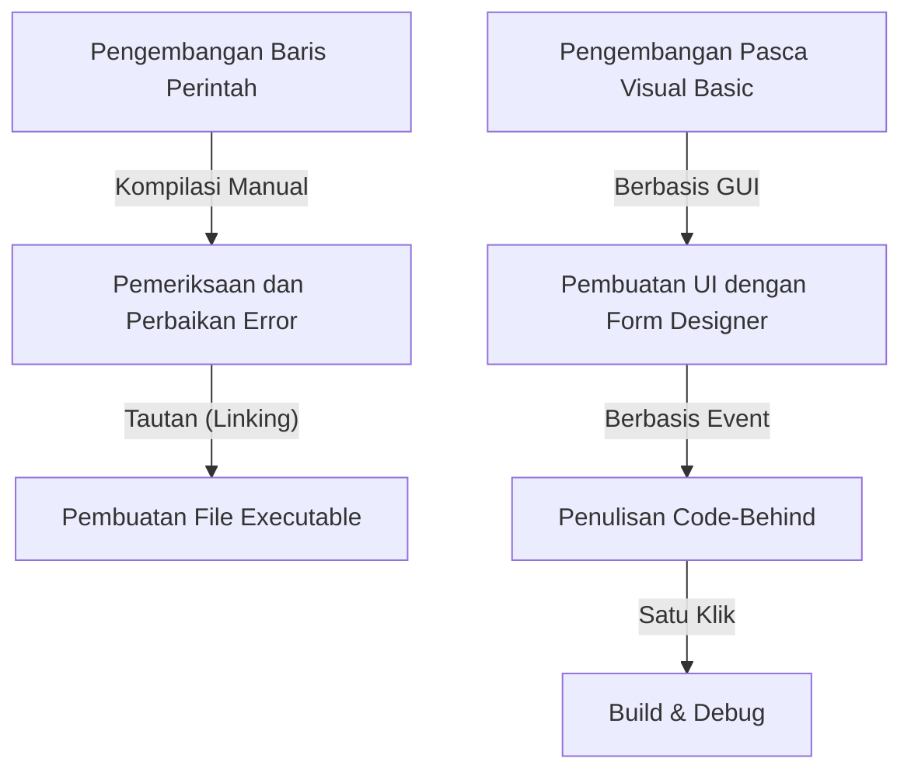
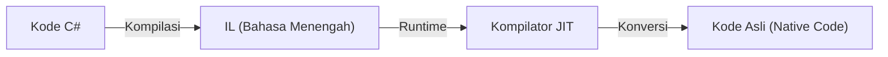

Dalam pengembangan perangkat lunak modern, Integrated Development Environment (IDE) adalah "senjata" yang sangat diperlukan bagi para programmer. Di antaranya, "Visual Studio" dari Microsoft telah berkuasa sebagai standar de facto industri selama bertahun-tahun. Artikel ini meninjau kembali sejarah evolusi Visual Studio, mulai dari kompilator yang berdiri sendiri di era MS-DOS hingga IDE cloud-native bertenaga AI terbaru.

## 1. Masa Awal: Dari Baris Perintah ke GUI

Dari tahun 1980-an hingga awal 1990-an, alat pengembangan disediakan sebagai produk individual seperti kompilator dan assembler. Programmer menulis kode di editor, memanggil kompilator dari baris perintah, dan kembali ke editor jika terjadi kesalahan, mengulangi siklus ini.

```cpp
/* Program bahasa C yang khas dari era MS-DOS */
#include <stdio.h>

int main(void) {
    printf("Hello, MS-DOS World!\n");
    return 0;
}
```

Situasi ini berubah drastis dengan munculnya "Visual Basic 1.0" pada tahun 1991. Pendekatan revolusioner untuk merancang layar GUI menggunakan drag & drop merevolusi pengembangan aplikasi Windows pada saat itu. Hal ini memungkinkan pembuatan aplikasi secara intuitif dengan operasi visual, dan disambut baik oleh banyak pengembang.



## 2. Visual Studio 97: Lahirnya Lingkungan Pengembangan Terpadu Sejati

Pada tahun 1997, Microsoft mengumumkan "Visual Studio 97", yang menggabungkan alat-alat yang sebelumnya disediakan secara terpisah, seperti Visual Basic, Visual C++, dan Visual J++, ke dalam satu paket. Ini adalah awal dari merek "Visual Studio".

Pengembang dapat bekerja dengan berbagai bahasa dan teknologi dalam lingkungan pengembangan yang sama, sangat menyederhanakan manajemen proyek dan proses build. Secara khusus, evolusi Visual C++ dan pengenalan MFC (Microsoft Foundation Classes) memudahkan pengembangan aplikasi Windows yang kompleks.

## 3. Kemunculan .NET Framework dan Visual Studio .NET

Pada tahun 2002, Microsoft merilis ".NET Framework" dan "Visual Studio .NET (2002)", yang secara signifikan mengubah paradigma pengembangan perangkat lunak. Bahasa baru bernama C# diperkenalkan, memungkinkan pengembang untuk menulis kode yang lebih aman dan efisien.

Konsep-konsep seperti managed code dan manajemen memori dengan garbage collection, yang sangat penting untuk bahasa pemrograman modern, ditetapkan selama periode ini. Selain itu, pengembangan layanan Web XML menjadi lebih mudah, mempercepat integrasi sistem melalui internet.



## 4. Menuju Era Pengembangan Agile dan Cloud

Memasuki tahun 2010-an, metode pengembangan perangkat lunak beralih ke pengembangan Agile. Seiring dengan ini, Visual Studio juga berevolusi dari sekadar IDE menjadi platform yang mendukung pengembangan tim. Melalui integrasi dengan "Team Foundation Server (sekarang Azure DevOps)", Visual Studio mencakup seluruh siklus hidup pengembangan seperti kontrol versi, integrasi berkelanjutan (CI), dan pengiriman berkelanjutan (CD).

Selain itu, kebangkitan komputasi awan (cloud computing) memperkuat fitur integrasi dengan Azure, menciptakan lingkungan yang mulus dari pengembangan hingga penerapan (deployment).

## 5. Gelombang Multi-Platform dan Open Source

Pada tahun 2015, editor kode yang ringan dan cepat "Visual Studio Code (VS Code)" dirilis, memberikan dampak yang sangat besar. VS Code, yang tidak hanya berjalan di Windows tetapi juga macOS dan Linux, serta mendukung berbagai bahasa dan kerangka kerja dengan ekstensi yang kaya, dengan cepat memenangkan dukungan para pengembang di seluruh dunia.

Selain itu, dengan peralihan .NET Core ke sumber terbuka (open-source) dan dukungan lintas-platform (cross-platform), Visual Studio melampaui batas eksklusif Windows tradisional dan memperoleh fleksibilitas untuk beradaptasi dengan berbagai ekosistem pengembangan.

## 6. Menuju Masa Depan di mana AI Membantu Pengodean

Dalam beberapa tahun terakhir, pengenalan fitur bantuan pengodean berbasis AI seperti "GitHub Copilot" telah mendorong produktivitas pengembang ke tingkat yang belum pernah terjadi sebelumnya. Dari penyelesaian kode otomatis, deteksi bug, hingga saran algoritma yang kompleks, AI kini berfungsi sebagai mitra yang kuat bagi para pengembang.

Dimulai dari baris perintah di era MS-DOS, pengembangan visual berbasis GUI, perubahan paradigma melalui .NET, integrasi dengan cloud, hingga bantuan oleh AI, Visual Studio selalu berevolusi bersama dengan garis depan pengembangan perangkat lunak. Visual Studio akan terus mengukir sejarahnya sebagai senjata terkuat para programmer.
