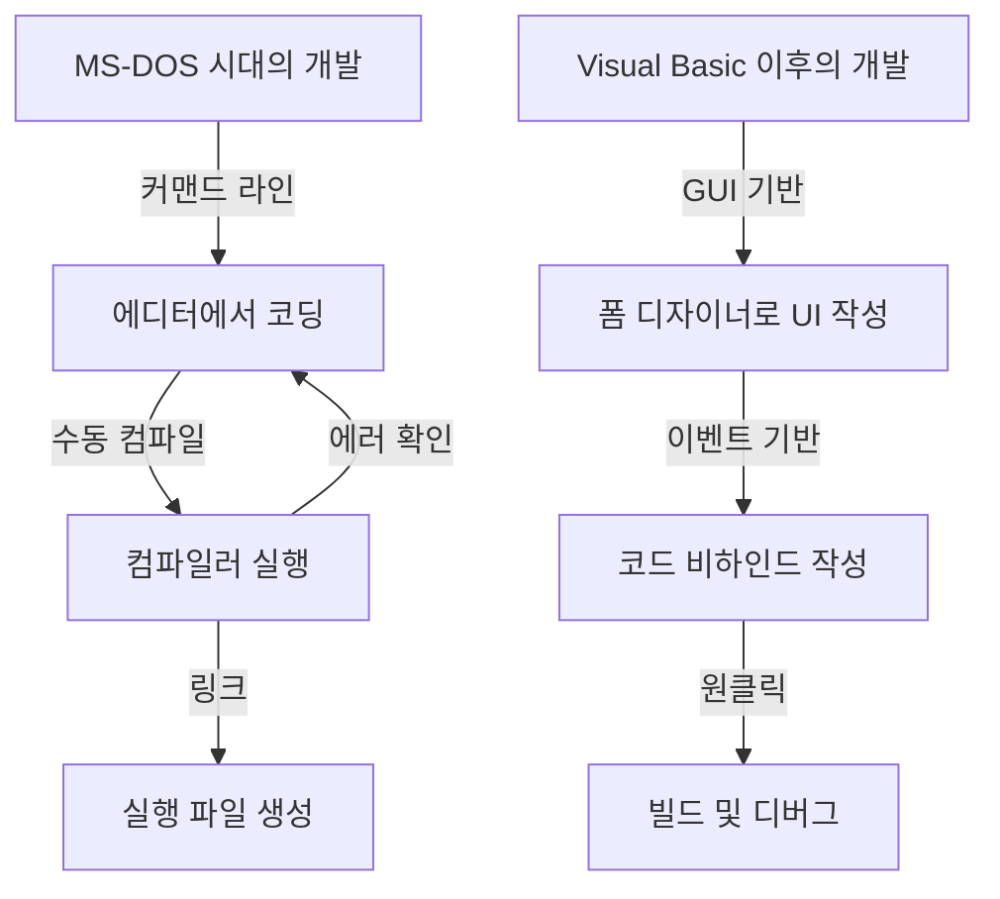
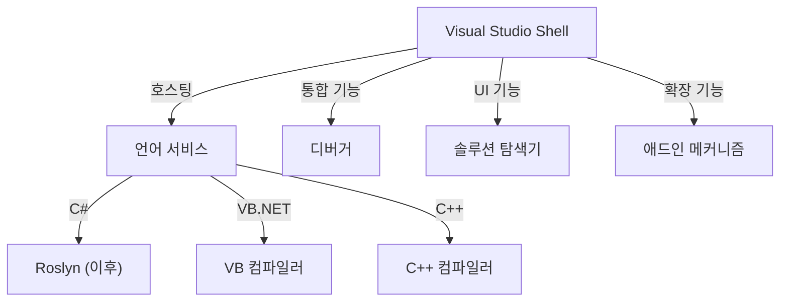

현대 소프트웨어 개발에서 통합 개발 환경(IDE)은 프로그래머에게 없어서는 안 될 '무기'입니다. 그중에서도 Microsoft의 'Visual Studio'는 25년 이상 동안 업계의 사실상 표준(de facto standard)으로 군림해 왔습니다.

본 기사에서는 MS-DOS 시절의 독립된 컴파일러 제품군에서 최신 AI 탑재 클라우드 네이티브 IDE에 이르기까지, Visual Studio의 장대한 진화 역사를 기술적 변천과 아키텍처 관점에서 깊이 있게 살펴봅니다.

## 1. 여명기: 커맨드 라인에서의 탈피와 '시각화'의 시작

1980년대 후반부터 1990년대 초에 걸쳐 Microsoft의 개발 도구는 C 컴파일러(Microsoft C/C++)나 어셈블러(MASM), 그리고 QuickBasic과 같은 개별 제품으로 제공되었습니다. 프로그래머는 에디터에서 코드를 작성하고, 커맨드 라인에서 컴파일러를 호출하며, 에러가 발생하면 다시 에디터로 돌아가는 사이클을 반복했습니다.

```cpp
/* MS-DOS 시대의 전형적인 C 언어 프로그램 (Microsoft C 6.0) */
#include <stdio.h>
#include <dos.h>

int main(void) {
    printf("Hello, MS-DOS World!\n");
    return 0;
}
```

이러한 상황을 완전히 뒤바꾼 것이 1991년에 등장한 **Visual Basic 1.0**입니다. GUI 화면을 '드래그 앤 드롭'으로 설계할 수 있는 획기적인 방식은 당시 Windows 애플리케이션 개발에 혁명을 불러일으켰습니다.



## 2. Visual Studio 97: 진정한 '통합' 개발 환경의 탄생

1997년, Microsoft는 지금까지 개별적으로 제공되던 Visual Basic, Visual C++, Visual J++, Visual FoxPro 등의 도구들을 하나의 패키지로 묶은 **Visual Studio 97**을 발표했습니다. 이것이 바로 'Visual Studio'라는 브랜드의 시작입니다.

### Visual C++의 진화와 MFC
당시 Windows 프로그래밍에서는 Win32 API를 직접 다루는 작업이 매우 번거로웠습니다. Visual C++는 **MFC (Microsoft Foundation Classes)**를 제공하여 객체 지향 방식의 Windows 애플리케이션 개발을 강력하게 뒷받침했습니다.

```cpp
// MFC를 사용한 Windows 애플리케이션의 기본 구조
#include <afxwin.h>

class CMyApp : public CWinApp {
public:
    virtual BOOL InitInstance();
};

class CMyFrame : public CFrameWnd {
public:
    CMyFrame() {
        Create(NULL, _T("Visual Studio History App"));
    }
};

BOOL CMyApp::InitInstance() {
    m_pMainWnd = new CMyFrame();
    m_pMainWnd->ShowWindow(SW_SHOW);
    return TRUE;
}

CMyApp theApp;
```

## 3. .NET Framework의 등장과 Visual Studio .NET (2002)

2000년대에 들어서면서 인터넷의 보급과 함께 분산 컴퓨팅에 대한 대응이 시급한 과제로 떠올랐습니다. Microsoft는 '.NET 전략'을 발표하고, 완전히 새로운 실행 환경인 **.NET Framework**와 새로운 언어인 **C#**을 선보였습니다.

이에 발맞추어 출시된 **Visual Studio .NET (2002)**는 IDE 역사상 가장 큰 전환점이 되었습니다.

### 아키텍처의 혁신
VS .NET에서는 기존의 개별 IDE 환경이 통합되어 공통 셸(Visual Studio Shell) 위에서 각 언어의 프로젝트가 동작하게 되었습니다.



```csharp
// C# 1.0을 통한 모던 프로그래밍의 개막
using System;

namespace VisualStudioHistory
{
    class Program
    {
        static void Main(string[] args)
        {
            Console.WriteLine("Hello, .NET World!");
        }
    }
}
```

## 4. Visual Studio 2010과 WPF를 통한 UI 전면 개편

Visual Studio 2010에서는 IDE 자체의 UI가 WPF(Windows Presentation Foundation)로 전면 재작성되어, 벡터 기반의 확장 가능하고 미려한 인터페이스로 진화했습니다. 또한, F#이 기본 탑재된 것도 이 버전부터입니다.

## 5. 클라우드와 AI 시대로: VS 2019에서 VS 2022로

최근 소프트웨어 개발의 주 무대는 클라우드로 이동했습니다. Visual Studio 역시 이에 발맞춰 Azure와의 원활한 통합을 이루어냈습니다.

또한, **Visual Studio 2022**에서는 마침내 IDE 자체가 64비트화되어 대규모 솔루션에서도 메모리 부족 문제를 겪지 않고 쾌적하게 동작하게 되었습니다.

### AI 기반 코딩 지원: IntelliCode
IntelliSense(코드 자동 완성)의 진화형으로 머신러닝 모델을 활용한 **IntelliCode**가 도입되었습니다. 개발자의 코드 맥락을 이해하고 다음에 입력해야 할 코드를 높은 정확도로 예측합니다.

```csharp
// 최신 C# (C# 10 이후)을 활용한 간결한 코딩
var history = new List<string> { "VS97", "VS2002", "VS2022" };

// IntelliCode가 맥락을 파악하여 최적의 LINQ 메서드를 제안
var modernIDEs = history.Where(v => v.Contains("2022")).ToList();

Console.WriteLine($"The modern IDE is {modernIDEs.FirstOrDefault()}");
```

## 마치며: 끊임없이 진화하는 '최강의 무기'

MS-DOS 시절의 투박한 커맨드 라인 도구에서 시작하여 GUI 혁명, .NET의 탄생, 그리고 현재의 AI 통합에 이르기까지, Visual Studio는 항상 소프트웨어 개발의 최전선에서 진화를 거듭해 왔습니다.

앞으로도 클라우드 개발의 확산 및 생성형 AI(GitHub Copilot 등)와의 긴밀한 융합을 통해 프로그래머의 '최강의 무기'는 더욱 강력하고 지능적인 도구로 발전해 나갈 것입니다.
