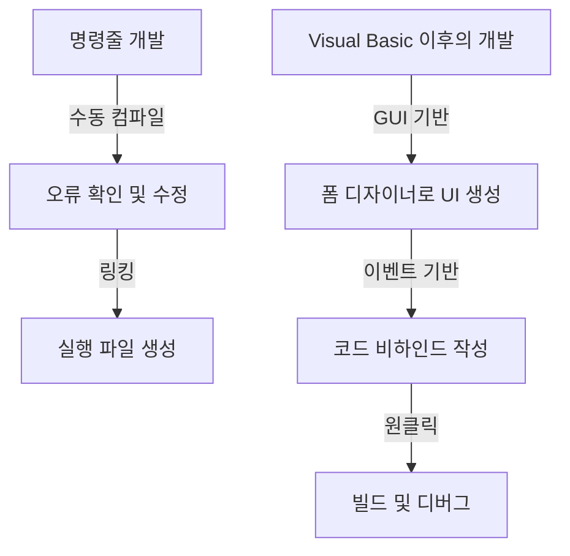
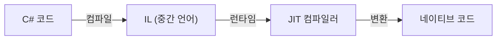

현대 소프트웨어 개발에서 통합 개발 환경(IDE)은 프로그래머에게 없어서는 안 될 "무기"입니다. 그중에서도 Microsoft의 'Visual Studio'는 오랜 기간 업계의 사실상 표준(de facto standard)으로 군림해 왔습니다. 이 글에서는 MS-DOS 시대의 독립된 컴파일러 제품군에서부터 최신 AI 탑재 클라우드 네이티브 IDE에 이르기까지 Visual Studio의 진화 역사를 되돌아봅니다.

## 1. 여명기: 명령줄에서 GUI로

1980년대부터 1990년대 초반에 걸쳐 개발 도구는 컴파일러나 어셈블러 등 개별 제품으로 제공되었습니다. 프로그래머는 편집기에서 코드를 작성하고, 명령줄에서 컴파일러를 호출하며, 오류가 발생하면 다시 편집기로 돌아가는 주기를 반복했습니다.

```cpp
/* MS-DOS 시대의 전형적인 C언어 프로그램 */
#include <stdio.h>

int main(void) {
    printf("Hello, MS-DOS World!\n");
    return 0;
}
```

이러한 상황을 일변시킨 것이 1991년에 등장한 'Visual Basic 1.0'입니다. GUI 화면을 드래그 앤 드롭으로 설계할 수 있는 획기적인 접근 방식은 당시 Windows 애플리케이션 개발에 혁명을 일으켰습니다. 시각적인 조작으로 직관적으로 애플리케이션을 만들 수 있게 되어 많은 개발자의 환영을 받았습니다.



## 2. Visual Studio 97: 진정한 통합 개발 환경의 탄생

1997년 Microsoft는 지금까지 개별적으로 제공하던 Visual Basic, Visual C++, Visual J++ 등의 도구들을 하나의 패키지로 묶은 'Visual Studio 97'을 발표했습니다. 이것이 'Visual Studio'라는 브랜드의 시작입니다.

개발자는 동일한 개발 환경 내에서 여러 언어와 기술을 다룰 수 있게 되었고, 프로젝트 관리 및 빌드 프로세스가 크게 간소화되었습니다. 특히 Visual C++의 발전과 MFC(Microsoft Foundation Classes)의 도입으로 복잡한 Windows 애플리케이션 개발이 쉬워졌습니다.

## 3. .NET Framework의 등장과 Visual Studio .NET

2002년, Microsoft는 소프트웨어 개발의 패러다임을 크게 바꾸는 '.NET Framework'와 'Visual Studio .NET (2002)'을 출시했습니다. C#이라는 새로운 언어가 도입되어 개발자는 보다 안전하고 효율적인 코드를 작성할 수 있게 되었습니다.

관리 코드(managed code)의 개념이나 가비지 컬렉션(garbage collection)에 의한 메모리 관리 등 현대 프로그래밍 언어에 필수적인 기능들이 이 시기에 확립되었습니다. 또한 XML 웹 서비스 개발이 용이해져 인터넷을 통한 시스템 연동이 가속화되었습니다.



## 4. 애자일 개발과 클라우드의 시대로

2010년대에 들어서면서 소프트웨어 개발 방법론은 애자일(Agile) 개발로 전환되었습니다. 이에 발맞춰 Visual Studio 역시 단순한 IDE에서 팀 개발을 지원하는 플랫폼으로 진화했습니다. 'Team Foundation Server(현재의 Azure DevOps)'와의 통합을 통해 버전 관리, 지속적 통합(CI), 지속적 제공(CD) 등 수명 주기 전체를 커버하게 되었습니다.

또한 클라우드 컴퓨팅의 대두로 Azure와의 연동 기능이 강화되어 개발부터 배포까지 원활하게 진행할 수 있는 환경이 조성되었습니다.

## 5. 멀티 플랫폼과 오픈 소스의 물결

2015년에는 가볍고 빠른 코드 편집기인 'Visual Studio Code(VS Code)'가 출시되어 큰 충격을 주었습니다. Windows뿐만 아니라 macOS와 Linux에서도 동작하며, 풍부한 확장 기능을 통해 다양한 언어와 프레임워크를 지원하는 VS Code는 순식간에 전 세계 개발자들의 지지를 모았습니다.

또한 .NET Core의 오픈 소스화 및 크로스 플랫폼 지원을 통해 Visual Studio 역시 기존 Windows 전용의 틀을 넘어 다양한 개발 생태계에 적응하는 유연성을 갖추게 되었습니다.

## 6. AI가 코딩을 지원하는 미래로

최근에는 AI 기반 코딩 지원 기능인 'GitHub Copilot' 등의 도입으로 개발자의 생산성이 전례 없는 수준에 도달하고 있습니다. 코드 자동 완성, 버그 탐지, 나아가 복잡한 알고리즘 제안까지 AI가 개발자의 강력한 파트너로서 기능하고 있습니다.

MS-DOS 시대의 명령줄에서 시작하여 GUI를 통한 시각적 개발, .NET을 통한 패러다임 전환, 클라우드와의 통합, 그리고 AI의 지원에 이르기까지 Visual Studio는 항상 소프트웨어 개발의 최전선과 함께 진화해 왔습니다. 앞으로도 프로그래머의 최강의 무기로서 그 역사를 계속 써 내려갈 것입니다.
