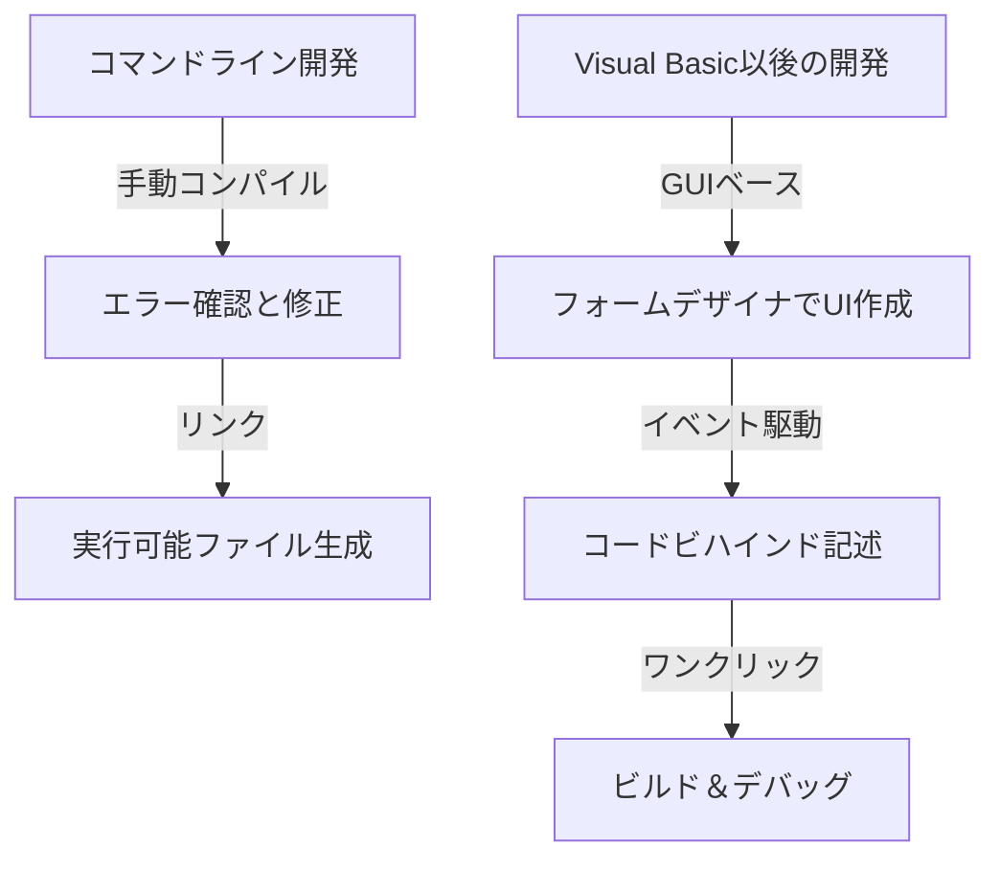
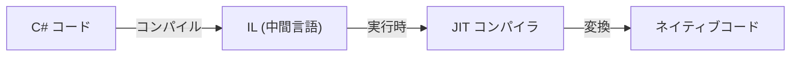

現代のソフトウェア開発において、統合開発環境（IDE）はプログラマーにとって不可欠な「武器」です。その中でも、Microsoftの「Visual Studio」は、長年にわたり業界のデファクトスタンダードとして君臨し続けています。本記事では、MS-DOS時代の独立したコンパイラ群から、最新のAI搭載クラウドネイティブIDEへと至るVisual Studioの進化の歴史を振り返ります。

## 1. 黎明期：コマンドラインからGUIへ

1980年代から1990年代初頭にかけて、開発ツールはコンパイラやアセンブラなど個別の製品として提供されていました。プログラマーはエディタでコードを書き、コマンドラインからコンパイラを呼び出し、エラーが出ればエディタに戻るというサイクルを繰り返していました。

```cpp
/* MS-DOS時代の典型的なC言語プログラム */
#include <stdio.h>

int main(void) {
    printf("Hello, MS-DOS World!\n");
    return 0;
}
```

この状況を一変させたのが、1991年に登場した「Visual Basic 1.0」です。GUI画面をドラッグ＆ドロップで設計できる画期的なアプローチは、当時のWindowsアプリケーション開発に革命をもたらしました。視覚的な操作で直感的にアプリケーションを作成できるようになり、多くの開発者に歓迎されました。



## 2. Visual Studio 97：真の統合開発環境の誕生

1997年、Microsoftはこれまで個別に提供していたVisual Basic, Visual C++, Visual J++などのツール群を一つのパッケージにまとめた「Visual Studio 97」を発表しました。これが「Visual Studio」というブランドの始まりです。

開発者は同じ開発環境内で複数の言語や技術を扱うことができるようになり、プロジェクトの管理やビルドプロセスが大幅に簡略化されました。特にVisual C++の進化とMFC（Microsoft Foundation Classes）の導入により、複雑なWindowsアプリケーションの開発が容易になりました。

## 3. .NET Frameworkの登場とVisual Studio .NET

2002年、Microsoftはソフトウェア開発のパラダイムを大きく変える「.NET Framework」と「Visual Studio .NET (2002)」をリリースしました。C#という新しい言語が導入され、開発者はより安全で効率的なコードを書くことができるようになりました。

マネージドコードの概念や、ガベージコレクションによるメモリ管理など、現代のプログラミング言語に欠かせない機能がこの時期に確立されました。さらに、XML Webサービスの開発が容易になり、インターネットを介したシステム連携が加速しました。



## 4. アジャイル開発とクラウドの時代へ

2010年代に入ると、ソフトウェア開発の手法はアジャイル開発へとシフトしました。これに伴い、Visual Studioも単なるIDEから、チーム開発を支援するプラットフォームへと進化を遂げました。「Team Foundation Server（現在のAzure DevOps）」との統合により、バージョン管理、継続的インテグレーション（CI）、継続的デリバリー（CD）などのライフサイクル全体をカバーするようになりました。

さらに、クラウドコンピューティングの台頭により、Azureとの連携機能が強化され、開発からデプロイまでシームレスに行える環境が整いました。

## 5. マルチプラットフォームとオープンソースの波

2015年には、軽量で高速なコードエディタ「Visual Studio Code（VS Code）」がリリースされ、大きな衝撃を与えました。WindowsだけでなくmacOSやLinuxでも動作し、豊富な拡張機能により様々な言語やフレームワークに対応できるVS Codeは、瞬く間に世界中の開発者の支持を集めました。

また、.NET Coreのオープンソース化やクロスプラットフォーム対応により、Visual Studioもまた、従来のWindows専用の枠を越え、多様な開発エコシステムに適応する柔軟性を手に入れました。

## 6. AIがコーディングを支援する未来へ

近年では、AIによるコーディング支援機能「GitHub Copilot」などの導入により、開発者の生産性はかつてないレベルに到達しています。コードの自動補完、バグの検出、さらには複雑なアルゴリズムの提案まで、AIが開発者の強力なパートナーとして機能するようになっています。

MS-DOS時代のコマンドラインから始まり、GUIによる視覚的開発、.NETによるパラダイムシフト、クラウドとの統合、そしてAIによる支援まで、Visual Studioは常にソフトウェア開発の最前線と共に進化してきました。これからもプログラマーの最強の武器として、その歴史を刻み続けることでしょう。
