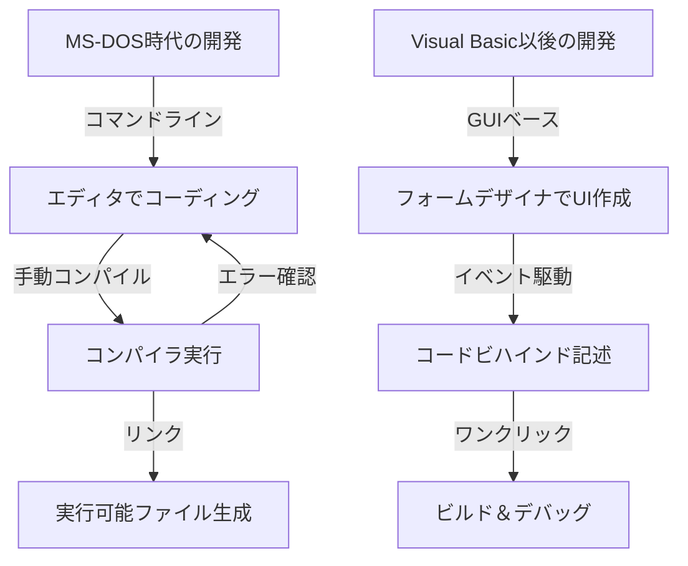
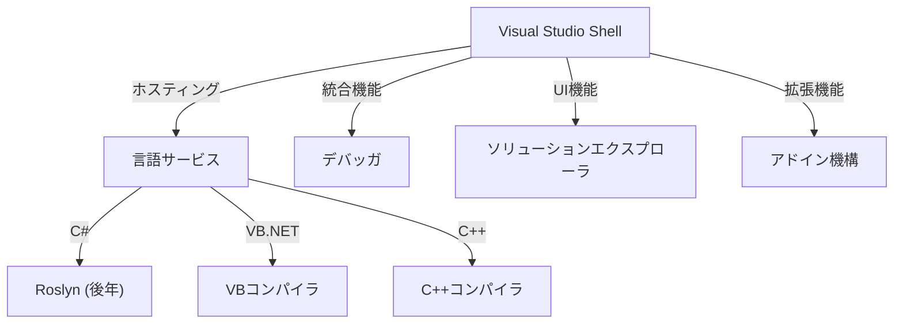

現代のソフトウェア開発において、統合開発環境（IDE）はプログラマーにとって不可欠な「武器」です。その中でも、Microsoftの「Visual Studio」は、四半世紀以上にわたり業界のデファクトスタンダードとして君臨し続けています。

本記事では、MS-DOS時代の独立したコンパイラ群から、最新のAI搭載クラウドネイティブIDEへと至るVisual Studioの壮大な進化の歴史を、技術的な変遷とアーキテクチャの観点から深く掘り下げます。

## 1. 黎明期：コマンドラインからの脱却と「視覚化」の幕開け

1980年代後半から1990年代初頭にかけて、Microsoftの開発ツールはCコンパイラ（Microsoft C/C++）やアセンブラ（MASM）、そしてQuickBasicといった個別の製品として提供されていました。プログラマーはエディタでコードを書き、コマンドラインからコンパイラを呼び出し、エラーが出ればまたエディタに戻るというサイクルを繰り返していました。

```cpp
/* MS-DOS時代の典型的なC言語プログラム (Microsoft C 6.0) */
#include <stdio.h>
#include <dos.h>

int main(void) {
    printf("Hello, MS-DOS World!\n");
    return 0;
}
```

この状況を一変させたのが、1991年に登場した **Visual Basic 1.0** です。GUI画面を「ドラッグ＆ドロップ」で設計できる画期的なアプローチは、当時のWindowsアプリケーション開発に革命をもたらしました。



## 2. Visual Studio 97：真の「統合」開発環境の誕生

1997年、Microsoftはこれまで個別に提供していたVisual Basic, Visual C++, Visual J++, Visual FoxProなどのツール群を一つのパッケージにまとめた **Visual Studio 97** を発表しました。これが「Visual Studio」というブランドの始まりです。

### Visual C++の進化とMFC
当時のWindowsプログラミングにおいて、Win32 APIを直接叩くのは非常に煩雑でした。Visual C++は **MFC (Microsoft Foundation Classes)** を提供し、オブジェクト指向によるWindowsアプリケーション開発を強力に後押ししました。

```cpp
// MFCを用いたWindowsアプリケーションの基本構造
#include <afxwin.h>

class CMyApp : public CWinApp {
public:
    virtual BOOL InitInstance();
};

class CMyFrame : public CFrameWnd {
public:
    CMyFrame() {
        Create(NULL, _T("Visual Studio History App"));
    }
};

BOOL CMyApp::InitInstance() {
    m_pMainWnd = new CMyFrame();
    m_pMainWnd->ShowWindow(SW_SHOW);
    return TRUE;
}

CMyApp theApp;
```

## 3. .NET Frameworkの登場とVisual Studio .NET (2002)

2000年代に入ると、インターネットの普及に伴い、分散コンピューティングへの対応が急務となりました。Microsoftは「.NET戦略」を打ち出し、全く新しい実行環境である **.NET Framework** と、新言語 **C#** を発表しました。

これに合わせてリリースされた **Visual Studio .NET (2002)** は、IDEの歴史における最大の転換点となります。

### アーキテクチャの刷新
VS .NETでは、従来の個別のIDE環境が統合され、共通のシェル（Visual Studio Shell）上で各言語のプロジェクトが動作するようになりました。



```csharp
// C# 1.0 によるモダンなプログラミングの幕開け
using System;

namespace VisualStudioHistory
{
    class Program
    {
        static void Main(string[] args)
        {
            Console.WriteLine("Hello, .NET World!");
        }
    }
}
```

## 4. Visual Studio 2010 と WPF によるUIの全面刷新

Visual Studio 2010では、IDE自体のUIがWPF (Windows Presentation Foundation) で書き直され、ベクターベースのスケーラブルで美しいインターフェースへと進化しました。また、F#が標準搭載されたのもこのバージョンです。

## 5. クラウドとAIの時代へ：VS 2019 から VS 2022 へ

近年、ソフトウェア開発の主戦場はクラウドへと移行しました。Visual Studioもそれに応じ、Azureとのシームレスな統合を果たしています。

さらに、**Visual Studio 2022** では、ついにIDE自体が64ビット化され、大規模なソリューションでもメモリ不足に悩まされることなく、快適に動作するようになりました。

### AIによるコーディング支援：IntelliCode
IntelliSense（入力補完）の進化形として、機械学習モデルを活用した **IntelliCode** が導入されました。開発者のコードの文脈を理解し、次に入力すべきコードを高精度で予測します。

```csharp
// 最新のC# (C# 10以降) を活用した簡潔なコーディング
var history = new List<string> { "VS97", "VS2002", "VS2022" };

// IntelliCodeが文脈から最適なLINQメソッドを提案
var modernIDEs = history.Where(v => v.Contains("2022")).ToList();

Console.WriteLine($"The modern IDE is {modernIDEs.FirstOrDefault()}");
```

## まとめ：進化を続ける「最強の武器」

MS-DOS時代の無骨なコマンドラインツールから始まり、GUI革命、.NETの誕生、そして現在のAI統合に至るまで、Visual Studioは常にソフトウェア開発の最前線で進化を続けてきました。

今後も、クラウド開発の普及や生成AI（GitHub Copilotなど）とのさらなる融合により、プログラマーの「最強の武器」はより強力に、そしてより知的になっていくことでしょう。
