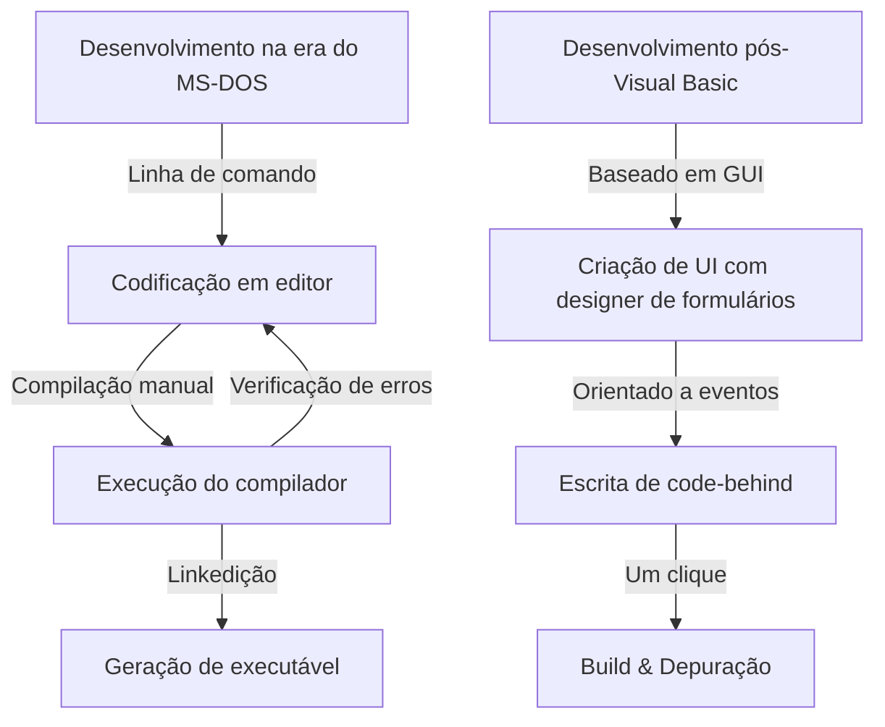
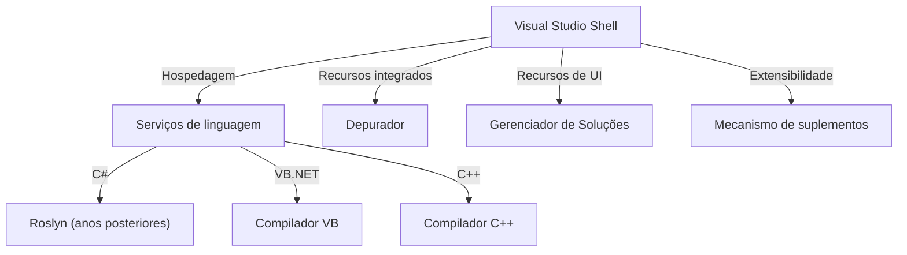

No desenvolvimento de software moderno, o ambiente de desenvolvimento integrado (IDE) é uma "arma" indispensável para os programadores. Entre eles, o "Visual Studio" da Microsoft tem reinado como o padrão de fato da indústria por mais de um quarto de século.

Neste artigo, vamos explorar a fundo a grandiosa história de evolução do Visual Studio — desde os compiladores isolados da era do MS-DOS até os modernos IDEs nativos da nuvem e integrados com IA —, analisando as transições tecnológicas e a sua arquitetura.

## 1. Os primórdios: O rompimento com a linha de comando e o início da "visualização"

Do final dos anos 1980 ao início dos anos 1990, as ferramentas de desenvolvimento da Microsoft eram fornecidas como produtos individuais, como compiladores C (Microsoft C/C++), assemblers (MASM) e o QuickBasic. Os programadores escreviam código em um editor, chamavam o compilador pela linha de comando e, caso surgissem erros, voltavam ao editor, repetindo esse ciclo continuamente.

```cpp
/* Programa típico em C na era do MS-DOS (Microsoft C 6.0) */
#include <stdio.h>
#include <dos.h>

int main(void) {
    printf("Hello, MS-DOS World!\n");
    return 0;
}
```

O que mudou completamente esse cenário foi o lançamento do **Visual Basic 1.0** em 1991. A abordagem inovadora de projetar telas de interface gráfica (GUI) usando "arrastar e soltar" revolucionou o desenvolvimento de aplicativos Windows na época.



## 2. Visual Studio 97: O nascimento de um verdadeiro ambiente "integrado" de desenvolvimento

Em 1997, a Microsoft reuniu em um único pacote ferramentas que antes eram oferecidas separadamente — como Visual Basic, Visual C++, Visual J++ e Visual FoxPro — e anunciou o **Visual Studio 97**. Esse foi o início da marca "Visual Studio".

### A evolução do Visual C++ e a MFC
Na programação para Windows da época, chamar diretamente a API Win32 era uma tarefa extremamente complexa. O Visual C++ ofereceu a **MFC (Microsoft Foundation Classes)**, impulsionando fortemente o desenvolvimento de aplicações Windows orientadas a objetos.

```cpp
// Estrutura básica de um aplicativo Windows usando MFC
#include <afxwin.h>

class CMyApp : public CWinApp {
public:
    virtual BOOL InitInstance();
};

class CMyFrame : public CFrameWnd {
public:
    CMyFrame() {
        Create(NULL, _T("Visual Studio History App"));
    }
};

BOOL CMyApp::InitInstance() {
    m_pMainWnd = new CMyFrame();
    m_pMainWnd->ShowWindow(SW_SHOW);
    return TRUE;
}

CMyApp theApp;
```

## 3. A chegada do .NET Framework e o Visual Studio .NET (2002)

Com a chegada dos anos 2000 e a popularização da Internet, o suporte à computação distribuída tornou-se uma necessidade urgente. A Microsoft lançou a sua "Estratégia .NET", anunciando um ambiente de execução totalmente novo, o **.NET Framework**, juntamente com uma nova linguagem de programação, o **C#**.

Lançado em conjunto com essas novidades, o **Visual Studio .NET (2002)** representou o maior ponto de virada na história dos IDEs.

### Renovação da arquitetura
No VS .NET, os ambientes de IDE que antes eram independentes foram unificados, permitindo que projetos em diferentes linguagens rodassem sobre uma shell comum (Visual Studio Shell).



```csharp
// O início da programação moderna com C# 1.0
using System;

namespace VisualStudioHistory
{
    class Program
    {
        static void Main(string[] args)
        {
            Console.WriteLine("Hello, .NET World!");
        }
    }
}
```

## 4. Visual Studio 2010 e a reformulação completa da UI com WPF

No Visual Studio 2010, a interface do usuário do próprio IDE foi reescrita em WPF (Windows Presentation Foundation), evoluindo para uma interface bonita e escalável baseada em vetores. Foi também nessa versão que a linguagem F# passou a ser incluída por padrão.

## 5. Rumo à era da nuvem e da IA: Do VS 2019 ao VS 2022

Nos últimos anos, o principal campo de batalha do desenvolvimento de software migrou para a nuvem. O Visual Studio acompanhou essa mudança, oferecendo integração contínua e perfeita com o Azure.

Além disso, com o **Visual Studio 2022**, o próprio IDE finalmente migrou para a arquitetura de 64 bits, permitindo trabalhar em soluções de grande escala confortavelmente e sem restrições de falta de memória.

### Assistência de codificação por IA: IntelliCode
Como uma evolução do IntelliSense (autocompletar código), foi introduzido o **IntelliCode**, que utiliza modelos de aprendizado de máquina. Ele compreende o contexto do código do desenvolvedor e prevê com alta precisão o próximo trecho a ser digitado.

```csharp
// Codificação concisa aproveitando recursos modernos do C# (C# 10 ou posterior)
var history = new List<string> { "VS97", "VS2002", "VS2022" };

// O IntelliCode sugere o método LINQ ideal com base no contexto
var modernIDEs = history.Where(v => v.Contains("2022")).ToList();

Console.WriteLine($"The modern IDE is {modernIDEs.FirstOrDefault()}");
```

## Conclusão: A "arma mais poderosa" em constante evolução

Começando como ferramentas austeras de linha de comando na era do MS-DOS, passando pela revolução gráfica das GUIs, o nascimento do .NET e até a integração atual com inteligência artificial, o Visual Studio sempre esteve na vanguarda da evolução do desenvolvimento de software.

No futuro, com a disseminação do desenvolvimento em nuvem e uma integração ainda mais profunda com IAs generativas (como o GitHub Copilot), a "arma mais poderosa" dos programadores certamente continuará a se tornar mais eficiente e inteligente.
