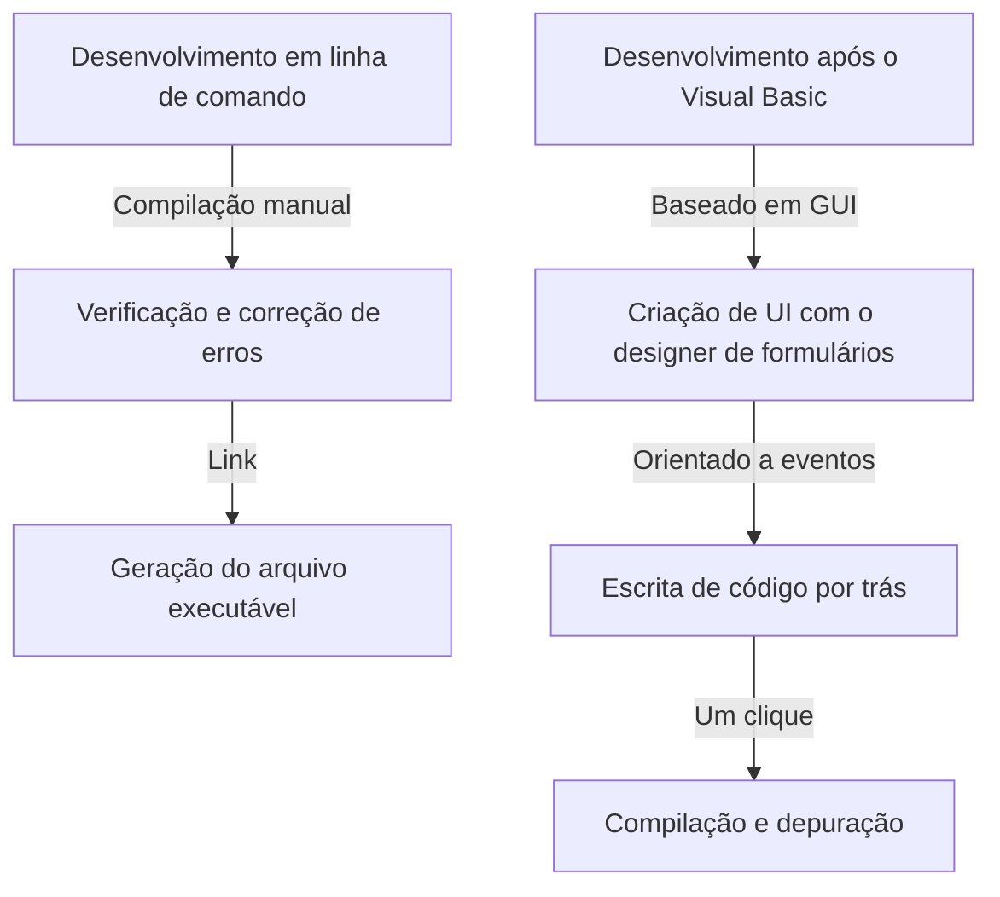

Na era atual de desenvolvimento de software, os Ambientes de Desenvolvimento Integrado (IDEs) são "armas" essenciais para os programadores. Entre eles, o "Visual Studio" da Microsoft tem reinado como o padrão de fato da indústria por muitos anos. Neste artigo, relembramos a história da evolução do Visual Studio, desde um conjunto de compiladores independentes na era MS-DOS até o mais recente IDE nativo da nuvem com inteligência artificial.

## 1. O Alvorecer: Da Linha de Comando à GUI

De 1980 ao início de 1990, as ferramentas de desenvolvimento eram fornecidas como produtos separados, como compiladores e montadores. Os programadores repetiam o ciclo de escrever código em um editor, chamar o compilador na linha de comando e retornar ao editor caso ocorressem erros.

```cpp
/* Programa em C típico da era MS-DOS */
#include <stdio.h>

int main(void) {
    printf("Hello, MS-DOS World!\n");
    return 0;
}
```

O que mudou completamente essa situação foi o "Visual Basic 1.0", lançado em 1991. Sua abordagem inovadora de projetar telas GUI por arrastar e soltar revolucionou o desenvolvimento de aplicativos para Windows da época. Isso permitiu a criação intuitiva de aplicativos por meio de operações visuais e foi muito bem recebido por muitos desenvolvedores.



## 2. Visual Studio 97: O Nascimento do Verdadeiro Ambiente de Desenvolvimento Integrado

Em 1997, a Microsoft anunciou o "Visual Studio 97", que combinou ferramentas como Visual Basic, Visual C++ e Visual J++, que antes eram oferecidas separadamente, em um único pacote. Este foi o início da marca "Visual Studio".

Os desenvolvedores puderam trabalhar com várias linguagens e tecnologias no mesmo ambiente de desenvolvimento, simplificando muito a gestão de projetos e o processo de construção. Em particular, a evolução do Visual C++ e a introdução da MFC (Microsoft Foundation Classes) facilitaram o desenvolvimento de aplicativos Windows complexos.

## 3. O Surgimento do .NET Framework e Visual Studio .NET

Em 2002, a Microsoft lançou o ".NET Framework" e o "Visual Studio .NET (2002)", mudando drasticamente o paradigma do desenvolvimento de software. A nova linguagem C# foi introduzida, permitindo que os desenvolvedores escrevessem códigos mais seguros e eficientes.

Recursos indispensáveis às linguagens de programação modernas, como o conceito de código gerenciado e o gerenciamento de memória via coleta de lixo, foram estabelecidos nessa época. Além disso, o desenvolvimento de serviços Web XML tornou-se mais fácil, acelerando a integração de sistemas pela Internet.


## 4. Rumo à Era do Desenvolvimento Ágil e da Nuvem

Entrando na década de 2010, os métodos de desenvolvimento de software mudaram para o desenvolvimento ágil. Junto com isso, o Visual Studio evoluiu de um simples IDE para uma plataforma de suporte ao desenvolvimento em equipe. Com a integração do "Team Foundation Server (agora Azure DevOps)", passou a cobrir todo o ciclo de vida, incluindo controle de versão, integração contínua (CI) e entrega contínua (CD).

Além disso, com a ascensão da computação em nuvem, os recursos de integração com o Azure foram fortalecidos, criando um ambiente perfeito desde o desenvolvimento até a implantação.

## 5. A Onda de Plataformas Múltiplas e Código Aberto

Em 2015, o editor de código leve e rápido "Visual Studio Code (VS Code)" foi lançado, causando um grande impacto. Capaz de rodar não apenas no Windows, mas também no macOS e no Linux, e suportando várias linguagens e frameworks por meio de suas abundantes extensões, o VS Code rapidamente ganhou o apoio de desenvolvedores em todo o mundo.

Além disso, com o .NET Core tornando-se de código aberto e compatível com várias plataformas, o Visual Studio também transcendeu a estrutura anterior exclusiva do Windows, ganhando flexibilidade para se adaptar a um ecossistema de desenvolvimento diversificado.

## 6. Para um Futuro Onde a IA Ajuda a Codificar

Nos últimos anos, com a introdução de recursos de suporte à codificação por IA, como o "GitHub Copilot", a produtividade do desenvolvedor atingiu níveis sem precedentes. A IA atua agora como um parceiro poderoso, desde a autocompletação de código e detecção de bugs até a sugestão de algoritmos complexos.

Começando com a linha de comando da era MS-DOS, passando pelo desenvolvimento visual baseado em GUI, a mudança de paradigma impulsionada pelo .NET, a integração com a nuvem e, finalmente, o suporte por IA, o Visual Studio sempre evoluiu na vanguarda do desenvolvimento de software. Ele certamente continuará a gravar sua história como a maior arma do programador.
