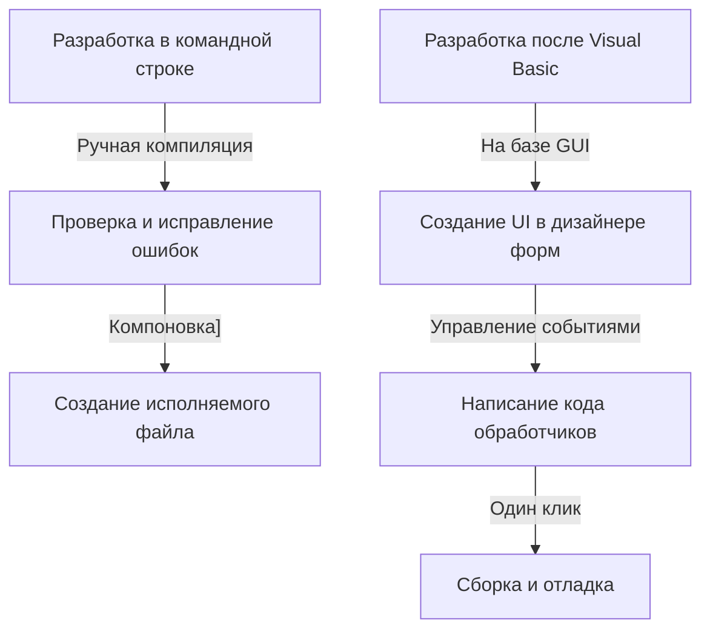

В современной разработке программного обеспечения интегрированные среды разработки (IDE) являются важнейшим «оружием» программиста. Среди них «Visual Studio» от Microsoft долгие годы сохраняет статус фактического стандарта отрасли. В этой статье мы вспомним историю развития Visual Studio, от набора независимых компиляторов эпохи MS-DOS до новейшей облачной IDE со встроенным искусственным интеллектом.

## 1. На заре: от командной строки к графическому интерфейсу (GUI)

С 1980-х до начала 1990-х годов инструменты разработки поставлялись как отдельные продукты, такие как компиляторы и ассемблеры. Программисты повторяли цикл: писали код в редакторе, вызывали компилятор из командной строки, а в случае ошибки возвращались в редактор.

```cpp
/* Типичная программа на языке C эпохи MS-DOS */
#include <stdio.h>

int main(void) {
    printf("Hello, MS-DOS World!\n");
    return 0;
}
```

Эта ситуация кардинально изменилась с появлением «Visual Basic 1.0» в 1991 году. Инновационный подход к проектированию экранов GUI методом перетаскивания (drag-and-drop) произвел революцию в разработке приложений для Windows того времени. Возможность интуитивно создавать приложения с помощью визуальных операций была с восторгом встречена множеством разработчиков.



## 2. Visual Studio 97: рождение истинной интегрированной среды разработки

В 1997 году Microsoft анонсировала «Visual Studio 97», объединив такие ранее предоставляемые по отдельности инструменты, как Visual Basic, Visual C++ и Visual J++, в один пакет. Это стало началом бренда «Visual Studio».

Разработчики получили возможность работать с несколькими языками и технологиями в одной среде разработки, что значительно упростило управление проектами и процесс сборки. В частности, развитие Visual C++ и внедрение MFC (Microsoft Foundation Classes) облегчили разработку сложных Windows-приложений.

## 3. Появление .NET Framework и Visual Studio .NET

В 2002 году Microsoft выпустила «.NET Framework» и «Visual Studio .NET (2002)», что существенно изменило парадигму разработки программного обеспечения. Был представлен новый язык C#, позволивший разработчикам писать более безопасный и эффективный код.

Именно в это время утвердились такие неотъемлемые для современных языков программирования функции, как концепция управляемого кода (managed code) и управление памятью с помощью сборщика мусора. Кроме того, упростилась разработка веб-сервисов XML, что ускорило интеграцию систем через Интернет.


## 4. Эпоха Agile и облачных технологий

С наступлением 2010-х годов методологии разработки программного обеспечения сместились в сторону Agile. Вслед за этим Visual Studio эволюционировала из простой IDE в платформу, поддерживающую командную разработку. Благодаря интеграции с «Team Foundation Server (ныне Azure DevOps)» она стала охватывать весь жизненный цикл, включая контроль версий, непрерывную интеграцию (CI) и непрерывную доставку (CD).

Более того, с развитием облачных вычислений были усилены функции интеграции с Azure, что позволило создать бесшовную среду от разработки до развертывания.

## 5. Волна мультиплатформенности и открытого исходного кода

В 2015 году был выпущен легкий и быстрый редактор кода «Visual Studio Code (VS Code)», произведший огромный фурор. VS Code, работающий не только на Windows, но и на macOS и Linux, а также поддерживающий различные языки и фреймворки с помощью множества расширений, быстро завоевал популярность среди разработчиков по всему миру.

Кроме того, с переходом .NET Core на открытый исходный код и появлением кроссплатформенности, Visual Studio также вышла за привычные рамки эксклюзивности для Windows, получив гибкость для адаптации к разнообразной экосистеме разработки.

## 6. К будущему, где ИИ помогает в программировании

В последние годы, с внедрением таких функций поддержки кодирования на базе ИИ, как «GitHub Copilot», производительность разработчиков достигла беспрецедентного уровня. ИИ теперь выступает мощным помощником разработчика, начиная от автодополнения кода и поиска ошибок до предложений сложных алгоритмов.

Начиная с командной строки эпохи MS-DOS, визуальной разработки через GUI, смены парадигмы с помощью .NET, интеграции с облаком и заканчивая поддержкой ИИ, Visual Studio всегда эволюционировала на передовой разработки программного обеспечения. Она несомненно продолжит писать свою историю в качестве главного оружия программиста.
