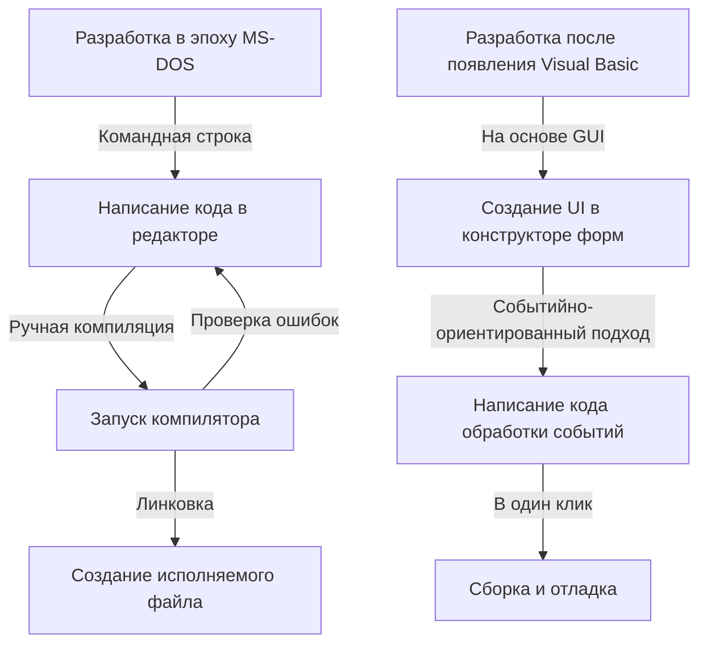
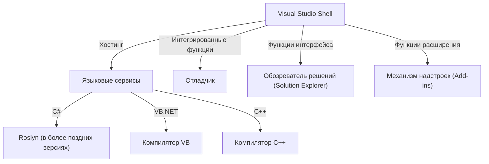

В современной разработке программного обеспечения интегрированная среда разработки (IDE) является незаменимым «оружием» программиста. Среди множества инструментов Microsoft Visual Studio уже более четверти века остается фактическим стандартом в индустрии.

В этой статье мы подробно рассмотрим грандиозную историю эволюции Visual Studio — от разрозненных компиляторов эпохи MS-DOS до новейшей облачной IDE с поддержкой искусственного интеллекта — сквозь призму технических изменений и архитектурных решений.

## 1. Зарождение: отказ от командной строки и рассвет «визуализации»

С конца 1980-х до начала 1990-х годов инструменты разработки Microsoft поставлялись в виде отдельных продуктов: компилятора C (Microsoft C/C++), ассемблера (MASM) и QuickBasic. Программисты писали код в текстовом редакторе, вызывали компилятор из командной строки, а при возникновении ошибок возвращались обратно в редактор — и этот цикл повторялся бесконечно.

```cpp
/* Типичная программа на языке C эпохи MS-DOS (Microsoft C 6.0) */
#include <stdio.h>
#include <dos.h>

int main(void) {
    printf("Hello, MS-DOS World!\n");
    return 0;
}
```

Ситуацию в корне изменило появление в 1991 году **Visual Basic 1.0**. Инновационный подход, позволявший проектировать графический интерфейс с помощью перетаскивания элементов (drag-and-drop), произвел революцию в разработке приложений для Windows того времени.



## 2. Visual Studio 97: рождение по-настоящему «интегрированной» среды разработки

В 1997 году Microsoft представила **Visual Studio 97**, объединив в единый пакет ранее поставлявшиеся отдельно инструменты: Visual Basic, Visual C++, Visual J++, Visual FoxPro и другие. Так началась история бренда Visual Studio.

### Эволюция Visual C++ и библиотека MFC
В то время прямая работа с Win32 API при программировании под Windows была крайне трудоемкой задачей. Visual C++ предложил библиотеку **MFC (Microsoft Foundation Classes)**, которая дала мощный импульс объектно-ориентированной разработке приложений для Windows.

```cpp
// Базовая структура Windows-приложения с использованием MFC
#include <afxwin.h>

class CMyApp : public CWinApp {
public:
    virtual BOOL InitInstance();
};

class CMyFrame : public CFrameWnd {
public:
    CMyFrame() {
        Create(NULL, _T("Visual Studio History App"));
    }
};

BOOL CMyApp::InitInstance() {
    m_pMainWnd = new CMyFrame();
    m_pMainWnd->ShowWindow(SW_SHOW);
    return TRUE;
}

CMyApp theApp;
```

## 3. Появление .NET Framework и Visual Studio .NET (2002)

С наступлением 2000-х годов и стремительным развитием интернета возникла острая необходимость в поддержке распределенных вычислений. Microsoft провозгласила стратегию «.NET», представив принципиально новую среду выполнения **.NET Framework** и новый язык программирования **C#**.

Выпущенная в поддержку этой концепции среда **Visual Studio .NET (2002)** стала крупнейшим поворотным моментом в истории IDE.

### Обновление архитектуры
В VS .NET разрозненные ранее среды были окончательно объединены: проекты на различных языках стали работать в рамках общей оболочки (Visual Studio Shell).



```csharp
// Рассвет современного программирования на C# 1.0
using System;

namespace VisualStudioHistory
{
    class Program
    {
        static void Main(string[] args)
        {
            Console.WriteLine("Hello, .NET World!");
        }
    }
}
```

## 4. Visual Studio 2010 и полное обновление интерфейса на базе WPF

В Visual Studio 2010 пользовательский интерфейс самой IDE был полностью переписан на WPF (Windows Presentation Foundation), превратившись в красивый, масштабируемый векторный интерфейс. Кроме того, именно в этой версии язык F# впервые был включен в стандартную поставку.

## 5. В эпоху облаков и искусственного интеллекта: от VS 2019 к VS 2022

В последние годы основная арена разработки программного обеспечения переместилась в облако. Отвечая на эти изменения, Visual Studio реализовала бесшовную интеграцию с Microsoft Azure.

Кроме того, в **Visual Studio 2022** сама среда разработки наконец стала полноценно 64-битной, что позволило комфортно работать даже с самыми масштабными решениями (Solution), не сталкиваясь с ограничениями по оперативной памяти.

### Помощь в написании кода на основе ИИ: IntelliCode
В качестве эволюционного развития IntelliSense (автодополнения кода) был представлен **IntelliCode**, использующий модели машинного обучения. Он анализирует контекст кода разработчика и с высокой точностью предсказывает, какой фрагмент кода должен быть введен следующим.

```csharp
// Лаконичный код с использованием современных возможностей C# (начиная с C# 10)
var history = new List<string> { "VS97", "VS2002", "VS2022" };

// IntelliCode предлагает наиболее подходящий метод LINQ на основе контекста
var modernIDEs = history.Where(v => v.Contains("2022")).ToList();

Console.WriteLine($"The modern IDE is {modernIDEs.FirstOrDefault()}");
```

## Заключение: непрерывно развивающееся «главное оружие»

Начав свой путь с суровых утилит командной строки эпохи MS-DOS, пройдя через революцию графического интерфейса, появление платформы .NET и вплоть до интеграции с искусственным интеллектом, Visual Studio неизменно развивалась на переднем крае индустрии разработки ПО.

И в будущем, по мере распространения облачной разработки и углубления интеграции с генеративным ИИ (таким как GitHub Copilot), «главное оружие» программиста будет становиться еще более мощным и интеллектуальным.
