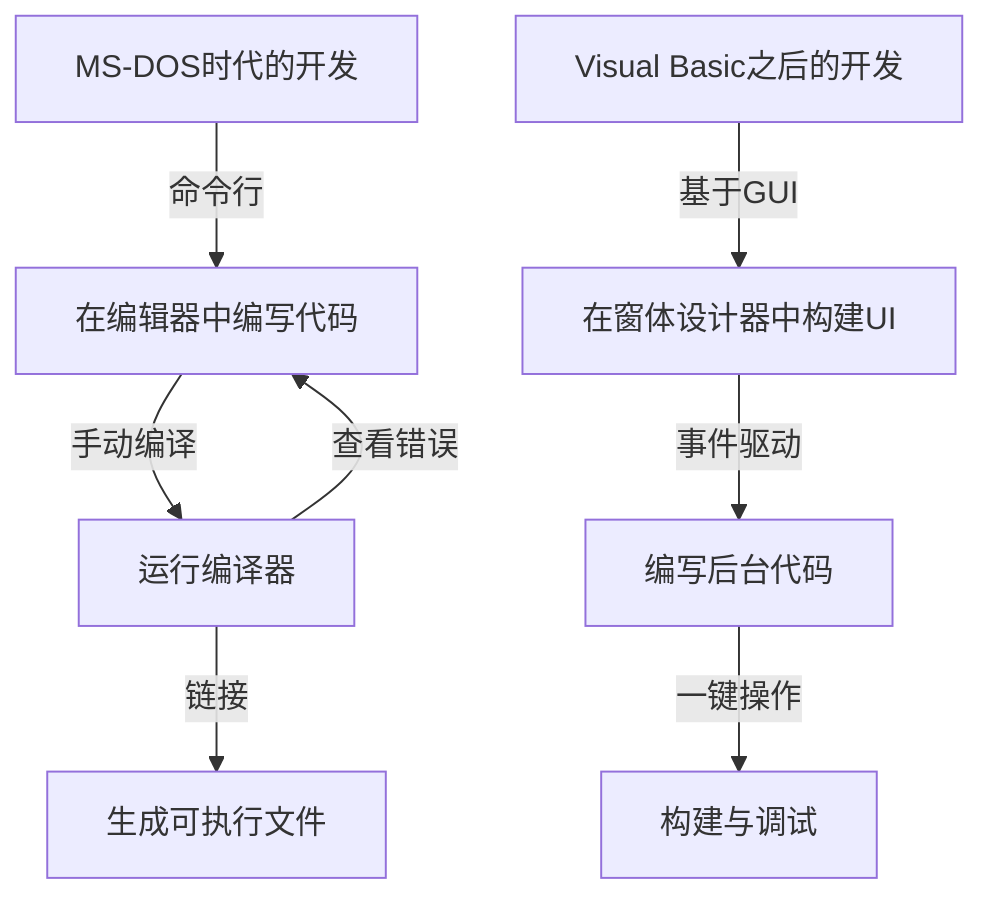
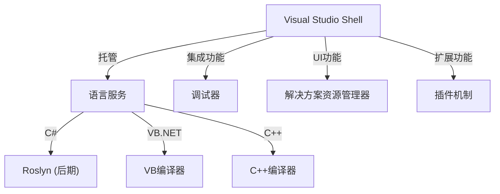

在现代软件开发中，集成开发环境（IDE）是程序员不可或缺的“武器”。其中，微软的“Visual Studio”在长达四分之一世纪多的时间里，一直稳居行业事实标准。

本文将从技术演变和架构的角度，深入剖析Visual Studio从MS-DOS时代的独立编译器工具链，演变至如今集成AI的云原生IDE的宏伟进化史。

## 1. 黎明时期：摆脱命令行与“可视化”的序幕

在20世纪80年代末至90年代初，微软的开发工具是以独立产品的形式分别提供的，包括C编译器（Microsoft C/C++）、汇编器（MASM）以及QuickBasic等。当时的程序员在编辑器中编写代码，从命令行调用编译器，一旦报错就返回编辑器修改，不断重复这一循环。

```cpp
/* MS-DOS时代典型的C语言程序 (Microsoft C 6.0) */
#include <stdio.h>
#include <dos.h>

int main(void) {
    printf("Hello, MS-DOS World!\n");
    return 0;
}
```

彻底改变这种局面的，是1991年推出的 **Visual Basic 1.0**。通过“拖放”（Drag & Drop）设计GUI界面的划时代方式，为当时的Windows应用程序开发带来了一场革命。



## 2. Visual Studio 97：真正的“集成”开发环境诞生

1997年，微软将此前单独提供的Visual Basic、Visual C++、Visual J++、Visual FoxPro等一系列工具打包整合，发布了 **Visual Studio 97**。这正是“Visual Studio”这一品牌的开端。

### Visual C++的演进与MFC
在当时的Windows编程中，直接调用Win32 API极其繁琐。Visual C++提供了 **MFC (Microsoft Foundation Classes)**，极大地推动了基于面向对象思想的Windows应用程序开发。

```cpp
// 使用MFC的Windows应用程序基本结构
#include <afxwin.h>

class CMyApp : public CWinApp {
public:
    virtual BOOL InitInstance();
};

class CMyFrame : public CFrameWnd {
public:
    CMyFrame() {
        Create(NULL, _T("Visual Studio History App"));
    }
};

BOOL CMyApp::InitInstance() {
    m_pMainWnd = new CMyFrame();
    m_pMainWnd->ShowWindow(SW_SHOW);
    return TRUE;
}

CMyApp theApp;
```

## 3. .NET Framework的诞生与Visual Studio .NET (2002)

进入21世纪，随着互联网的普及，支持分布式计算成为了迫切需求。微软推出了“.NET战略”，并发布了全新的运行时环境 **.NET Framework** 和全新编程语言 **C#**。

随之发布的 **Visual Studio .NET (2002)** 成为了IDE发展史上最重要的转折点。

### 架构革新
在VS .NET中，过去相互独立的IDE环境得到了彻底整合，各种语言的项目得以统一运行在通用的外壳程序（Visual Studio Shell）之上。



```csharp
// C# 1.0 开启现代编程新篇章
using System;

namespace VisualStudioHistory
{
    class Program
    {
        static void Main(string[] args)
        {
            Console.WriteLine("Hello, .NET World!");
        }
    }
}
```

## 4. Visual Studio 2010 与基于WPF的UI全面革新

在Visual Studio 2010中，IDE自身的UI使用WPF (Windows Presentation Foundation) 进行了全面重写，演进为基于矢量的、可缩放且精美的界面。此外，F#也是从这一版本开始作为标准功能内置其中。

## 5. 迈向云与AI时代：从VS 2019到VS 2022

近年来，软件开发的主战场转移到了云端。Visual Studio也顺应这一趋势，实现了与Azure的无缝集成。

此外，在 **Visual Studio 2022** 中，IDE本身终于全面转向64位架构，即便面对超大型解决方案，开发者也无需再为内存不足而困扰，运行体验更加流畅自如。

### 基于AI的编码辅助：IntelliCode
作为IntelliSense（智能补全）的进化版，利用机器学习模型的 **IntelliCode** 应运而生。它能够理解开发者的代码上下文，高精度预测接下来应输入的代码。

```csharp
// 利用最新C# (C# 10及以上) 编写的简洁代码
var history = new List<string> { "VS97", "VS2002", "VS2022" };

// IntelliCode根据上下文推荐最佳LINQ方法
var modernIDEs = history.Where(v => v.Contains("2022")).ToList();

Console.WriteLine($"The modern IDE is {modernIDEs.FirstOrDefault()}");
```

## 总结：不断演进的“最强武器”

从MS-DOS时代质朴生硬的命令行工具起步，历经GUI革命、.NET的诞生，直至今日的AI深度集成，Visual Studio始终走在软件开发的最前线，不断演进。

未来，随着云开发的普及以及与生成式AI（如GitHub Copilot等）的进一步融合，程序员的这把“最强武器”必将变得更加强大、更加智能。
