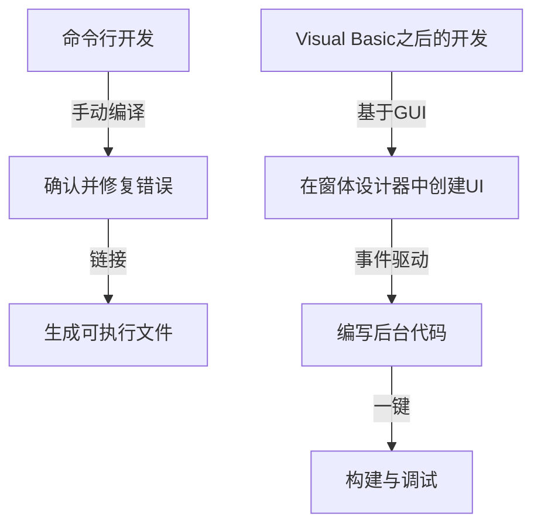
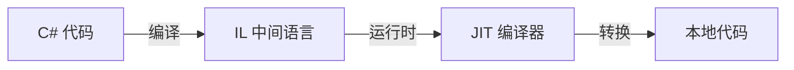

在现代软件开发中，集成开发环境（IDE）是程序员不可或缺的“武器”。其中，微软的“Visual Studio”作为事实上的行业标准，多年来一直稳居霸主地位。本文将回顾Visual Studio的进化史，看它是如何从MS-DOS时代的一组独立编译器，发展到如今搭载AI的云原生IDE。

## 1. 黎明期：从命令行到GUI

在20世纪80年代到90年代初，开发工具（如编译器和汇编器）是作为独立产品提供的。程序员在编辑器中编写代码，从命令行调用编译器，如果出现错误再返回编辑器，如此循环往复。

```cpp
/* MS-DOS时代的典型C语言程序 */
#include <stdio.h>

int main(void) {
    printf("Hello, MS-DOS World!\n");
    return 0;
}
```

1991年问世的“Visual Basic 1.0”彻底改变了这一现状。它能通过拖放来设计GUI界面的革命性方法，为当时的Windows应用程序开发带来了颠覆性的变化。这种通过视觉操作直观创建应用程序的方式，受到了众多开发者的欢迎。



## 2. Visual Studio 97：真正的集成开发环境诞生

1997年，微软宣布推出“Visual Studio 97”，将以前单独提供的Visual Basic、Visual C++、Visual J++等工具集打包在一起。这就是“Visual Studio”品牌的开端。

开发者可以在同一个开发环境中处理多种语言和技术，项目管理和构建过程得到了极大的简化。特别是Visual C++的进化以及MFC（Microsoft Foundation Classes）的引入，让复杂的Windows应用程序开发变得更加容易。

## 3. .NET Framework的登场与Visual Studio .NET

2002年，微软发布了极大改变软件开发范式的“.NET Framework”和“Visual Studio .NET (2002)”。一种名为C#的新语言被引入，使得开发者能够编写更安全、更高效的代码。

现代编程语言中不可或缺的功能，例如托管代码的概念以及通过垃圾回收进行内存管理，都是在这一时期确立的。此外，XML Web服务的开发也变得更加容易，加速了基于互联网的系统集成。



## 4. 迈向敏捷开发与云计算时代

进入2010年代后，软件开发方法向敏捷开发转变。与此同时，Visual Studio也从单纯的IDE进化为支持团队开发的平台。通过与“Team Foundation Server（现为Azure DevOps）”的集成，它开始覆盖版本控制、持续集成（CI）、持续交付（CD）等整个生命周期。

此外，随着云计算的兴起，与Azure的协作功能得到增强，构建了从开发到部署可以无缝进行的环境。

## 5. 多平台与开源浪潮

2015年，轻量且高速的代码编辑器“Visual Studio Code (VS Code)”发布，带来了巨大的冲击。VS Code不仅能在Windows上运行，还能在macOS和Linux上运行，并通过丰富的扩展功能支持各种语言和框架，瞬间获得了全球开发者的拥护。

另外，随着.NET Core的开源和跨平台支持，Visual Studio也跨越了以往仅限Windows的框架，获得了适应多样化开发生态系统的灵活性。

## 6. 走向AI辅助编程的未来

近年来，随着“GitHub Copilot”等AI编程辅助功能的引入，开发者的生产力达到了前所未有的水平。从自动补全代码、检测Bug，甚至到建议复杂的算法，AI已然成为开发者强大的合作伙伴。

从MS-DOS时代的命令行开始，经历了基于GUI的可视化开发、.NET带来的范式转变、与云的集成，再到AI的辅助，Visual Studio始终与软件开发的最前沿共同进化。未来，它也必将作为程序员的最强武器，继续书写它的历史。
