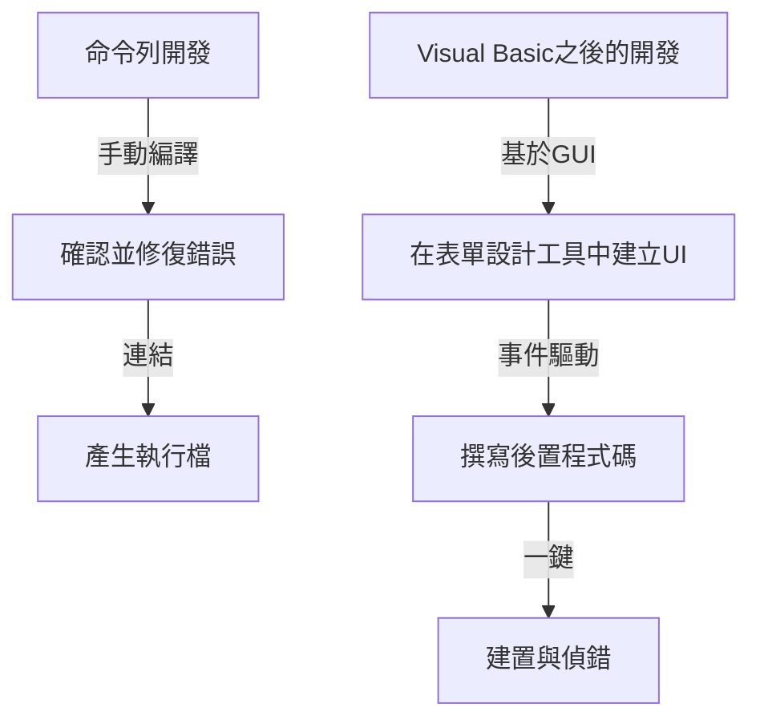

在現代軟體開發中，整合開發環境（IDE）是程式設計師不可或缺的「武器」。其中，微軟的「Visual Studio」做為業界的實質標準，多年來一直穩居霸主地位。本文將回顧Visual Studio的進化史，看它是如何從MS-DOS時代的一組獨立編譯器，發展到如今搭載AI的雲原生IDE。

## 1. 黎明期：從命令列到GUI

在1980年代到1990年代初，開發工具（如編譯器和組譯器）是做為獨立產品提供的。程式設計師在編輯器中撰寫程式碼，從命令列呼叫編譯器，如果出現錯誤再返回編輯器，如此不斷循環。

```cpp
/* MS-DOS時代的典型C語言程式 */
#include <stdio.h>

int main(void) {
    printf("Hello, MS-DOS World!\n");
    return 0;
}
```

1991年問世的「Visual Basic 1.0」徹底改變了這一現狀。它能透過拖曳來設計GUI介面的革命性方法，為當時的Windows應用程式開發帶來了顛覆性的改變。這種透過視覺操作直觀建立應用程式的方式，受到了眾多開發者的歡迎。



## 2. Visual Studio 97：真正的整合開發環境誕生

1997年，微軟宣布推出「Visual Studio 97」，將以前單獨提供的Visual Basic、Visual C++、Visual J++等工具集打包在一起。這就是「Visual Studio」品牌的開端。

開發者可以在同一個開發環境中處理多種語言和技術，專案管理和建置過程得到了極大的簡化。特別是Visual C++的進化以及MFC（Microsoft Foundation Classes）的引入，讓複雜的Windows應用程式開發變得更加容易。

## 3. .NET Framework的登場與Visual Studio .NET

2002年，微軟發布了極大改變軟體開發典範的「.NET Framework」和「Visual Studio .NET (2002)」。一種名為C#的新語言被引入，使得開發者能夠撰寫更安全、更高效的程式碼。

現代程式語言中不可或缺的功能，例如受控碼的概念以及透過垃圾回收進行記憶體管理，都是在這一時期確立的。此外，XML Web服務的開發也變得更加容易，加速了基於網際網路的系統整合。


## 4. 邁向敏捷開發與雲端運算時代

進入2010年代後，軟體開發方法向敏捷開發轉變。與此同時，Visual Studio也從單純的IDE進化為支援團隊開發的平台。透過與「Team Foundation Server（現為Azure DevOps）」的整合，它開始涵蓋版本控制、持續整合（CI）、持續交付（CD）等整個生命週期。

此外，隨著雲端運算的興起，與Azure的協作功能得到增強，建構了從開發到部署可以無縫進行的環境。

## 5. 多平台與開源浪潮

2015年，輕量且高速的程式碼編輯器「Visual Studio Code (VS Code)」發布，帶來了巨大的衝擊。VS Code不僅能在Windows上執行，還能在macOS和Linux上執行，並透過豐富的擴充功能支援各種語言和框架，瞬間獲得了全球開發者的擁護。

另外，隨著.NET Core的開源和跨平台支援，Visual Studio也跨越了以往僅限Windows的框架，獲得了適應多樣化開發作業系統的彈性。

## 6. 走向AI輔助寫程式的未來

近年來，隨著「GitHub Copilot」等AI程式碼輔助功能的引入，開發者的生產力達到了前所未有的水準。從自動完成程式碼、偵測Bug，甚至到建議複雜的演算法，AI已然成為開發者強大的合作夥伴。

從MS-DOS時代的命令列開始，經歷了基於GUI的視覺化開發、.NET帶來的典範轉移、與雲端的整合，再到AI的輔助，Visual Studio始終與軟體開發的最前線共同進化。未來，它也必將做為程式設計師的最強武器，繼續寫下它的歷史。
