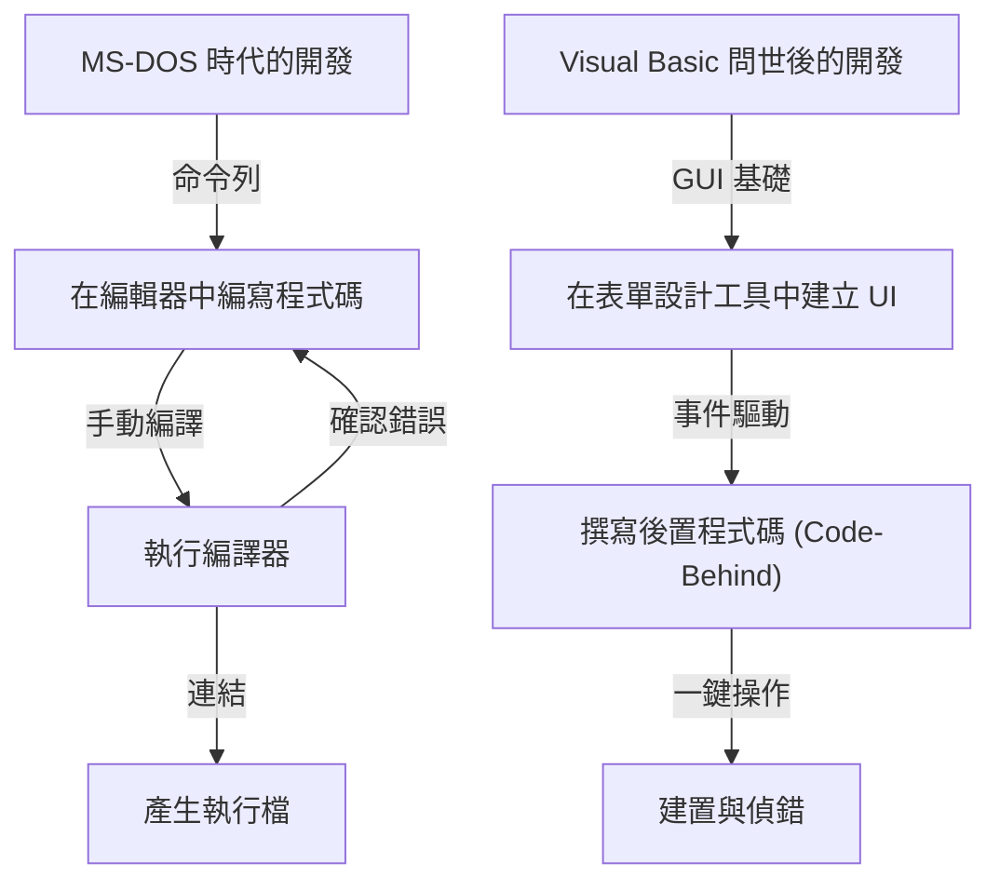
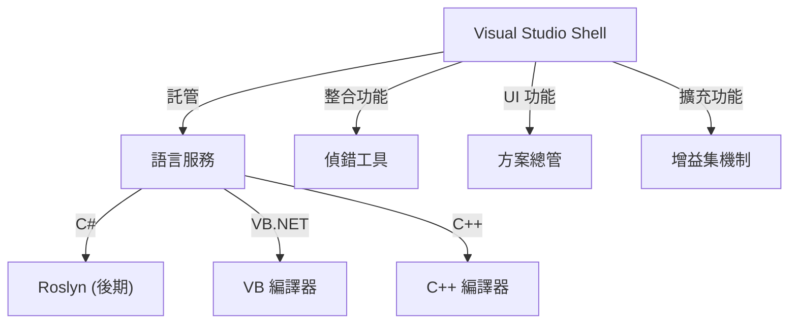

在現代軟體開發中，整合開發環境（IDE）是程式設計師不可或缺的「武器」。其中，微軟（Microsoft）的「Visual Studio」更是在超過四分之一個世紀的時間裡，穩居業界實質標準（de facto standard）的寶座。

本文將從技術變遷與架構視角，深入探討 Visual Studio 從 MS-DOS 時代的獨立編譯器群，一路發展至如今搭載 AI 的雲端原生 IDE 之壯大演進史。

## 1. 黎明期：擺脫命令列與「視覺化」的序幕

從 1980 年代後半到 1990 年代初期，微軟的開發工具多以個別產品的形式提供，例如 C 編譯器（Microsoft C/C++）、組譯器（MASM）以及 QuickBasic。當時程式設計師總是不斷重複著這樣的循環：在編輯器中撰寫程式碼、透過命令列呼叫編譯器，遇到錯誤時再切換回編輯器修改。

```cpp
/* MS-DOS 時代典型的 C 語言程式 (Microsoft C 6.0) */
#include <stdio.h>
#include <dos.h>

int main(void) {
    printf("Hello, MS-DOS World!\n");
    return 0;
}
```

徹底翻轉這種開發模式的，正是 1991 年問世的 **Visual Basic 1.0**。透過「拖曳（Drag & Drop）」來設計 GUI 介面的劃時代做法，為當時的 Windows 應用程式開發帶來了革命性的變革。



## 2. Visual Studio 97：真正的「整合」開發環境誕生

1997 年，微軟將過去個別提供的 Visual Basic、Visual C++、Visual J++、Visual FoxPro 等工具打包成單一軟體套件，正式發表了 **Visual Studio 97**。這正是「Visual Studio」品牌的起點。

### Visual C++ 的演進與 MFC
在當時的 Windows 程式設計中，直接呼叫 Win32 API 相當繁瑣且複雜。Visual C++ 提供了 **MFC (Microsoft Foundation Classes)**，大力推動了以物件導向為核心的 Windows 應用程式開發。

```cpp
// 使用 MFC 的 Windows 應用程式基本架構
#include <afxwin.h>

class CMyApp : public CWinApp {
public:
    virtual BOOL InitInstance();
};

class CMyFrame : public CFrameWnd {
public:
    CMyFrame() {
        Create(NULL, _T("Visual Studio History App"));
    }
};

BOOL CMyApp::InitInstance() {
    m_pMainWnd = new CMyFrame();
    m_pMainWnd->ShowWindow(SW_SHOW);
    return TRUE;
}

CMyApp theApp;
```

## 3. .NET Framework 的登場與 Visual Studio .NET (2002)

步入 2000 年代，隨著網際網路的普及，支援分散式運算成為當務之急。微軟提出了「.NET 戰略」，並發表了全新的執行環境 **.NET Framework** 以及全新語言 **C#**。

配合此戰略推出的 **Visual Studio .NET (2002)**，成為了 IDE 發展史上最重要的轉捩點。

### 架構的全面革新
在 VS .NET 中，過去各自為政的 IDE 環境被全面整合，各語言專案均可在共同的外殼（Visual Studio Shell）上運作。



```csharp
// 由 C# 1.0 揭開現代程式設計的序幕
using System;

namespace VisualStudioHistory
{
    class Program
    {
        static void Main(string[] args)
        {
            Console.WriteLine("Hello, .NET World!");
        }
    }
}
```

## 4. Visual Studio 2010 與以 WPF 重構的全新 UI

在 Visual Studio 2010 中，IDE 本身的使用者介面使用 WPF (Windows Presentation Foundation) 進行全面重寫，進化為基於向量圖形、具備高度擴展性且更加精美現代的介面。此外，F# 也是從這個版本開始成為內建標準支援的語言。

## 5. 邁向雲端與 AI 時代：從 VS 2019 到 VS 2022

近年來，軟體開發的主戰場轉向了雲端。Visual Studio 也順應潮流，實現了與 Azure 的無縫整合。

更進一步地，在 **Visual Studio 2022** 中，IDE 本體終於全面轉換為 64 位元架構，即使面對極大規模的方案（Solution），也不再受記憶體不足所困擾，運作更為流暢迅速。

### AI 賦能的程式碼輔助：IntelliCode
作為 IntelliSense（程式碼自動完成）的進化版，導入了運用機器學習模型的 **IntelliCode**。它能深入理解開發者的程式碼語境，以極高準確度預測接下來應該輸入的程式碼。

```csharp
// 運用最新 C# (C# 10+) 的簡潔程式設計
var history = new List<string> { "VS97", "VS2002", "VS2022" };

// IntelliCode 能根據上下文推薦最合適的 LINQ 方法
var modernIDEs = history.Where(v => v.Contains("2022")).ToList();

Console.WriteLine($"The modern IDE is {modernIDEs.FirstOrDefault()}");
```

## 總結：持續演進的「最強武器」

從 MS-DOS 時代純粹質樸的命令列工具發端，歷經 GUI 革命、.NET 的誕生，再到如今與 AI 的深度融合，Visual Studio 始終站在軟體開發的最前線持續進化。

展望未來，隨著雲端開發的普及以及與生成式 AI（如 GitHub Copilot）的更深層整合，程式設計師手中的這把「最強武器」必將變得更加強大、更加智慧。
