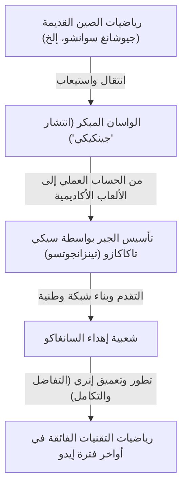
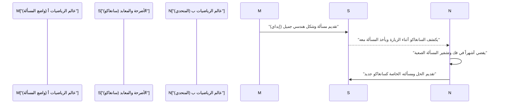

## 1. مقدمة: "معجزة الرياضيات" التي حدثت في اليابان تحت سياسة العزلة

من القرن السابع عشر حتى منتصف القرن التاسع عشر، تبنت اليابان سياسة عزلة خارجية صارمة تُعرف باسم "ساكوكو". في هذه الحقبة حيث كان التبادل مع العلوم والثقافة الغربية مقيداً بشدة، حدثت ظاهرة فريدة من نوعها لا مثيل لها في العالم داخل اليابان. إنها ازدهار ثقافة الرياضيات اليابانية المتقدمة والفريدة **"واسان (Wasan)"**.

في نفس الفترة في أوروبا، أسس [إسحاق نيوتن](/ar/p/newton/) وغوتفريد لايبنتز وآخرون حساب التفاضل والتكامل، وتطورت الرياضيات الحديثة بسرعة. ومن المثير للدهشة، أنه حتى في الدولة الجزرية الواقعة في الشرق الأقصى وهي اليابان، ولدت مفاهيم رياضية متقدمة تضاهي حساب التفاضل والتكامل بشكل مستقل تماماً عنهم.

في هذا المقال، سنستعرض بالتفصيل تاريخ الواسان، الذي بدأ كمسح وحسابات عملية، ثم تطور إلى لعبة فكرية بحتة، وفي النهاية ارتقى ليصبح نوعاً من الفن. كما سنسلط الضوء على علماء الرياضيات العباقرة الذين قادوا هذا التطور، بالإضافة إلى الثقافة الفريدة "سانغاكو" التي لا مثيل لها في العالم.

## 2. فجر الواسان: الكتاب الأكثر مبيعاً "جينكيكي" الذي أشعل طفرة الرياضيات

كان العامل الحاسم الذي أدى إلى الانتشار الهائل لثقافة الرياضيات في اليابان هو نشر كتاب "جينكيكي (Jinkoki)" بقلم يوشيدا ميتسويوشي (Yoshida Mitsuyoshi) في عام 1627، في أوائل فترة إيدو.

قبل ذلك، كان الحساب في اليابان في الغالب عبارة عن معرفة معقدة منقولة من الصين، وكان يتعامل معها فقط عدد قليل من المثقفين والمسؤولين. ومع ذلك، شرح كتاب "جينكيكي" بطريقة واضحة جداً مع رسومات توضيحية غنية طرق الحساب باستخدام المعداد (سوروبان) المستخدمة في المعاملات التجارية اليومية، وطرق حساب مساحة الحقول الزراعية وحجم أكياس الأرز، وحتى المشكلات التي تشبه الألغاز والترفيه مثل "حساب الفئران" و"ماموكوداتي".

في ذلك الوقت من فترة إيدو، وبفضل انتشار مدارس المعبد (تيراكويا)، وصلت نسبة محو الأمية بين عامة الشعب إلى مستوى مذهل على مستوى العالم. أصبح "جينكيكي" الكتاب الأكثر مبيعاً بشكل غير مسبوق، وتم نشر طبعات مقرصنة ونسخ منقحة منه عدة مرات. من خلال هذا الكتاب، أدرك ليس فقط الساموراي، بل أيضاً التجار والمزارعون "متعة الرياضيات".

## 3. نيوتن اليابان، ظهور "قديس الرياضيات" سيكي تاكاكازو

في النصف الثاني من القرن السابع عشر، ظهر عبقري لا مثيل له ارتقى بالواسان من مجرد تسلية واستخدام عملي إلى رياضيات مجردة متقدمة من الطراز العالمي. إنه **سيكي تاكاكازو (Seki Takakazu)**. أُطلق عليه لاحقاً لقب "سانسي (قديس الرياضيات)"، وأصبح الشخصية الأكثر أهمية في تاريخ الرياضيات اليابانية.

### 3.1 تينزانجوتسو: تأسيس الجبر
كان أحد أعظم إنجازات سيكي تاكاكازو هو ابتكار طريقة تعبير جبرية حسابية فريدة تُعرف باسم "تينزانجوتسو". قبل ذلك، كانت الطريقة السائدة هي الطريقة الفيزيائية للحساب عن طريق ترتيب العصي الخشبية المسماة "سانغي" على لوحة، ولكن من الصعب حل المعادلات المعقدة متعددة المتغيرات بهذه الطريقة. أنشأ سيكي تاكاكازو طريقة (تعبيرات رمزية) لتمثيل المجهول بحروف الكانجي ومعالجة الصيغ على الورق لإعداد المعادلات. وبفضل هذا، تحررت الرياضيات اليابانية من القيود المادية وحققت تطوراً هائلاً.

### 3.2 المحددات واكتشاف أرقام برنولي
كدليل على عبقرية سيكي تاكاكازو، يُشار إلى اكتشافاته المتزامنة مع علماء الرياضيات الأوروبيين. ففي كتابه "كايفوكوداي نو هو" (1683)، طرح مفهوم "المحددات (Determinant)" لإيجاد حلول للمعادلات الخطية المتزامنة. كان هذا الحدث يسبق اقتراح لايبنتز لمفهوم مماثل في أوروبا بحوالي 10 سنوات.

بالإضافة إلى ذلك، فإن "أرقام برنولي" التي تظهر في صيغة مجموع القوى تم توضيحها أيضاً بوضوح في المخطوطة التي تركها سيكي تاكاكازو "كاتسويو سانبو" (1712)، وذلك في نفس الوقت الذي أعلن فيه السويسري جاكوب برنولي عنها (1713).

## 4. تحدي الحد: "إنري" وتاكيبي كاتاهيرو

بعد وفاة سيكي تاكاكازو، قام تلميذه البارز **تاكيبي كاتاهيرو (Takebe Katahiro)** وآخرون بتطوير الواسان بشكل أكبر. أكبر مشكلة صعبة تحدوها كانت الحسابات المتعلقة بـ "الدائرة".

ابتكر علماء الواسان طريقة **"إنري (Enri)"** التي تعادل حساب التفاضل والتكامل الحديث. ابتكر تاكيبي كاتاهيرو طريقة تستخدم توسيع سلسلة لا نهائية (تعادل سلسلة تايلور) للعثور على طول القوس ومساحة مقطع الدائرة. يُقال إنه من خلال حسابات يدوية مذهلة، نجح في حساب قيمة الثابت الرياضي باي $\pi$ بدقة تصل إلى 41 رقماً عشرياً.

$$ \pi \approx 3.14159265358979323846264338327950288419716\dots $$

لقد تجاوزت هذه النتائج الأغراض العملية، وكانت نتاجاً لشغف استكشاف رياضي بحت وهو "البحث عن الحقيقة".

## 5. الثقافة الرياضية الفريدة عالمياً "سانغاكو (Sangaku)"

أكثر ما يرمز إلى أن الواسان كان ثقافة محبوبة على نطاق واسع من قبل عامة الناس، وليس فقط من قبل طبقة النخبة، هو **"السانغاكو (Sangaku)"**.

السانغاكو هو نوع من إيما (لوحات خشبية) التي رُسمت عليها مسائل رياضية حلها الفرد نفسه، أو أشكال هندسية جميلة، أو طرق الحل، والتي تم تقديمها إلى الأضرحة والمعابد كقرابين. بدأ هذا العرف في منتصف القرن السابع عشر، وأصبح يحظى بشعبية كبيرة في جميع أنحاء اليابان طوال فترة إيدو.

### 5.1 لماذا تم إهداء الرياضيات للأضرحة والمعابد؟

كان هناك 3 أسباب رئيسية لإهداء السانغاكو.
1. **الشكر للآلهة وبوذا**: تعبير خالص عن الشكر مفاده "تم حل هذه المشكلة الصعبة بفضل حماية الآلهة وبوذا".
2. **مكان لإثبات الذات والعرض**: دور يشبه الأوراق الأكاديمية الحديثة أو العروض التوضيحية لعرض الموهبة الرياضية للفرد على الجمهور.
3. **رسالة تحدي للآخرين**: غالباً ما اتخذ السانغاكو شكل "تقديم المسألة فقط دون كتابة الحل (إيداي)". كانت هذه رسالة تحدي تقول "إذا كان هناك من يستطيع حل هذه المسألة، فليحلها"، وكان عالم رياضيات آخر يرى هذا يقدم حله كسانغاكو جديد، مما يؤسس تواصلاً فكرياً.

### 5.2 شبكة المعرفة التي تجاوزت الطبقات

الشيء الأكثر إثارة للدهشة هو أن مقدمي السانغاكو لم يقتصروا على العلماء المرموقين والساموراي. فالسانغاكو الموجودة حالياً تحمل أسماء تجار، وفلاحين في القرى، وحتى نساء ومراهقين. وبوجود مسافرين مهتمين بالرياضيات يتجولون في جميع أنحاء البلاد (أشخاص يسافرون أثناء تدريس الرياضيات)، كان الأرخبيل الياباني بأكمله يعمل مثل "مجتمع رياضيات ضخم على الإنترنت". في فترة إيدو حيث كان النظام الطبقي صارماً، كان عالم الرياضيات فقط هو القائم على الجدارة تماماً، وكانت هناك تفاعلات متساوية تتجاوز الطبقات.

## 6. نهاية الواسان، والمساهمة الصامتة في التحديث

بعد استعراش ميجي في عام 1868، بدأت اليابان في السير في طريق التغريب السريع والتحديث. بالنسبة لحكومة ميجي التي تهدف إلى إثراء الأمة وتعزيز الجيش ورعاية الصناعة، تم اعتبار الواسان، الذي كان عبارة عن مجموعة من الألغاز والألعاب للغاية وكان له نظامه الخاص من رموز الكانجي، بمثابة عائق أمام إدخال العلوم والتكنولوجيا الغربية.

ونتيجة لذلك، ومع إصدار النظام التعليمي في عام 1872 (العام الخامس من ميجي)، تقرر تعليم الرياضيات الغربية فقط في التعليم المدرسي، وتراجع تقليد الواسان الذي استمر لعدة قرون بسرعة.

ومع ذلك، لم يختف الواسان سدى أبداً. فخلال فترة إيدو، تجذرت "القدرة على التفكير المنطقي"، و"القدرة على التعامل مع المفاهيم المجردة"، وقبل كل شيء "الفضول الفكري للاستمتاع بالتعلم نفسه" بعمق حتى بين عامة الناس في جميع أنحاء البلاد. إن تمكن اليابان من استيعاب الرياضيات العليا والعلوم الحديثة الغربية بسرعة مذهلة بعد فترة ميجي واللحاق بأعلى مستوى في العالم يرجع بلا شك إلى وجود "تربة الواسان" هذه.

## 7. خاتمة: الرومانسية الرياضية التي لا تزال حية في العصر الحديث

حتى اليوم، لا يزال هناك حوالي 900 لوحة سانغاكو موجودة في الأضرحة والمعابد في جميع أنحاء اليابان، ويتم الحفاظ عليها ودراستها بعناية باعتبارها ممتلكات ثقافية مهمة للمنطقة. بالإضافة إلى ذلك، في السنوات الأخيرة، في مجال تعليم الرياضيات الحديث، أصبحت مسائل الهندسة في السانغاكو تجذب الانتباه مرة أخرى كمواد تعليمية ممتازة لتعليم "متعة اكتشاف واستكشاف المسائل بأنفسهم" بدلاً من التعلم عن ظهر قلب.

إن شغف الناس في فترة إيدو بالرياضيات المنحوت على ألواح خشبية يواصل حديثه الهادئ إلينا في العصر الحديث، عبر الزمن، عن رومانسية الاستكشاف الفكري وفرحة الحل.
